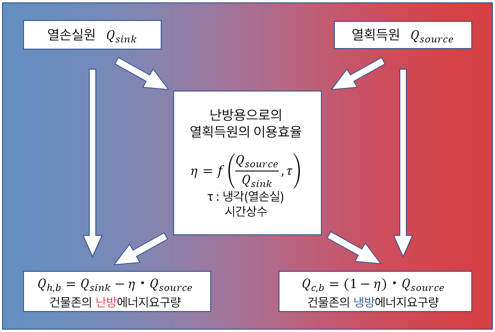
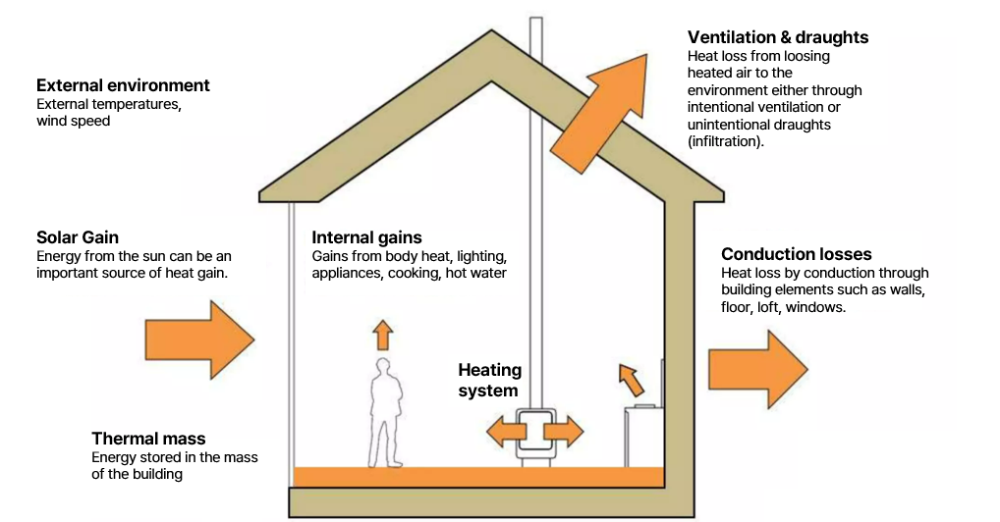
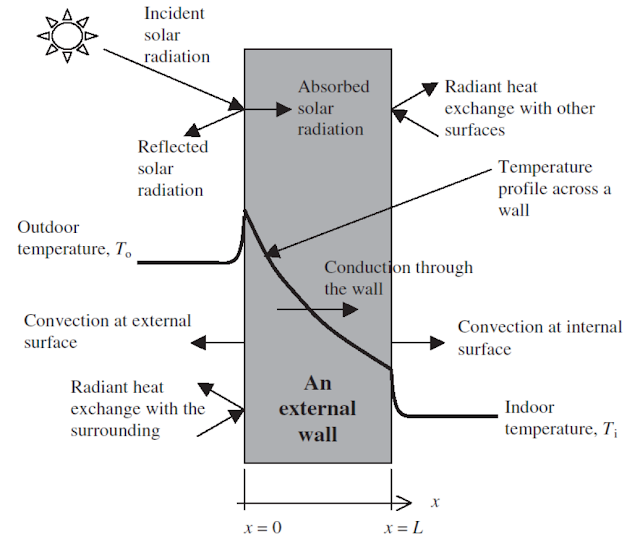
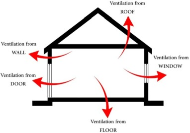
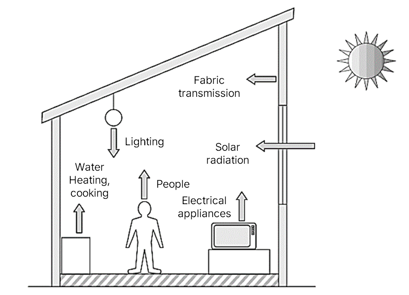
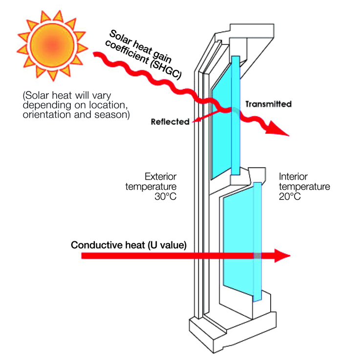
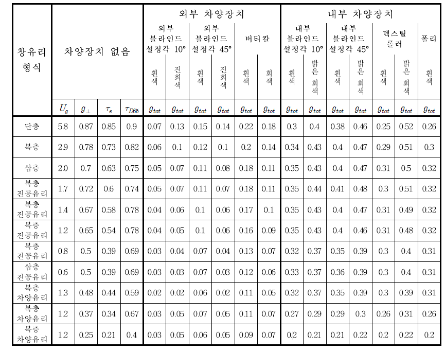

# 1.1. 열손실 및 열획득 (Heat loss and heat gain)

아래 그림은 열손실원과 열획득원을 바탕으로 난방 및 냉방 에너지 요구량을 계산하는 열에너지 흐름 관계를 도식화한 것입니다.

  
  
<strong>Figure 1-1. Cooling & Heating Energy Demand</strong>

존의 열손실/열획득은 서로 대차 대조된 후, 난방부하 또는 냉방부하가 계산됩니다. 다음과 같은 열손실 및 열획득이 부하 분석 시 고려됩니다:

- 관류에 의한 열손실/열획득
- 환기에 의한 열손실/열획득 (침기, 창문환기, 이웃 존과의 환기)
- 존의 부하와 무관하게 온도 처리된 급기에 의한 열손실/열획득
- 투명한 창호를 통한 태양열 획득
- 불투명한 벽체의 외피에서 태양열흡수와 열방사에 의한 열손실/열획득
- 전자기기, 인공조명, 인체발열(사람, 동물), 건물 존으로 온기나 냉기를 가진 물건 유입/반출, 존 내부에 열/냉열 배관이 지나가 발생하는 내부 열손실/열획득

---

## 1.1.1. 열손실 \(Q_{sink}\)과 열획득 \(Q_{source}\)

전도와 자연환기에 의한 열 획득 및 손실, 기계환기에 의한 냉열유입, 존 내부의 냉열원, 태양열입사, 그리고 복사손실에 의한 존의 전체 열손실 및 열획득이 결정됩니다.

  
  
<strong>Figure 1.1-2. Heat Gain or Loss Diagram</strong>

열손실 \(Q_{sink}\) 과 열획득 \(Q_{source}\) 계산식은 다음과 같습니다:

  

    {{ include_equations("2", 11, 11) }}
    {{ include_equations("2", 16, 16) }}
  

---

### 1.1.1.1. 전도에 의한 열손실 및 열획득 \(Q_{T}\)

#### 전도 열손실/열획득

전도에 의한 열손실과 열획득은 벽체, 지붕, 바닥 등 외피를 통해 발생하는 열의 손실과 획득을 의미합니다.

아래 수식은 전체 전도 손실 및 획득을 계산하는 식입니다:   

- **열손실**: {{ include_equations("2", 12, 12) }}
- **열획득**: {{ include_equations("2", 18, 18) }}

  
  
<strong>Heat Gain Figure 1</strong>

#### 외기에 의한 벽체를 통한 전도
- 열손실: {{ include_equations("2", 42, 42) }}
- 열획득: {{ include_equations("2", 43, 43) }}
- 열관류율 합산: {{ include_equations("2", 44, 44) }}

#### 비난방존의 벽체를 통한 전도
- 열손실: {{ include_equations("2", 46, 46) }}
- 열획득: {{ include_equations("2", 47, 47) }}
- 열관류율 합산: {{ include_equations("2", 48, 48) }}

#### 이웃 난방/냉방 존의 벽체를 통한 전도
- 열손실: {{ include_equations("2", 50, 50) }}
- 열획득: {{ include_equations("2", 51, 51) }}
- 열관류율 합산: {{ include_equations("2", 52, 52) }}

#### 땅으로의 전도
- 열손실: {{ include_equations("2", 53, 53) }}
- 열획득: {{ include_equations("2", 54, 54) }}
- 열관류율 (지면): 
  $$
  H_{T,s}: \text{DIN EN ISO 13370 에 따라 산정}
  $$

---

### 1.1.1.2. 환기에 의한 열손실 및 열획득 \(Q_{V}\)

#### 환기 열손실/열획득

환기에 의한 열손실 및 열획득은 자연 침기, 창 개방, 기계 환기, 인접 공간을 통한 공기 흐름 등으로 인해 발생하는 에너지 손실 및 획득입니다.

아래 수식은 전체 환기 손실 및 획득을 계산하는 식입니다:   

- **열손실**: {{ include_equations("2", 13, 13) }}
- **열획득**: {{ include_equations("2", 19, 19) }}

  
  
<strong>Heat Gain Figure 2</strong>

#### 외기 침기

- 열손실: {{ include_equations("2", 56, 56) }}
- 열획득: {{ include_equations("2", 57, 57) }}
- 상세:  
  {{ include_equations("2", 58, 58) }}
  실내온도 설정 식:
  $$
  \vartheta_i = \vartheta_{i,h} \ \text{oder} \ \vartheta_{i,c} \quad \text{(난방 또는 냉방 분석 – 실내온도)}
  $$
  야간감소 및 주말감소 (난방 시):  
  {{ include_equations("2", 26, 26) }}  
  {{ include_equations("2", 30, 30) }}  
  공간적 제한 및 시각적 제한:  
  {{ include_equations("2", 33, 33) }}  
  {{ include_equations("2", 35, 35) }}  
  냉방 시 실내온도:  
  {{ include_equations("2", 36, 36) }}

#### 창문환기

- 열손실: {{ include_equations("2", 64, 64) }}
- 열획득: {{ include_equations("2", 65, 65) }}

#### 기계환기

- 열손실: {{ include_equations("2", 81, 81) }}
- 열획득: {{ include_equations("2", 82, 82) }}
- 기계환기 조건:
  {{ include_equations("2", 90, 90) }}
  {{ include_equations("2", 91, 91) }}
  {{ include_equations("2", 92, 92) }}

#### 다른 존으로부터 유입된 공기

- 열손실: {{ include_equations("2", 97, 97) }}
- 열획득: {{ include_equations("2", 98, 98) }}

---

### 1.1.1.3. 내부 열손실 \(Q_{I, sink}\) 및 내부 발열 획득 \(Q_{I, source}\)

#### 내부 열손실/내부 발열 획득

분석 존을 통과하는 냉매/냉수 분배관, 차가운 공기가 지나가는 덕트 또는 기기(예: 냉장 진열대, 빙쇄기 등), 규칙적으로 존으로 유입되는 차가운 물질 또는 물건(예: 생산 활동에서의 물품)으로 인해 내부 열손실이 발생합니다.

내부 발열 획득은 사람, 동물, 기기, 인공조명 등에서 발열되는 열과 존 내부에 설치되는 난방분배배관, 온수배관, 덕트, 축열탱크, 보일러, 냉동기, 규칙적으로 존으로 유입되는 고온의 물체로부터 획득되는 열을 고려합니다.

아래 수식은 내부 열손실 및 내부 발열 획득을 계산하는 식입니다:   

- **내부 열손실**: {{ include_equations("2", 15, 15) }}
- **내부 발열 획득**: {{ include_equations("2", 20, 20) }}

  
  
<strong>Heat Gain Figure 3</strong>

#### 내부 열손실 상세 항목  
- 난방, 냉방, 급탕 및 공조시스템에 의한 비제어적 열손실원:   

  {{ include_equations("2", 125, 125) }}

- 기기에 의한 열손실원:   

  {{ include_equations("2", 120, 120) }}   

- 물품이나 재료반입에 의한 열손실원:   

  {{ include_equations("2", 122, 122) }}

#### 내부 발열 획득 상세 항목  

- 인체에 의한 열획득원:   

  {{ include_equations("2", 118, 118) }}

- 기기에 의한 열획득원:   

  {{ include_equations("2", 119, 119) }}

- 인공조명에 의한 열획득원:   

  {{ include_equations("2", 123, 123) }}

- 난방, 냉방, 급탕 및 공조시스템에 의한 비제어적 열획득원:   

  {{ include_equations("2", 124, 124) }}

---

### 1.1.1.4. 복사 열손실 및 태양열에 의한 열획득 \(Q_{S}\)

#### 복사 열손실/태양열에 의한 열획득

열손실의 경우, 불투명한 표면에 입사된 태양열은 장파장 복사에 의해 손실 차감되기 때문에 입사 태양열보다 복사에 의한 방사가 크면 열손실이 발생합니다.

열획득의 경우, 투명한 창을 통해 직접 존으로 유입되거나 불투명한 외벽에 흡수되어 전도에 의해 존으로 유입되는 열을 고려합니다.

아래 수식은 복사 열손실 및 태양열에 의한 열획득을 계산하는 식입니다:   

- **복사 열손실**: {{ include_equations("2", 111, 111) }}
- **태양열에 의한 열획득**: {{ include_equations("2", 17, 17) }}

  
  
<strong>Heat Gain Figure 4</strong>

#### 불투명 구조체를 통한 태양열 유입
{{ include_equations("2", 111, 111) }}
{{ include_equations("2", 112, 112) }}

##### 표면 흡수율 \(\alpha\)

<!DOCTYPE html>
<html lang="ko">
<head>
  <meta charset="UTF-8">
  <title>표면 흡수율</title>
  
</head>
<body>
  <table>
    <tr>
      <th>표면</th>
      <th>흡수율 α</th>
    </tr>
    <tr>
      <td>벽표면 – 밝은 칠 – 중간 칠 – 어두운 칠</td>
      <td class="value"> 0.4 0.6 0.8</td>
    </tr>
    <tr>
      <td>경질벽돌 벽</td>
      <td class="value">0.8</td>
    </tr>
    <tr>
      <td>밝은 층 벽</td>
      <td class="value">0.6</td>
    </tr>
    <tr>
      <td>지붕 – 붉은벽돌 – 어두운 표면 – 금속(광택) – 콜타르 지붕층(모래가 첨부된)</td>
      <td class="value"> 0.6 0.8 0.2 0.6</td>
    </tr>
  </table>
</body>
</html>

#### 투명체를 통한 태양입사광에 의한 열획득
{{ include_equations("2", 105, 105) }}

차양 및 음영을 고려한 총에너지 투과율  
{{ include_equations("2", 106, 106) }}  
{{ include_equations("2", 107, 107) }}  
{{ include_equations("2", 108, 108) }}  
{{ include_equations("2", 109, 109) }}   

   

##### 창유리 및 자양장치에 대한 표준값

<!DOCTYPE html>
<html lang="ko">
<head>
  <meta charset="UTF-8">
  <title>창유리 형식별 차양장치 영향</title>
  
</head>
   
</html>

     

