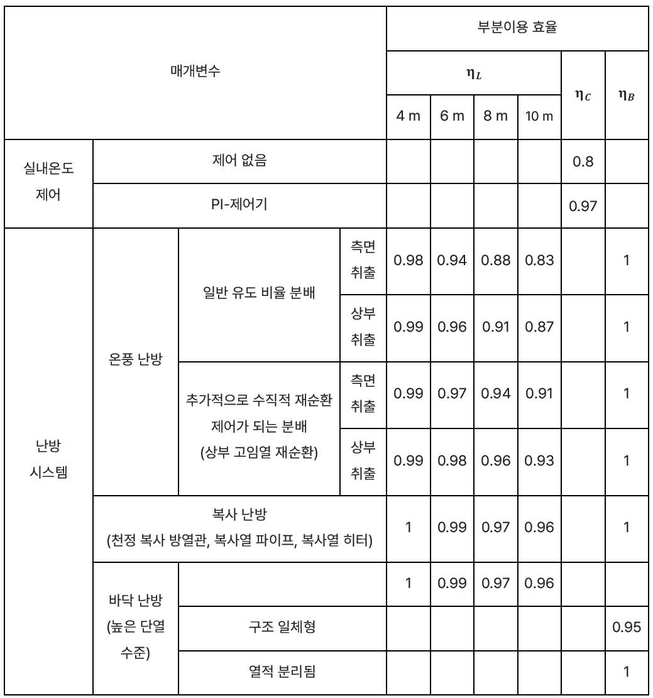
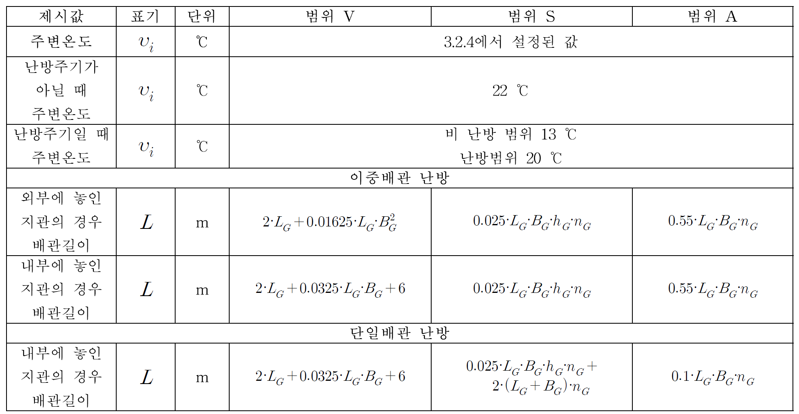
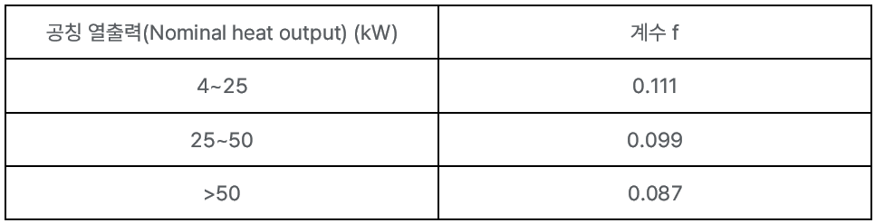
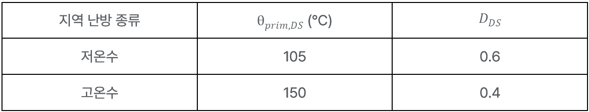
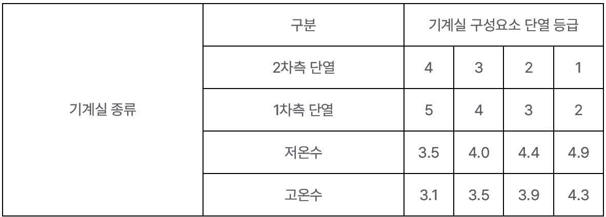

# 1. 난방 에너지소요량 (Energy use for heating system)

## 1.1. 개요

본 절은 난방 시스템의 각 단계(전달, 분배, 저장, 생산)에서 산출된 손실 (loss), 소요량 (energy use), 보조에너지 (auxiliary energy)를 종합하여, **최종적으로 열 생산기기(보일러, 히트펌프 등)가 공급해야 하는 에너지 소요량**을 산정하는 방법을 기술합니다.   

   

         
         
<strong>Figure 1.1-1. 공조처리의 제 1장에서 다루는 범위</strong>

   

열 생산기기의 에너지 소요량 산정을 위해 건물의 난방 에너지 요구량(\( Q_{h,b} \))에 각 과정에서 발생하는 모든 열손실을 더하여 열 생산기기가 실제로 감당해야 할 열 에너지 공급량(\( Q_{h,outg} \))을 결정합니다.      
또한, 이 과정에서 소비되는 모든 보조에너지 공급량, 신재생에너지 시스템에 의한 열획득도 합산합니다.   

---    

## 1.2. 생산기기 열 에너지 공급량(heat output)

- 열 생산기기가 공급해야 하는 총 열 공급량(\(Q_{h,outg}\))은 최종적으로 실내에 공급되어야 하는 순수 난방에너지 요구량(Energy need)(\(Q_{h,b}\))과 열이 사용자에게 도달하기까지의 과정, 즉 전달(\(Q_{h,ce}\)), 분배(\(Q_{h,d}\)), 저장(\(Q_{h,s}\)) 단계에서 발생하는 모든 열손실의 합으로 계산됩니다.   

   
$$
Q_{h,outg} = Q_{h,b} + Q_{h,ce} + Q_{h,d} + Q_{h,s}
$$(1.2-1)

- 열 생산기기가 공조시스템의 가열유닛(Heating coil)에 열을 공급하는 경우, \(Q_{h,b}\) 대신 공조기 가열에 필요한 열량 \(Q_{h*,b}\)를 사용합니다.   

   
$$
Q_{h,outg} = Q_{h*,b} + Q_{h,ce} + Q_{h,d} + Q_{h,s}
$$(1.2-2)

- 열 생산기기가 흡수식 냉동기에 열을 공급하는 경우, 냉동기 구동에 필요한 열량 \(Q_{c,f}\)를 사용합니다.   

   
$$
Q_{h,outg} = Q_{c,f} + Q_{h,d} + Q_{h,s}
$$ (1.2-3)

- 열 생산기기로부터 열이 공급되는 과정이 다수인 경우, 각각의 과정의 \(Q_{h,outg}\)를 합산합니다.   

---    

### 1.2.1. 최종 난방 에너지 소요량

- 건물이 실제로 요구하는 최종 난방 에너지 소요량(\(Q_{h,f}\))은 생산기기의 열에너지 공급량(\(Q_{h,outg}\))과 공급 과정의 열 손실량(\(Q_{h,g}\))을 더한 값에서, 태양열 등 신재생에너지로 공급된 열량(\(Q_{h,reg}\))을 차감하여 계산됩니다.   

   
$$
Q_{h,f} = Q_{h,outg} + Q_{h,g} - Q_{h,reg}
$$   
$$
Q_{h,reg} = Q_{h,sol} + Q_{h,in}
$$
(1.2.1-1)

  

    <!-- Where 텍스트: 독립적, 굵고 이탤릭 -->
    

      Where,
    

    <!-- 수식 설명들: 왼쪽 정렬, Pretendard 유지 -->
    \( Q_{h,sol} \) : 태양열에너지
    \( Q_{h,in} \) : 주변 환경으로부터의 열 획득
  

 

---    

### 1.2.2. 보조에너지

- 난방 시스템에서 보조에너지(\(Q_{h,aux}\))는 열 전달, 분배, 저장, 생산의 각 단계에서 소요되는 모든 보조에너지의 합으로 산출되며 최종 에너지 소요량에 포함됩니다.   

   
$$
Q_{h,aux} = Q_{h,ce,aux} + Q_{h,d,aux} + Q_{h,s,aux} + Q_{h,g,aux}
$$ (1.2.2-1)

---    

### 1.2.3. 비제어적 열획득(Heat gain)

- 난방 시스템의 전달, 분배, 저장, 생산 과정에서 열 에너지의 일부는 제어되지 않고 난방 중인 실내 공간으로 유입되어 열획득으로 작용할 수 있다. 이 비제어적 열획득(\(Q_{I,h}\))은 열에너지 소요량을 계산할 때 고려되어야 합니다.   

   
$$
Q_{l,h} = Q_{l,h,s} + Q_{l,h,g}
$$ (1.2.3-1)

---    

## 1.3. 각 프로세스의 기준 조건 설정

기본적으로 일일 난방이용시간 \( t_{h,Nutz} = 0 \)이면, 부하율 \( \beta_j = 0 \)입니다.      
만약 #장의 공조난방 시스템에서 요구사항이 있을 경우, #장에서 산정된 \( t_{h,Nutz} \)를 따르도록 합니다.   

---    

### 1.3.1. 평균 부하율(Part load level)

평균 부하율(\( \beta_{i} \))은 시스템의 최대 공급 능력 대비 실제 평균 부하가 어느 정도인지를 나타내는 무차원 변수입니다.    각 단계(전달, 분배, 저장, 생산)마다 열손실이 존재하므로, 각 단계의 부하율을 개별적으로 계산합니다.   

- **열 전달 부하율 \( \beta_{h,ce} \)**

$$
\beta_{h,ce} = \frac{Q_{h,b}}{\dot{Q}_{h,\max} \cdot t_h}
$$ (1.3.1-1)

- **열 분배 부하율 \( \beta_{h,d} \)**

$$
\beta_{h,d} = \frac{Q_{h,b} + Q_{h,ce}}{\dot{Q}_{dot\,h,max} \cdot t_h}
$$ (1.3.1-2)

- **열 저장 부하율 \( \beta_{h,s} \)**

$$
\beta_{h,s} = \frac{Q_{h,b} + Q_{h,ce} + Q_{h,d}}{\dot{Q}_{dot\,h,max} \cdot t_h}
$$ (1.3.1-3)

- **열 생산 부하율 \( \beta_{h,g} \)**

$$
\beta_{h,g} = \frac{Q_{h,b} + Q_{h,ce} + Q_{h,d} + Q_{h,s}}{\dot{Q}_{dot\,h,max} \cdot t_h}
$$ (1.3.1-4)

  

    <!-- Where 텍스트: 독립적, 굵고 이탤릭 -->
    

      Where,
    

    <!-- 수식 설명들: 왼쪽 정렬, Pretendard 유지 -->
    \( Q_{h,b} \): 월별 난방 에너지 요구량 [kWh]
    \( Q_{h,max} \): 최대 난방 출력 [kW]
    \( t_{h} \): 월별 난방 시간
  

 

---    

### 1.3.2. 온도 기반 제어

온도에 따라 자동 조절되는 난방 시스템에서, 개별 프로세스(전달, 분배, 저장, 생산)의 온도는 시스템의 설계 조건에서 평균 부하율과 평균 온도차에 의해 정해진다.

온도 \( \theta_{HK,m(\beta_j)} \)를 산정합니다.   

- **평균 난방 사이클 온도(\( \theta_{HK,m} \))**

$$
\theta_{HK,m(\beta_j)} = 0.5 \cdot ( \theta_{VL,m(\beta_j)} + \theta_{RL,m(\beta_j)} )
$$ (1.3.2-1)

- **평균 온도차(\( \Delta \theta_{HK,m}(\beta_i) \))**

$$
\Delta \theta_{HK,m}(\beta_i) = \theta_{VL,m}(\beta_i) - \theta_{RL,m}(\beta_i)
$$ (1.3.2-2)

- **평균 공급 온도(\(\theta_{VL,m}\))**

$$
\theta_{VL,m}(\beta_i) = (\theta_{VA} - \theta_{i,h,\text{soll}}) \cdot \beta_i^{\frac{1}{n}} + \theta_{i,h,\text{soll}}
$$ (1.3.2-3)

- **평균 환수 온도(\( \theta_{RL,m} \))**

$$
\theta_{RL,m(\beta_i)} = ( \theta_{RA} - \theta_{i,h,soll} ) \cdot \beta_j^{(1/n)} + \theta_{i,h,soll}
$$ (1.3.2-4)

  

    <!-- Where 텍스트: 독립적, 굵고 이탤릭 -->
    

      Where,
    

    <!-- 수식 설명들: 왼쪽 정렬, Pretendard 유지 -->
    \( \beta_i \) : 2.1.3.1에서 계산된 각 프로세스의 평균 부하율
    \( \theta_{VA} \) : 난방 시스템의 설계 조건 공급 온도 [℃]
    \( \theta_{RA} \) : 난방 시스템의 설계 조건 환수 온도 [℃]
    \( n \) : 방열지수 (라디에이터 = 1.33, 바닥 난방 = 1.1) 
    \( \theta_{i,h,\text{soll}} \) : 난방 시스템 가동 시간 동안의 실내 온도 [℃]
  

 

---    

- **작동 유체(Working fluid)의 평균 초과 온도 \( \Delta \theta_A \)**

$$
\Delta \theta_A = ( \theta_{VA} + \theta_{RA} ) / 2 - \theta_{i,h,soll}
$$ (1.3.2-5)

혼합기(mixer)가 설치된 정온 보일러의 경우, 전달과 분배 과정에서 초과 온도 값 적용, 혼합기가 없는 정온 보일러의 평균 온도 = 70℃ 적용

- 건물이 리모델링 되었을 경우, 설계 온도는 조정할 수 있습니다. 새로운 자세한 설계가 수립되지 않은 경우, 아래 표의 설계 온도를 사용하도록 합니다. 중간 값일 경우, 한 단계 높은 온도 쌍을 선택하도록 합니다.   

<!DOCTYPE html>
<html lang="ko">
<head>
   <meta charset="UTF-8">
   <title>설계 온도</title>
   
</head>

<strong>&lt;Table 1.3.2-6. 설계온도&gt;</strong>

<table>
   <tr>
      <th rowspan="2">기존 설계 온도</th>
      <th colspan="3">새 설계 온도에서 Q̇N,neu / Q̇N,alt</th>
   </tr>
   <tr>
      <th>70/55 ℃</th>
      <th>55/45 ℃</th>
      <th>35/28 ℃</th>
   </tr>
   <tr>
      <td>90/70 ℃</td>
      <td>63.8 %</td>
      <td>40.6 %</td>
      <td>11.3 %</td>
   </tr>
   <tr>
      <td>70/55 ℃</td>
      <td>-</td>
      <td>63.7 %</td>
      <td>17.8 %</td>
   </tr>
   <tr>
      <td>55/45 ℃</td>
      <td>-</td>
      <td>-</td>
      <td>27.9 %</td>
   </tr>
</table>

</html>

- 축열조가 없는 열 생산기기의 경우 평균 공급/환수 온도는   

 $$
\theta_{HK,m}(\beta_i) = 0.5 \cdot \left( \theta_{VL,m}(\beta_i) + \theta_{RL,m}(\beta_i) \right)
$$ (1.3.2-7)

식으로 구합니다.   

- 상이한 난방 배관망이 설치된 경우, 최대 온도는 열 생산기기가 충족해야 하는 요구 사항에 따릅니다.   
- 정온 보일러와 바이오매스 보일러는 평균 온도를 70 °C로 가정합니다.   
- 콘덴싱 보일러의 효율 계산에서 환수 온도가 고려되어야 합니다.   
- 저온 및 콘덴싱 보일러에서 준비 손실은 평균 난방 배관망 온도에 관련됩니다.    

---    

### 1.3.3. 보일러 정격 출력(Rated output) 산정

- **보일러 정격출력(\( \dot{Q}_{N,h} \))**: 보일러의 정격 출력을 산정하기 위해 첫 번째로 모든 연결된 열 소비기기의 최대 출력이 결정되어야 합니다. 동시 발생하는 수요에 따라 보일러의 정격 출력은 가장 큰 단일 수요 또는 동시 발생하는 수요의 합 중에서 결정됩니다.      

- **난방 시스템의 보일러 정격 출력(\(Q_{N,h}\))**:   

$$
\dot{Q}_{dot\,N,h} = 1.3 \cdot \dot{Q}_{dot\,h,max}
$$ (1.3.3-1)

이미 열 생산기기가 설치된 기존 건물의 경우, 정격 출력은 설치된 기기의 값을 이용합니다.    설치된 기기 값을 알 수 없는 경우, 아래 식을 사용합니다.   

$$
\dot{Q}_{N,h} = 2.5 \cdot \dot{Q}_{h,\text{max}}
$$ (1.3.3-2)

  

    <!-- Where 텍스트: 독립적, 굵고 이탤릭 -->
    

      Where,
    

    <!-- 수식 설명들: 왼쪽 정렬, Pretendard 유지 -->
    \( \dot{Q}_{h,\text{max}} \) : 건물의 최대 열 부하 [kW]
  

 

- **동시 열 부하(난방, 급탕, 공조 등) 발생 시**:   
동시에 여러 가지의 열 부하가 발생할 경우, 보일러의 정격출력은 **동시에 발생하는 부하들의 합**으로 또는 **우선순위가 높은 부하 중 가장 큰 값**으로 결정됩니다.   

$$
\dot{Q}_N = \max\left( \sum \dot{Q}_{N,\text{gleichzeitig}} , \dot{Q}_{\text{vorrang}} \right)
$$ (1.3.3-3)

---    

### 1.3.4. 운전 시간

건물 난방/급탕 요구량(# 절)에서 야간감소/정지 또는 주말감소/정지가 고려되었다면, 보일러 운전에서도 동일하게 고려해야 합니다.   

- **난방 시스템의 운전 시간 설계**: 분배 배관망 및 열 생산 과정의 열 손실 계산을 위해 야간이나 주말의 운전 감소/정지, 온도 저하, 지속 운전 방식을 고려하는 일일 운전 시간이 사용됩니다.   

- **일일 설계 운전시간 \( t_{h,rL,T} \)**   

   
   $$
   t_{h,rL,T} = 24 - f_{L,NA} \cdot (24 - t_{h,op})
   $$ (1.3.4-1)

  

    <!-- Where 텍스트: 독립적, 굵고 이탤릭 -->
    

      Where,
    

    <!-- 수식 설명들: 왼쪽 정렬, Pretendard 유지 -->
    \( f_{L,NA} \): 야간감소/정지에 대한 운전시간계수
    \( t_{h,op} \): 일일 난방 시간
  

 

   - **지속 운전**: \( f_{L,NA} = 0 \)   

   - **야간 정지**: \( f_{L,NA} = 1 \)   

   - **야간 감소**:   

 
   $$
   f_{L,NA} = 1 - \frac{\theta_{NA,Grenz} - \theta_e}{\theta_{NA,Grenz} - \theta_{e,min}}
   $$ (1.3.4-2)

  

    <!-- Where 텍스트: 독립적, 굵고 이탤릭 -->
    

      Where,
    

    <!-- 수식 설명들: 왼쪽 정렬, Pretendard 유지 -->
    \( \theta_{NA,Grenz} \) = 야간 감소 한계 온도 = \(10^\circ\mathrm{C} \)  
    \( \theta_e \): 월 평균 외기 온도[℃]
    \( \theta_{e,min} \): 일평균 설계 온도[℃]
  

 

---    

- **월별 설계 운전일 \( d_{h,rB} \)**   

 
   $$
   d_{h,rB} = d_{mth} \cdot \left( \frac{365 - f_{L,WA} \cdot (365 - d_{Nutz,A})}{365} \right)
   $$ (1.3.4-3)

 

  

    <!-- Where 텍스트: 독립적, 굵고 이탤릭 -->
    

      Where,
    

    <!-- 수식 설명들: 왼쪽 정렬, Pretendard 유지 -->
    \( d_{mth} \): 월별 일수
    \( d_{Nutz,A} \): 연간 이용기간 
    \( f_{L,WA} \): 주말 운전 감소/정지 계수 
  

 

   - **지속 운전**: \( f_{L,WA} = 0 \)   
   - **주말 정지**: \( f_{L,WA} = 1 \)   
   - **주말 감소**:   

 
$$
f_{L,WA} = 1 - \frac{\theta_{WA,Grenz} - \theta_e}{\theta_{WA,Grenz} - \theta_{e,min}}
$$ (1.3.4-4)

 

  

    <!-- Where 텍스트: 독립적, 굵고 이탤릭 -->
    

      Where,
    

    <!-- 수식 설명들: 왼쪽 정렬, Pretendard 유지 -->
    \( \theta_{WA,Grenz} \) = 주말 감소 한계 온도 = \( 15^\circ\mathrm{C} \)

  

 

---    

- **월별 계산 난방 운전시간 \( t_{h,rL} \)**   

$$
t_{h,rL} = t_{h,rL,T} \cdot d_{h,rB}
$$ (1.3.4-5)

- 상이한 난방 배관망 운전 또는 난방 시스템 이외의 열 생산기기가 존재하거나 배관망에 다른 열 수요를 갖는 에너지원(냉동기, 공조장치, 온수 등)이 연결되어 있는 경우, 가장 오랜 시간 수요가 발생하는 에너지원의 운전시간을 적용합니다.   

$$
t_{h,rL} = t_{h,rL,T} \cdot d_{h,rB}
$$ (1.3.4-6)

---    

- **월별 난방일수 \( d_{h,mth} \)**:   

$$
d_{h,mth} = \frac{t_{h,rL,T}^*}{24}
$$ (1.3.4-7)

- **월별 이용일수 \( d_{Nutz,mth} \)**:   

$$
d_{Nutz,mth} = \frac{d_{Nutz,A}}{365} \cdot d_{mth}
$$ (1.3.4-8)

- **일년 단위 산정치의 월별 분배**: 

난방 시스템 구성요소 중 에너지 요구량이 존 별 대차대조에 영향을 미치지 않는 요소(순환펌프 등)는 일 년 단위로 계산하여도 무방하다. 에너지 요구량을 월별로 비교해야 하는 경우, 일 년 요구량인 \(W_{h,d,e,a}\)로부터 월별 요구량 \(W_{h,d,e,M}\)를 계산합니다.   

$$
W_{h,d,e,M} = W_{h,d,e,a} \cdot \frac{ \beta_{h,d,M} \cdot t_{\text{Nutz,mth}} }{ \beta_{h,d,a} \cdot t_{h,op} \cdot d_{\text{Nutz,a}} }
$$ (1.3.4-9)

---    

## 1.4. 열 손실 및 보조에너지 계산

### 1.4.1. 전달 과정의 열 손실

- 실내 난방 에너지 전달 과정의 열 손실(Q_h,ce)과 열 전달 총 이용효율 (η_h,ce)은 아래와 같이 정의합니다.   

 $$
Q_{h,ce} = \left( \frac{f_{Radiant} \cdot f_{int} \cdot f_{hwdr}}{\eta_{h,ce}} - 1 \right) \cdot Q_{h,b} $$
(1.4.1-1)

  

    <!-- Where 텍스트: 독립적, 굵고 이탤릭 -->
    

      Where,
    

    <!-- 수식 설명들: 왼쪽 정렬, Pretendard 유지 -->
    \( f_{\text{Radiant}} \) : 복사 영향 계수
    \( f_{\text{int}} \) : 간헐 운전 계수
    \( f_{\text{hydr}} \) : 수력학적 균형 계수 = 1
    \( \eta_{h,\text{ce}} \) : 열 전달 총 이용효율
  

 

 
- \( \eta_{h,\text{ce}} \): 실내 열전달 총 효율   

 $$
\eta_{h,\text{ce}} = \dfrac{1}{4 - (\eta_L + \eta_C + \eta_B)}
$$ (1.4.1-2)

  

    <!-- Where 텍스트: 독립적, 굵고 이탤릭 -->
    

      Where,
    

    <!-- 수식 설명들: 왼쪽 정렬, Pretendard 유지 -->
    \( \eta_L \) : 실내 공기온도의 수직 분포에 대한 효율
    \( \eta_C \) : 실내 온도제어에 대한 효율
    \( \eta_B \) : 외피 열손실에 대한 효율
  

 

일반적인 상황에서 \(f_{Radiant}\)(\(h > 4m\)인 대형 홀 공간에서 중요)와 \(f_{int}\)(실내 온도감소 고려)는 1로 설정합니다.   

- 연간 열 손실(\(Q_{h,ce,a}\))은 월별 계산한 열 손실의 합과 같습니다.   

$$
Q_{h,ce,a} = \sum Q_{h,ce}
$$ (1.4.1-3)

<!DOCTYPE html>
<html lang="ko">
<head>
   <meta charset="UTF-8">
   <title>라디에이터 이용 효율</title>
   
</head>

&lt;Table 1.4.1-4. 라디에이터의 부분 이용 효율 (실 높이 ≤ 4m)&gt;

<table>
   <tr>
      <th rowspan="2" colspan="2">매개변수</th>
      <th colspan="4">이용 효율</th>
   </tr>
   <tr>
      <th colspan="2"><i>&eta;L</i></th>
      <th><i>&eta;C</i></th>
      <th><i>&eta;B</i></th>
   </tr>
   <tr>
      <td rowspan="2">실내온도제어</td>
      <td>제어 없음, 중앙에서 공급온도 제어</td>
      <td colspan="2"></td>
      <td>0.8</td>
      <td></td>
   </tr>
   <tr>
      <td>P-제어기 (2 K)</td>
      <td colspan="2"></td>
      <td>0.93</td>
      <td></td>
   </tr>
   <tr>
      <td rowspan="2">초과온도 (θi = 20℃)</td>
      <td rowspan="2">42.5 K (예로 70/55)</td>
      <td>&eta;L1</td>
      <td>&eta;L2</td>
      <td></td>
      <td></td>
   </tr>
   <tr>
      <td>0.93</td>
      <td></td>
      <td></td>
      <td></td>
   </tr>
   <tr>
      <td rowspan="1">외부 벽체를 통한 열손실 (GF = 유리면)</td>
      <td></td>
      <td></td>
      <td>0.95</td>
      <td></td>
      <td>1</td>
   </tr>
</table>

</html>

- 초과 온도와 외부 벽체를 통한 열손실이 복합적으로 영향을 미치는 경우, 평균 효율을 사용합니다.   
- 예시) 외벽 측에 위치한 라디에이터, 초과 온도 42.5 K, P-제어기 (2 K)일 때

$$
\eta_L = \frac{\eta_{L1} + \eta_{L2}}{2} = \frac{0.93 + 0.95}{2} = 0.94
$$ (1.4.1-5)

$$
\eta_C = 0.93
$$ (1.4.1-6)

$$
\eta_B = 1
$$ (1.4.1-7)

$$
\eta_{h,\text{ce}} = \frac{1}{4 - (\eta_L + \eta_C + \eta_B)} = \frac{1}{4 - (0.94 + 0.93 + 1)} = \frac{1}{1.13} = 0.88
$$ (1.4.1-8)

- 간헐 운전 계수: \(f_{int}\) = 0.97 (지속 운전의 경우, \(f_{int}\) = 1)   
- 복사 영향 계수: \(f_{Radiant}\) = 1.0   

<!DOCTYPE html>
<html lang="ko">
<head>
   <meta charset="UTF-8">
   <title>물 기반 난방 시스템의 효율</title>
   
</head>

&lt;Table 1.4.1-9. 물 기반 난방 시스템의 효율 (실 높이 ≤ 4m)&gt;

<table>
   <tr>
      <th rowspan="2" colspan="2">매개변수</th>
      <th colspan="4">부분이용 효율</th>
   </tr>
   <tr>
      <th><i>&eta;L</i></th>
      <th><i>&eta;C</i></th>
      <th colspan="2"><i>&eta;B</i></th>
   </tr>
   <tr>
      <td rowspan="3">실내온도제어</td>
      <td>열 매체: 물 제어 없음 (중앙 공급온도 제어)</td>
      <td></td>
      <td>0.78</td>
      <td colspan="2"></td>
   </tr>
   <tr>
      <td>PI-제어기</td>
      <td></td>
      <td>0.95</td>
      <td colspan="2"></td>
   </tr>
   <tr>
      <td>전기 난방 PI 제어기</td>
      <td></td>
      <td>0.93</td>
      <td colspan="2"></td>
   </tr>
   <tr>
      <td rowspan="4">시스템</td>
      <td>바닥난방</td>
      <td></td>
      <td></td>
      <td>&eta;B1</td>
      <td>&eta;B2</td>
   </tr>
   <tr>
      <td>습식</td>
      <td>1</td>
      <td></td>
      <td>0.93</td>
      <td></td>
   </tr>
   <tr>
      <td>건식</td>
      <td>1</td>
      <td></td>
      <td>0.96</td>
      <td></td>
   </tr>
   <tr>
      <td>건식 + 얇은 층</td>
      <td>1</td>
      <td></td>
      <td>0.98</td>
      <td></td>
   </tr>
   <tr>
      <td rowspan="1">설치 면을 통한 열 손실</td>
      <td>최소 단열된 바닥 난방</td>
      <td></td>
      <td></td>
      <td></td>
      <td>0.95</td>
   </tr>
</table>
</html>

- 시스템과 설치 면을 통한 열 손실이 영향을 미치는 경우, 평균을 사용합니다.   

<!DOCTYPE html>
<html lang="ko">
<head>
   <meta charset="UTF-8">
   <title>공기 난방에 대한 이용 효율</title>
   
</head>

&lt;Table 1.4.1-10. 공기 난방에 대한 이용 효율 (공조 장치) (실 높이 ≤ 4m)&gt;

<table>
   <tr>
      <th rowspan="2">시스템 구성</th>
      <th rowspan="2">제어 매개변수</th>
      <th colspan="2"><i>&eta;h,ce</i></th>
   </tr>
   <tr>
      <th>낮은 등급 제어 (On/Off)</th>
      <th>높은 등급 제어 (P 제어)</th>
   </tr>
   <tr>
      <td rowspan="3">급기 가열 백업 (추가 가열 유닛)</td>
      <td>실내온도</td>
      <td>0.82</td>
      <td>0.87</td>
   </tr>
      <tr>
      <td>실내온도 (급기 온도 다단 제어)</td>
      <td>0.88</td>
      <td>0.90</td>
   </tr>
   </tr>
      <tr>
      <td>배기 온도</td>
      <td>0.81</td>
      <td>0.85</td>
   </tr>
   <tr>
      <td rowspan="1">순환 공기 가열 (인덕션 유닛, 팬코일 유닛)</td>
      <td>실내온도</td>
      <td>0.89</td>
      <td>0.93</td>
   </tr>
   
</table>
</html>

- 실 높이 4m 이상 공간에 대한 이용 효율 (대형 홀 건물): 아래 표

     
<strong>Table 1.4.1-11. 4m ≤ 실 높이 ≤ 10m 공간에 대한 이용 효율</strong>

     

### 1.4.2. 열 전달 보조에너지

- 존으로 열을 전달하는 과정에서 제어기기, 팬, 펌프 등의 전력 소비를 보조에너지로 정의하며 보조에너지 소요량(\(Q_{h,ce,aux}\))은 아래와 같이 계산합니다.    

$$
Q_{h,ce,aux} = Q_C + Q_{V,P}
$$ (1.4.2-1)

  

    <!-- Where 텍스트: 독립적, 굵고 이탤릭 -->
    

      Where,
    

    <!-- 수식 설명들: 왼쪽 정렬, Pretendard 유지 -->
    \( Q_C \) = 제어기기의 보조에너지
    \( Q_{V,P} \) = 팬, 펌프 등의 보조에너지 
  

 

$$
Q_C = P_C \cdot d_{mth} \cdot \frac{24}{1000}$$
(1.4.2-2)

   

  

    <!-- Where 텍스트: 독립적, 굵고 이탤릭 -->
    

      Where,
    

    <!-- 수식 설명들: 왼쪽 정렬, Pretendard 유지 -->
    \( P_C \) = 제어기기의 정격 전력
  

 

$$
Q_{V,P} = (P_V \cdot n_V + P_P \cdot n_P) \cdot \frac{t_{h,rL}}{1000} $$
(1.4.2-3)

  

    <!-- Where 텍스트: 독립적, 굵고 이탤릭 -->
    

      Where,
    

    <!-- 수식 설명들: 왼쪽 정렬, Pretendard 유지 -->
    \( n_V \) = 팬 개수
    \( n_P \) = 펌프 개수
    \( P_V \) = 팬 정격 전력 소비
    \( P_P \) = 펌프의 정격 전력 소비
  

 

펌프의 정격 전력 소비 데이터가 없는 경우:

$$
P_P = 50 \cdot \dot{Q}_{LH}^{0.08} $$
(1.4.2-4)

  

    <!-- Where 텍스트: 독립적, 굵고 이탤릭 -->
    

      Where,
    

    <!-- 수식 설명들: 왼쪽 정렬, Pretendard 유지 -->
    \( \dot{Q}_{LH} \) = 공기가열 유닛(Heating coil)의 정격 전력 소비 
  

 

- 제어기기, 팬, 펌프의 정격 전력 소비는 제품 사양을 참조하거나 아래 표의 값을 사용합니다.    
- 팬/펌프의 운전 시간은 난방 시스템과 같다고 가정합니다.   

<!DOCTYPE html>
<html lang="ko">
<head>
   <meta charset="UTF-8">
   <title>제어기기의 보조에너지 표준 값</title>
   
</head>

&lt;Table 1.4.2-5. 제어기기의 보조에너지 표준 값&gt;

<table>
   <tr>
      <th colspan="2">매개변수</th>
      <th>전력 (W) (구동 시)</th>
   </tr>
   <tr>
      <td rowspan="3">PC</td>
      <td>전기모터 구동식 전기적 제어</td>
      <td>0.1</td>
   </tr>
   <tr>
      <td>전기열 구동식 전기적 제어</td>
      <td>0.1</td>
   </tr>
   <tr>
      <td>전자기 구동식 전기적 제어</td>
      <td>0.1</td>
   </tr>

</table>

<head>
   <meta charset="UTF-8">
   <title>급기 팬의 보조 에너지 표준 값</title>
   
</head>

&lt;Table 1.4.2-6. 급기 팬의 보조 에너지 표준 값 (실 높이 ≤ 4m)&gt;

<table>
   <tr>
      <th colspan="2">매개변수</th>
      <th>전력</th>
   </tr>
   <tr>
      <td rowspan="4">PV</td>
      <td>팬 코일 유닛</td>
      <td>10</td>
   </tr>
   <tr>
      <td>전기 가열식 팬 코일 유닛</td>
      <td>10</td>
   </tr>
   <tr>
      <td>동적 방열식 축열 난방</td>
      <td>12</td>
   </tr>
   <tr>
      <td>지속 및 동적 방열식 축열 난방</td>
      <td>12</td>
   </tr>
</table>

<head>
   <meta charset="UTF-8">
   <title>Table 1.4.2-7. 팬 코일 유닛의 용량에 따른 성능 실례</title>
   
</head>

&lt;Table 1.4.2-7. 팬 코일 유닛의 용량에 따른 성능 실례&gt;

<table>
   <tr>
      <th>구분</th>
      <th>FC-200</th>
      <th>FC-300</th>
      <th>FC-400</th>
      <th>FC-600</th>
      <th>FC-800</th>
   </tr>
   <tr>
      <td>PV (W)</td>
      <td>25</td>
      <td>35</td>
      <td>45</td>
      <td>65</td>
      <td>90</td>
   </tr>

</table>
</html>
    

    
### 1.4.3. 중앙 온수 난방 분배 배관망의 열 손실

- 중앙 온수 난방 시스템의 분배 과정에서 **배관망의 열 손실(\(Q_{h,d}\))**은 열 생산기기에서 생산된 온수가 각 존까지 배관망을 따라 이동하는 동안 주변으로의 열 손실입니다.   

$$
Q_{h,d} = \sum \left[ U_i \cdot (\theta_{HK,m} - \theta_i) \cdot L_i \cdot t_{h,rL,i} \right]
$$ (1.4.3-1)

  

    <!-- Where 텍스트: 독립적, 굵고 이탤릭 -->
    

      Where,
    

    <!-- 수식 설명들: 왼쪽 정렬, Pretendard 유지 -->
    \( U_{i}\) = 열관류율
  

 

공조난방 시스템에서 가열 유닛이 가열되는 경우, 평균 열매체 온도(\(θ_{h*}\))와 공조 시스템 운전시간(\(t_{h*,op}\))를 사용합니다.   

평균 열매체 온도(\(θ_{r,Nutz}\))와 시스템 운전시간(\(t_{c,op}\))를 사용합니다.    

- **비제어적 열획득(Q_I,h,d)**: 배관망이 존을 통과할 경우, 통과한 구간 i의 배관망에서 발생하는 열 손실은 존의 에너지 요구량 분석에서 비제어적 열 획득에 포함됩니다.   

$$
Q_{I,h,d,i} = Q_{h,d,i} $$
(1.4.3-2)

- **배관 길이(L) 산정**: 배관 길이는 기본적으로 배관 도면을 바탕으로 산정합니다.   
- 배관망 주변 온도는 2.1.2.4에서 설정한 값을 적용하며, 없을 경우 아래 표에서 채택합니다.   
- 배관망은 V, S, A,의 3가지 범위로 구분해 구성합니다.    
- V는 생산기기로부터 주관까지의 수평 분배, S는 지관, A는 실내 방열기까지의 차단 가능한 말단 배관을 의미합니다.    
- \(L_{G}\), \(B_{G}\), \(h_{G}\), \(n_{G}\)는 각각 건물의 가장 긴 세로 길이, 넓이, 층 수, 층 높이입니다.   

    
<strong>Table 1.4.3-3. 배관망에 대한 표준값</strong>

    

- **배관 열관류율(U)**: 배관의 단열재 사양에 따라 결정되며, 정보가 없는 경우 건물의 준공 연도와 배관 위치를 기준으로 아래 표의 표준값을 사용합니다.   

<!DOCTYPE html>
<html lang="ko">
<head>
   <meta charset="UTF-8">
   <title>배관의 열관류율 표</title>
   
</head>

<h5>&lt;Table 1.4.3-4. 배관의 열관류율 \( U_i \) 표준값&gt;</h5>

<table>
   <tr>
      <th rowspan="2">건물 준공연도</th>
      <th rowspan="1">분배</th>
      <th colspan="2">외부 설치된 수직배관</th>
      <th colspan="2">내부 설치된 수직 배관</th>
   </tr>
   <tr>
      <td>V</td><td>S</td><td>A</td><td>S</td><td>A</td>
   </tr>
   <tr>
      <td>1995 이후</td>
      <td>0.2</td><td>0.255</td><td>0.255</td><td>0.255</td><td>0.255</td>
   </tr>
   <tr>
      <td>1980~1995</td>
      <td>0.2</td><td>0.4</td><td>0.4</td><td>0.3</td><td>0.4</td>
   </tr>
   <tr>
      <td>1980 이전</td>
      <td>0.4</td><td>0.4</td><td>0.4</td><td>0.4</td><td>0.4</td>
   </tr>

   <tr><th colspan="6">비단열 배관</th></tr>

   <tr>
      <td>\( A_{NGF} \leq 200 \, \text{m}^2 \)</td>
      <td>1</td><td>1</td><td>1</td><td>1</td><td>1</td>
   </tr>
   <tr>
      <td>\( 200 \, \text{m}^2 \lt A_{NGF} \leq 500 \, \text{m}^2 \)</td>
      <td>2</td><td>2</td><td>2</td><td>2</td><td>2</td>
   </tr>
   <tr>
      <td>\( A_{NGF} > 500 \, \text{m}^2 \)</td>
      <td>3</td><td>3</td><td>3</td><td>3</td><td>3</td>
   </tr>
   <tr>
      <td>외벽 내 설치</td>
      <td></td><td></td>
      <td>전체 열공급 /  실내 이용 가능한 열공급</td>
      <td></td><td></td>
   </tr>
    <tr>
      <td>외벽 비단열</td>
      <td></td><td></td>
      <td>1.35/0.8</td>
      <td></td><td></td>
   </tr>
    <tr>
      <td>외벽</td>
      <td></td><td></td>
      <td>1/0.9</td>
      <td></td><td></td>
   </tr>
    <tr>
      <td>외부단열</td>
      <td></td><td></td>
      <td></td>
      <td></td><td></td>
   </tr>
   <tr>
      <td>\( \text{외벽 } U = 0.4 \, \text{W/m}^2\cdot \text{K} \)</td>
      <td></td><td></td>
      <td>0.785/0.55</td>
      <td></td><td></td>
   </tr>
</table>

</html>

    

### 1.4.4. 배관망 순환펌프 보조에너지

- **분배 배관망 보조에너지(\(Q_{h,d,aux}\)) 산정**: 순환 펌프의 에너지 소비량은 분배 배관망의 필요 수력학적 에너지 요구량과 히트펌프 운전에 대한 소비지수를 근거로 산정합니다.   

$$
Q_{h,d,aux} = W_{h,d,hydr} \cdot e_{h,d,aux} $$
(1.4.4-1)

  

    <!-- Where 텍스트: 독립적, 굵고 이탤릭 -->
    

      Where,
    

    <!-- 수식 설명들: 왼쪽 정렬, Pretendard 유지 -->
    \( W_{h,d,hydr} \) = 수력학적 에너지 요구량
    \( e_{h,d,aux} \) = 히트펌프 운전에 대한 소비지수
  

 

$$
W_{h,d,hydr} = \frac{P_{\text{pump}}}{1000} \cdot \beta_{h,d} \cdot t_h $$
(1.4.4-2)

$$
e_{h,d,aux} = C_{P1} + C_{P2} \cdot \beta_{h,d}^{-1} $$
(1.4.4-3)

- 펌프의 정격 성능은 제품 사양 정보로부터 계산할 수 있다.

$$
Q_{h,d,aux} = \frac{P_{\text{pump}}}{1000} \cdot \beta_{h,d} \cdot t_h \cdot \left( C_{P1} + C_{P2} \cdot \beta_{h,d}^{-1} \right) $$
(1.4.4-4)

  

    <!-- Where 텍스트: 독립적, 굵고 이탤릭 -->
    

      Where,
    

    <!-- 수식 설명들: 왼쪽 정렬, Pretendard 유지 -->
    \( C_{P1}, C_{P2}\) = 보조에너지 계산을 위한 상수
  

 

<!DOCTYPE html>
<html lang="ko">
<head>
   <meta charset="UTF-8">
   <title>펌프 제어 계수 표</title>
   
</head>

<h5>&lt;Table 1.4.4-5. 펌프 제어에 따른 \( C_{P1}, C_{P2} \)&gt;</h5>

<table>
   <tr>
      <th>펌프 제어</th>
      <th>\( C_{P1} \)</th>
      <th>\( C_{P2} \)</th>
   </tr>
   <tr>
      <td>제어 안함</td>
      <td>0.25</td>
      <td>0.75</td>
   </tr>
   <tr>
      <td>\( \Delta p_{\text{const}} \)</td>
      <td>0.75</td>
      <td>0.25</td>
   </tr>
   <tr>
      <td>\( \Delta p_{\text{variable}} \)</td>
      <td>0.9</td>
      <td>0.1</td>
   </tr>
</table>
</html>

- **간헐적 운전 시 펌프 보조에너지**: 시스템이 야간/주말에 감소/정지 같은 간헐적 운전할 경우 펌프 에너지 소비량 또한 시간 비율을 반영해야 합니다.   

$$
Q_{h,d,aux} = W_{h,d,aux} \cdot e_{h,d,aux} \cdot \frac{1.03 \cdot t_{h,rL} + f_{P,A} \cdot (t_h - t_{h,rL})}{t_h}
$$ (1.4.4-6)

 

  

    <!-- Where 텍스트: 독립적, 굵고 이탤릭 -->
    

      Where,
    

    <!-- 수식 설명들: 왼쪽 정렬, Pretendard 유지 -->
    \( f_{P,A} \) = 펌프 감소/정지 운전 보정 계수
  

 

감소 가동: \( 0 \leq f_{P,A} \leq 1 \), 표준값 0.6   
정지 가동: \( f_{P,A} = 0 \)   

    
### 1.4.5. 저장 과정 열손실

- **저장 열손실 (\( Q_{h,s} \))**: 저장 탱크의 열 손실은 아래와 같이 정의합니다.   

$$
Q_{h,s} = f_{\text{verbindung}} \cdot \left( \frac{\theta_{h,s} - \theta_i}{45} \right) \cdot d_{h,\text{mth}} \cdot q_{B,S}
$$ (1.4.5-1)

  

    <!-- Where 텍스트: 독립적, 굵고 이탤릭 -->
    

      Where,
    

    <!-- 수식 설명들: 왼쪽 정렬, Pretendard 유지 -->
    \( f_{\text{verbindung}} \) (열 생산기기 - 저장탱크 연결 배관 열 손실)
    \( q_{B,S} \) = 일일 열 손실 (탱크 내부 물 - 설치 공간 간 평균 온도차 45 K 기준) 
  

 

열 생산기기 - 저장탱크 연결 배관 열 손실   

- 열 생산기기와 저장 탱크 위치가 동일할 때: \( f_{\text{verbindung}} = 1.2 \)   
- 열 생산기기와 저장 탱크 위치가 다를 때: #.4.4의 배관손실처럼 계산   

일일 열 손실   
\( q_{B,S} = 0.4 + 0.14 \cdot V^{0.45} \)

- **비제어적 열획득**: 축열조가 난방 중인 존 내에 설치된 경우, 이 손실은 해당 존의 비제어적 열획득으로 고려됩니다.      

$$
Q_{I,h,s} = Q_{h,s} $$
(1.4.5-2)

- **저장 탱크용 펌프 보조에너지 (\( Q_{h,s,aux} \))**: 축열조 운전을 위한 별도의 펌프가 있는 경우, 펌프의 보조에너지 소비량은 아래와 같습니다.      

$$
Q_{h,s,aux} = \left( \frac{P_{\text{Pumpe}}}{1000} \right) \cdot t_P $$
(1.4.5-3)

  

    <!-- Where 텍스트: 독립적, 굵고 이탤릭 -->
    

      Where,
    

    <!-- 수식 설명들: 왼쪽 정렬, Pretendard 유지 -->
    \( P_{\text{Pumpe}} \) = 펌프의 정격 전력 소비
    \( t_P = \beta_{h,s} \cdot 24 \cdot d_{h,\text{mth}} \) (열 생산기기와 동시 가동될 경우)
  

### 1.4.6. 열 생산기기(보일러)의 에너지 공급량(Heat output)   

- 난방 시스템에 태양열 시스템이나 공조 시설 등으로부터 열이 공급되면, 난방 시스템에서 요구하는 추가 열량을 보일러와 같은 열 생산기기로 공급해야 합니다. 이를 **생산기기 잔여 열 공급량** (\( Q^*_h \)) 이라고 정의하고 아래와 같이 계산합니다.      

$$
Q^*_h = Q_{h,\text{outg}} - Q_{h,\text{sol}} - Q_{rv,h,\text{outg}}
$$ (1.4.6-1)

- 보일러가 여러 대 적용된 경우, 공급되는 열량은 차례대로 계산합니다.      
- 난방과 급탕이 하나의 보일러로 공급될 경우, 난방 운전시간에서 급탕을 위한 가동시간을 차감합니다.      
- 난방/급탕/공조를 위해 요구되는 보일러의 최대 성능은 동시 가동할 경우 모든 보일러 성능의 합 또는 순차 가동의 최대 보일러 성능으로부터 정합니다.      

$$
\dot{Q}_N = \max \left( \sum \dot{Q}_{N,\text{gleichzeitig}}, \dot{Q}_{\text{Vorrang}} \right)
$$ (1.4.6-2)

 

#### 1.4.6.1. 난방 보일러    

난방 열 생산 과정의 열손실 (\( Q_{h,g} \))은 보일러 종류에 따라 계산됩니다.       
보일러의 정격 성능은 난방 배관망으로의 평균 열 공급성능 (\( \dot{Q}_{d,in} \))에 의해 결정됩니다.       
단일/동시/순차 가동 시 보일러의 부하율은 아래와 같습니다.      

- **단일 보일러 부하율 (\( \beta_h \))**:   

$$
\beta_h = \frac{ \dot{Q}_{d,in} }{ \dot{Q}_N }
$$ (1.4.6.1-1)

- **다수 보일러 동시 가동 시 부하율 (\( \beta_{h,i} \))**:   

$$
\beta_{h,i} = \frac{ \dot{Q}_{d,in} }{ \sum \dot{Q}_{N,j} }
$$ (1.4.6.1-2)

- **다수 보일러 순차 가동 시 부하율 (\( \beta_{h,n} \))**:   

$$
\beta_{h,n} = \frac{ \dot{Q}_{d,in} - \sum \dot{Q}_{N,n-1} }{ \dot{Q}_{N,n} } \quad (\dot{Q}_{d,in} < \sum \dot{Q}_{N,n} \text{일 경우})
$$ (1.4.6.1-3)

- **연료장전식 난방 보일러의 열 생산과정에서 손실 (\( Q_{h,g} \)) 및 보조에너지 (\( Q_{h,g,aux} \))**:   
보일러의 열 생산과정에서 발생하는 열 손실 (\( Q_{h,g} \))과 보조에너지 (\( Q_{h,g,aux} \))는   
보일러의 정격 생산 성능 (\( \dot{Q}_N \)), 정격 운전일 때 효율 (\( \eta_{K,100\%} \)),   
부분 부하 효율 (\( \eta_{K,30\%} \)), 측정 손실 (\( q_{B,70} \)), 전기적 성능 (\( P_{aux} \)) 등으로부터 계산됩니다.   

**일일 열 생산손실 (\( Q_{h,g} \)):**   

$$
Q_{h,g} = \sum \left( Q_{h,g,v,i} \cdot d_{h,rB} \right)
$$ (1.4.6.1-4)

 
- \( 0 < \beta_{h,i} \leq \beta_{K,pl} \) 일 경우:   

$$
Q_{h,g,v,i} = \left( \left( \frac{ \beta_{h,i} }{ \beta_{K,pl} } \cdot \dot{Q}_{v,g,pl} - \dot{Q}_{B,h} \right) + \dot{Q}_{B,h} \right) \cdot (t_{h,rL} - t_{w,100\%}) $$ (1.4.6.1-5)

- \( \beta_{K,pl} < \beta_{h,i} < 1.0 \) 일 경우:   

$$
Q_{h,g,v,i} = \frac{ \beta_{h,i} - \beta_{K,pl} }{ 1 - \beta_{K,pl} } \cdot (\dot{Q}_{V,g,100\%} - \dot{Q}_{V,g,pl}) \cdot (t_{h,rL} - t_{w,100\%}) $$
(1.4.6.1-6)

  

    <!-- Where 텍스트: 독립적, 굵고 이탤릭 -->
    

      Where,
    

    <!-- 수식 설명들: 왼쪽 정렬, Pretendard 유지 -->
    \( \beta_{K,pl} = 0.3 \) (기름 & 가스 보일러), \( \beta_{K,100\%} = 1.0 \)
    \( t_{w,100\%} = \frac{Q_{w,outg}}{ \dot{Q}_N \cdot d_{\text{Nutz,mth}} } \) (참조: 3.3.2)
  

 

---    

**평균 열 출력 (\( \dot{Q}_{d,in} \))**: 평균 열 공급성능(\( dot{Q}_{d,in} \))은 난방, 난방/급탕, 난방/급탕/공조 3가지로 구분되며 아래와 같이 계산한다.
- 난방 또는 난방/급탕 시:   

$$
\dot{Q}_{d,in} = \frac{ Q_{h,outg} }{ d_{h,rB} \cdot (t_{h,r,L,T} - t_{w,100\%}) }
$$ (1.4.6.1-7)

- 난방/급탕/공조 시:   

$$
\dot{Q}_{d,in} = \sum \left( \frac{ Q_{h,outg} }{ t_{\text{Betrieb,K}} - t_{w,100\%} } \cdot d_{\text{Nutz,mth}} \right)
$$ (1.4.6.1-8)

---    

**일일 보일러 손실성능**: 보일러의 일일 손실성능은 대기(정지) 상태, 부분 부하 운전 상태, 그리고 정격(100%) 운전 상태에서의 손실 성능으로 구성된다.

- **대기 손실 성능 (\( \dot{Q}_{B,h} \))**:   

$$
\dot{Q}_{B,h} = q_{B,θ} \cdot \left( \frac{ \dot{Q}_N }{ \eta_{K,100\%} } \right) \cdot f_{Hs/Hi}
$$ (1.4.6.1-9)

- \(q_{B,θ}\):

$$
q_{B,θ} = q_{B,70} \cdot \frac{ \theta_{HK,m} - \theta_i }{ 70 - 20 }
$$ (1.4.6.1-10)

  

    <!-- Where 텍스트: 독립적, 굵고 이탤릭 -->
    

      Where,
    

    <!-- 수식 설명들: 왼쪽 정렬, Pretendard 유지 -->
    \( f_{Hs/Hi} \) = 사용된 연료의 고위-저위발열량 비
  

  

- **전부하 손실 성능 (\(dot{Q}_{V,g,100\%}\))**: 보일러가 100% 부하로 운전될 때의 손실 성능

$$
\dot{Q}_{V,g,100\%} = \frac{ f_{Hs/Hi} - \eta_{K,100\%,Betrieb} }{ \eta_{K,100\%,Betrieb} } \cdot \dot{Q}_N
$$ (1.4.6.1-11)

- **부분 부하 손실 성능 (\(dot{Q}_{V,g,pl\%}\))**: 보일러가 부분 부하 운전할 때의 손실 성능  

$$
\dot{Q}_{V,g,pl} = \frac{ f_{Hs/Hi} - \eta_{K,pl\%,Betrieb} }{ \eta_{K,pl\%,Betrieb} } \cdot \beta_{K,pl} \cdot \dot{Q}_N
$$ (1.4.6.1-12)

- \(\eta_{K,100\%,\text{Betrieb}}\):

$$
\eta_{K,100\%,\text{Betrieb}} = \eta_{K,100\%} + G \cdot (\theta_{g,\text{test},100} - \theta_{HK,m})
$$ (1.4.6.1-13)

- \(\eta_{K,\text{pl}\%,\text{Betrieb}}\):

$$
\eta_{K,\text{pl}\%,\text{Betrieb}} = \eta_{K,\text{pl}\%} + H \cdot (\theta_{g,\text{test},\text{pl}} - \theta_{HK,m})
$$ (1.4.6.1-14)

<!DOCTYPE html>
<html lang="ko">
<head>
  <meta charset="UTF-8">
  <title>보일러 온도</title>
  
</head>

<h5>&lt;Table 1.4.6.1-15. 보일러 온도&gt;</h5>

<table>
  <tr>
    <th rowspan="1">보일러 유형</th>
    <th>\(\theta_{g,\text{test,100}}\) (부하 100%) (°C)<th> 
    <th>  \(\theta_{g,\text{test,pl}}\) (부분 부하) (°C)</th>
  </tr>
  <tr>
    <th colspan="3">가스 / 기름</th>
  </tr>
  <tr>
    <td>표준</td>
    <td>70</td>
    <td>50</td>
  </tr>
  <tr>
    <td>저온</td>
    <td>70</td>
    <td>40</td>
  </tr>
  <tr>
    <td>콘덴싱</td>
    <td>70</td>
    <td>30</td>
  </tr>
</table>
</html>

<!DOCTYPE html>
<html lang="ko">
<head>
  <meta charset="UTF-8">
  <title>온도 보정 계수</title>
  
</head>
<h5>&lt;Table 1.4.6.1-16. 온도 보정계수&gt;</h5>

<table>
  <tr>
    <th rowspan="1">보일러 유형</th>
    <th>계수 G<th> 
    <th>계수 H</th>
  </tr>
  <tr>
    <td>표준 보일러</td>
    <td>0</td>
    <td>0.0004</td>
  </tr>
  <tr>
    <td>저온보일러</td>
    <td>0.0004</td>
    <td>0.0004</td>
  </tr>
  <tr>
    <td>가스 콘덴싱 보일러</td>
    <td>0.002</td>
    <td>0.002</td>
  </tr>
  <tr>
    <td>기름 콘덴싱 보일러</td>
    <td>0</td>
    <td>0.0004</td>
  </tr>
</table>
</html>

 

- **존으로의 비제어적 열 유입 (\( Q_{I,h,g} \))**: 보일러의 열손실은 보일러가 설치된 존의 비제어적 열획득으로 계산된다. 

$$
Q_{I,h,g} = q_{s,θ} \cdot \frac{ \dot{Q}_N }{ \eta_{K,100\%} } \cdot (t_{h,rL,T} - t_{w,100\%}) \cdot d_{h,rB}
$$ (1.4.6.1-17)

  

    <!-- Where 텍스트: 독립적, 굵고 이탤릭 -->
    

      Where,
    

    <!-- 수식 설명들: 왼쪽 정렬, Pretendard 유지 -->
    \( q_{s,θ} = 0.5 \cdot q_{B,θ} \) (가스보일러)
    \( q_{s,θ} = 0.75 \cdot q_{B,θ} \) (그 외 모든 보일러)
  

 

- **보조에너지 (\( Q_{h,g,aux} \))**: 보일러의 보조에너지는 급수-환수 온도 차 20 ℃ 및 평균 부분부하 \(β_{h,i}\) 일 때 유량을 기준으로 최대 부하/부분 부하/대기모드에서 측정된 보일러의 보조 동력(\(P_{aux}\))을 기반으로 산정한다. 

$$
Q_{h,g,aux} = \sum \left( P_{h,g,aux,i} \cdot \left( t_{h,rL} - t_{w,100\%} \cdot \frac{ d_{\text{mth}} \cdot d_{\text{Nutz,a}} }{365} \right) + P_{aux,SB} \cdot (24 \cdot d_{\text{mth}} - t_{h,rL}) \right)
$$ (1.4.6.1-18)

  

    <!-- Where 텍스트: 독립적, 굵고 이탤릭 -->
    

      Where,
    

    <!-- 수식 설명들: 왼쪽 정렬, Pretendard 유지 -->
    \( P_{\text{aux,SB}} \): 대기모드 보조 동력
  

 

\( P_{h,g,\text{aux},i} \):   
- \( 0 < \beta_{h,i} \leq \beta_{K,pl} \):

$$
P_{h,g,\text{aux},i} = \left( \frac{ \beta_{h,i} }{ \beta_{K,pl} } \right) \cdot (P_{\text{aux,pl},i} - P_{\text{aux,SB}}) + P_{\text{aux,SB}}
$$ (1.4.6.1-19)

  

    <!-- Where 텍스트: 독립적, 굵고 이탤릭 -->
    

      Where,
    

    <!-- 수식 설명들: 왼쪽 정렬, Pretendard 유지 -->
    \( P_{\text{aux,pl}} \): 부분 부하 시 보조 동력
  

 

- \( \beta_{K,pl} < \beta_{h,i} < 1.0 \):

$$
P_{h,g,\text{aux},i} = \frac{ \beta_{h,i} - \beta_{K,pl} }{ 1 - \beta_{K,pl} } \cdot (P_{\text{aux,100}} - P_{\text{aux,pl}}) + P_{\text{aux,pl}}
$$ (1.4.6.1-20)

**\(P_{aux,100}\), \(P_{aux,pl}\)**:   

- 표준-난방 보일러   
   - 가스 보일러:   

$$
P_{aux,100} = P_{aux,p} = \frac{0.148 \cdot \dot{Q}_N + 40}{1000}$$ (1.4.6.1-21)

   - 분무식 보일러 (가스/기름):   

$$
P_{aux,100} = 0.045 \cdot \dot{Q}_N^{0.48}$$ (1.4.6.1-22)

$$
P_{aux,pl} = 0.015 \cdot \dot{Q}_N^{0.48}$$ (1.4.6.1-23)

- 저온 보일러   

   - 가스 보일러:   

$$
P_{aux,100} = P_{aux,pl} = \frac{0.148 \cdot \dot{Q}_N + 40}{1000}$$ (1.4.6.1-24)

   - 분무식 보일러 (가스/기름):   

$$
P_{aux,100} = 0.045 \cdot \dot{Q}_N^{0.48}$$ (1.4.6.1-25)

$$
P_{aux,pl} = 0.015 \cdot \dot{Q}_N^{0.48}$$ (1.4.6.1-26)

- 콘덴싱 보일러:   

$$P_{aux,100} = 0.045 \cdot \dot{Q}_N^{0.48}$$ (1.4.6.1-27)

  

$$P_{aux,pl} = 0.015 \cdot \dot{Q}_N^{0.48}$$ (1.4.6.1-28)

---    

### 1.4.7. 개별 열 생산기기

#### 1.4.7.1. 실내 가스히터   
- **굴뚝 연계식 (1985년 이전)**:   

$$
Q_{h,f} = 1.4 \cdot Q_{h,b} \quad \text{월간 (1985년 이전)}
$$ (1.4.7.1-1)

  

$$
Q_{h,f} = 1.34 \cdot Q_{h,b} \quad \text{월간 (1985년 이후)}
$$ (1.4.7.1-2)

   

- **외벽-기기**   

$$
Q_{h,f} = 1.47 \cdot Q_{h,b} \quad \text{월간 (1985년 이전)}
$$ (1.4.7.1-3)

   

$$
Q_{h,f} = 1.40 \cdot Q_{h,b} \quad \text{월간 (1985년 이후)}
$$ (1.4.7.1-4)

   

---    

#### 1.4.7.2. 증발버너 기름연소난로   

$$
Q_{h,f} = 1.4 \cdot Q_{h,b} \quad \text{월간 (1985년 이전)}
$$ (1.4.7.2-1)

   

$$
Q_{h,f} = 1.34 \cdot Q_{h,b} \quad \text{월간 (1985년 이후)}
$$ (1.4.7.2-2)

   

---    

#### 1.4.7.3. 홀 난방기   
- **복사열 파이프, 개별 온풍기**:   

$$
Q_{h,f} = (1 - f) \cdot Q_h
$$ (1.4.7.3-1)

     
<strong>Table 1.4.7.3-2. 이용 효율</strong>

     

- **복사열 히터 열손실 (\( Q_{h,g} \))**:   

$$
Q_{h,g} = V_{\text{abluft,spez}} \cdot C_{p,\text{Abluft}} \cdot (\theta_{\text{Abluft}} - \theta_{\text{Außen}}) \cdot t_{h,rL}
$$ (1.4.7.3-3)

- **복사열 히터의 보조에너지 (\( Q_{h,g,aux} \))**: 벽 또는 천정에 설치된 팬의 전력 소비량   

$$
Q_{h,g,aux} = 0.0006 \cdot Q_{h,b}
$$ (1.4.7.3-4)

---         

#### 1.4.7.4. 전기 보일러   
**분리 생산식 저장:**   

$$
Q_{h,s} + Q_{h,g} = 0.11 \cdot Q_{h,\text{outg}} \quad \text{월간}
$$ (1.4.7.4-1)

   

**내부 생산식 저장:**   

$$
Q_{h,s} + Q_{h,g} = 0.09 \cdot Q_{h,\text{outg}} \quad \text{월간}
$$ (1.4.7.4-2)

   

---         

#### 1.4.7.5. 원/근거리 지역난방   
**열 손실 (\( Q_{h,g} \))**:   

$$
Q_{h,g} = H_{DS} \cdot (\theta_{DS} - \theta_i)
$$ (1.4.7.5-1)

$$
H_{DS} = B_{DS} \cdot \Phi_{DS}^{1/3}
$$ (1.4.7.5-2)

  

    <!-- Where 텍스트: 독립적, 굵고 이탤릭 -->
    

      Where,
    

    <!-- 수식 설명들: 왼쪽 정렬, Pretendard 유지 -->
    \( \Phi_{DS} \): 정격 출력(= \(dot{Q}_{N}\))   
  

 

$$
\theta_{DS} = D_{DS} \cdot \theta_{\text{prim,DS}} + (1 - D_{DS}) \cdot \theta_{\text{sek,DS}}
$$ (1.4.7.5-3)

  

    <!-- Where 텍스트: 독립적, 굵고 이탤릭 -->
    

      Where,
    

    <!-- 수식 설명들: 왼쪽 정렬, Pretendard 유지 -->
    \( D_{DS} \): 급수 온도에 따른 계수    
    \( \theta_{\text{prim,DS}} \): 기계실 1차 급수 온도   
    \( B_{DS} \): 기계실 단열 등급에 따른 계수   
  

 

     
<strong>Table 1.4.7.5-4. \(D_{DS}\)</strong>

     

     
<strong>Table 1.4.7.5-5. \(B_{DS}\)</strong>

     

**보조에너지 (\( Q_{h,g,aux} \)):**   
지역난방 열이 건물로 중계되는 과정의 보조에너지는 무시하며, 난방 시스템의 공급온도제어가 기계실에서 이루어질 시, 이에 대한 보조에너지로 월간 10 kWh를 적용합니다.   

## 1.5. HVAC 가열 유닛(Heating coil) 에너지 요구량 (Energy need)  
공조시스템의 가열유닛에 필요한 에너지 요구량 (\( Q_h^*,b \))은 #절에서 계산된 공조 가열 에너지 요구량 (\( Q_{vh,b} \))에 전달 및 분배 과정에서 발생하는 손실을 더하여 산정됩니다.

$$
Q_h^*,b = Q_{vh,b} + Q_{vh,ce} + Q_{vh,d}
$$  (1.5-1)

---

### 1.5.1. 전달 과정 열손실 (\( Q_{vh,ce} \))  
공조시스템에서 존으로 열을 전달하는 과정의 손실이며, 별도의 기준이 없는 경우 전달 효율 (\( \eta_{vh,ce} \))은 1로 가정합니다.

$$
Q_{vh,ce} = (1 - \eta_{vh,ce}) \cdot Q_{vh,b}
$$ (1.5.1-1)

---

### 1.5.2. 분배 과정에서의 손실 (\( Q_{vh,d} \))  
**건물 내부 배관**: 건물 전체 에너지 균형 관점에서 손실을 0으로 고려합니다.  

$$
Q_{vh,d} = 0
$$ (1.5.2-1)

**건물 외부 배관**: 외부에 설치된 배관의 표면적 (\( A_{K,A} \))과  
가동 시간 (\( t_{h^*,\text{op,mth}} \))을 기준으로 열손실을 계산합니다.

$$
Q_{vh,d} = f_{vh,d} \cdot A_{K,A} \cdot \frac{t_{h^*,\text{op,mth}}}{1000}
$$ (1.5.2-2)

  

    <!-- Where 텍스트: 독립적, 굵고 이탤릭 -->
    

      Where,
    

    <!-- 수식 설명들: 왼쪽 정렬, Pretendard 유지 -->
    \( f_{vh,d} \): 공기 분배에 대한 열손실계수 (표준값: 16 (\(W/m^2\))
  

 

- 급기와 실내 온도의 차이가 10K를 초과하는 경우, 별도의 상세 계산과 증명이 필요합니다.

---

### 1.5.3. 누기율  
급기 온도와 실내 온도의 차이가 10K 미만일 경우, 덕트 누기에 의한 열손실은 무시합니다.  
급기와 실내 온도의 차이가 10K를 초과하는 경우, 열손실의 개별 계산과 증명이 필요합니다.

---

### 1.5.4. 온수 시스템 온도  
공조기 가열유닛의 예열 및 재열을 위한 온수 공급 온도는 설계상 월별 평균값을 확정해야 합니다.   
설정값이 없는 경우, **70/55℃**를 표준값으로 사용합니다.

---

### 1.5.5. 가열유닛 운전시간 (\( t_{h^*,\text{op,mth}} \))  
월별 운전시간은 연간 운전시간 (\( t_{H,r} \))을 월별 부하율 \(( b_{vh,\text{mth}} / b_{vh,a} )\)에 따라 배분하여 계산합니다.

$$
t_{h^*,\text{op,mth}} = t_{H,r} \cdot \left( \frac{b_{vh,\text{mth}}}{b_{vh,a}} \right)
$$ (1.5.5-1)

- \( t_{h^*,\text{op,mth}} > t_{\text{RLT-Betrieb,mth}} \)일 경우:  

$$
t_{h^*,\text{op,mth}} = t_{\text{RLT-Betrieb,mth}}
$$ (1.5.5-2)

- \( t_{h^*,\text{op,mth}} < 0.1 \cdot t_{\text{RLT-Betrieb,mth}} \)일 경우:  

$$
t_{h^*,\text{op,mth}} = 0.1 \cdot t_{\text{RLT-Betrieb,mth}}
$$ (1.5.5-3)

---

- \( b_{vh,\text{mth}}\)

$$
b_{vh,\text{mth}} = \frac{Q_{vh,b}}{\dot{Q}_{H,\text{max}}}
$$ (1.5.5-4)

- \( b_{vh,a}\)

$$
b_{vh,a} = \sum_{1}^{12} b_{vh,\text{mth}}
$$ (1.5.5-5)

