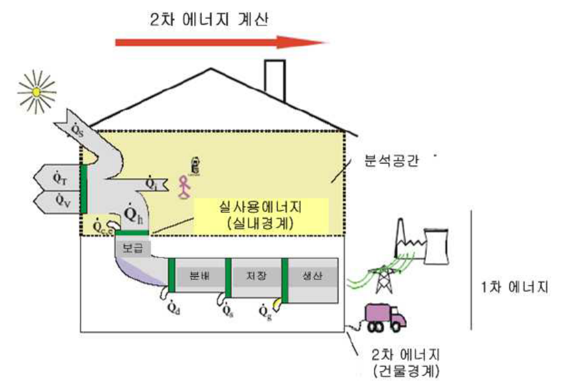
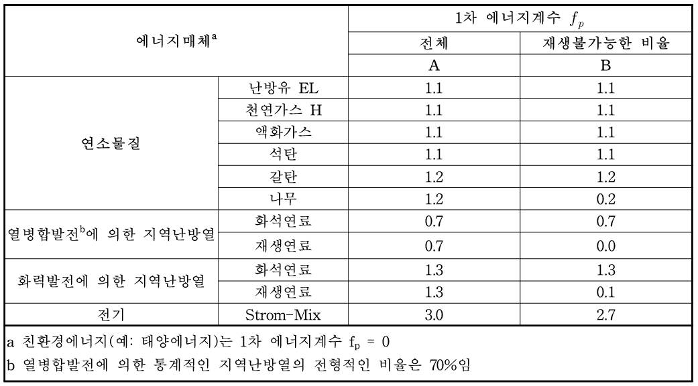
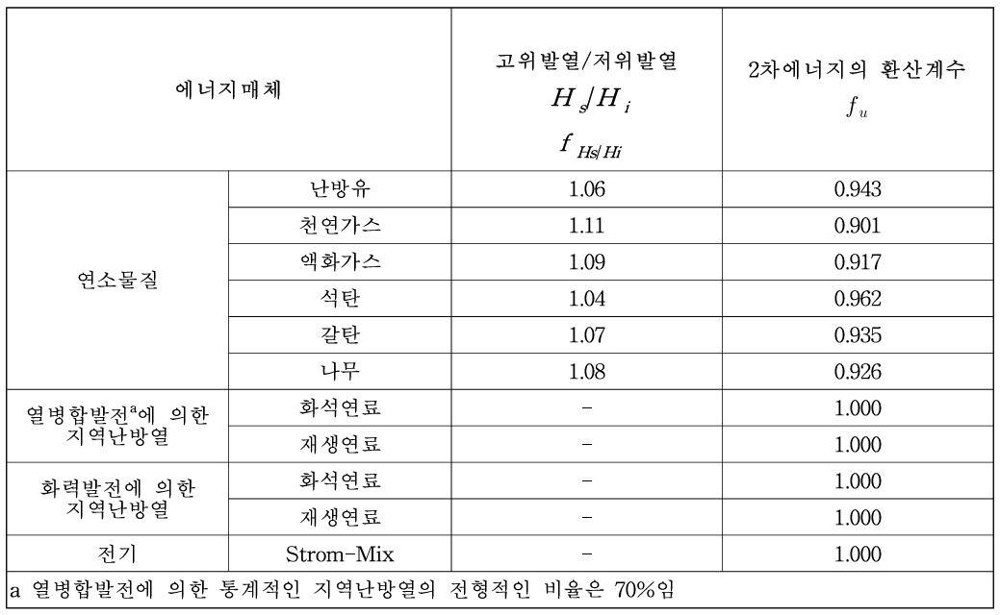

# 2.7. 1차에너지소요량 산정

1차에너지소요량을 구하기 위해서는, 이전 장들에서 계산된 각 설비 시스템(난방, 냉방, 공조, 급탕, 조명)의 **2차에너지소요량**이 먼저 산정되어야 합니다. 본 장에서는 이 2차에너지소요량을 최종적으로 1차에너지소요량으로 환산하는 과정을 다룹니다.

     
     
<strong>1차에너지 분석개요</strong>

---

## 2.7.1. 2차 에너지소요량 분석

### 2.7.1.1. 2차 에너지소요량

에너지소요량은 건물의 난방, 냉방, 급탕, 공조, 조명 기기를 운용하는 데 필요한 연간 총연료 및 전기에너지의 양을 의미합니다.

**- 조명 에너지소요량 (\(Q_{l,f}\))**: 1.4장의 조명 에너지요구량과 동일합니다.

**- 보조에너지에 필요한 에너지소요량 (\(Q_{f,aux}\))**: 냉난방, 급탕, 환기시스템 등의 운용(펌프, 팬, 제어 등)에 부가적으로 사용되는 모든 전력 에너지의 합으로 계산됩니다.

$$
Q_{f,\text{aux}} = Q_{h,\text{aux}} + Q_{c,\text{aux}} + Q_{V,\text{aux}} + Q_{h^*,\text{aux}} + Q_{c^*,\text{aux}} + Q_{m^*,\text{aux}} + Q_{w,\text{aux}} + Q_{l,\text{aux}}
$$

- \(Q_{h_aux}\) = 난방 시스템에 대한 보조에너지
- \(Q_{c,aux}\) = 냉방 시스템에 대한 보조에너지
- \(Q_{V,aux}\) = 송풍에 대한 보조에너지
- \(Q_{h*,aux}\) = 온풍난방에 대한 보조에너지
- \(Q_{c*,aux}\)  = 냉방공조에 대한 보조에너지
- \(Q_{m*,aux}\) = 가습공조에 대한 보조에너지
- \(Q_{w,aux}\) = 급탕 시스템에 대한 보조에너지
- \(Q_{l,aux}\) = 조명 시스템에 대한 보조에너지

**- 연료원에 따른 에너지소요량 (Q_f,j)**: 건물에 필요한 에너지소요량을 각 연료원(j)별로 분리하여 합산합니다.

$$
Q_{f,j} = Q_{h,j} + Q_{h^*,f,j} + Q_{c,f,j} + Q_{c^*,f,j} + Q_{m^*,f,j} + Q_{w,f,j} + Q_{l,f,j} + Q_{f,j,\text{aux}}
$$

- \(Q_{h,f,j}\) = 난방 시스템의 에너지소요량
- \(Q_{h*,f,j}\) = 난방공조 시스템의 에너지소요량
- \(Q_{c,f,j}\) = 냉방 시스템의 에너지소요량
- \(Q_{c*,f,j}\) = 냉방공조시스템의 에너지소요량
- \(Q_{m*,f,j}\) = 가습시스템의 에너지소요량
- \(Q_{w,f,j}\) = 급탕시스템의 에너지소요량
- \(Q_{l,f,j}\) = 조명시스템의 에너지소요량
- \(Q_{f,j,aux}\) = 보조에너지의 에너지소요량

### 2.7.1.2. 1차에너지소요량 평가
**- 1차에너지소요량 (\(Q_{p}\))**: 연료원별 에너지소요량(\(Q_{f,j}\))에 각 연료원의 1차 에너지 환산계수(\(f_{p,j}\))와 2차 에너지 환산계수(\(f_{u,j}\))를 곱하여 총합을 산출합니다. 모든 연소물질에 대한 1차에너지 평가는 발열량에 기인하기 때문에 1차에너지소요량은 2차에너지환산계수로 저위 발열량으로 환산되어야 합니다.

$$
Q_p = \sum_j \left( Q_{f,j} \cdot f_{p,j} \cdot f_{u,j} \right)
$$

**-가. 1차 에너지 환산계수 (\(f_{p}\))**: 2차에너지를 생산하는 데 필요한 총 1차에너지의 생산에 대한 복합적 요소들을 고려하는 계수입니다. 각 에너지원에 대한 계수는 아래 표를 참고합니다.

     
<strong>1차 에너지계수 \(f_{p}\)</strong>

     

     

**- 나. 2차 에너지 환산계수 (\(f_{u}\))**: 에너지소요량에 따라 연료원별로 에너지함량을 계산하기 위한 계수입니다. 각 에너지원에 대한 계수는 아래 표를 참고합니다.

     
<strong>2차 에너지계수</strong>

     

