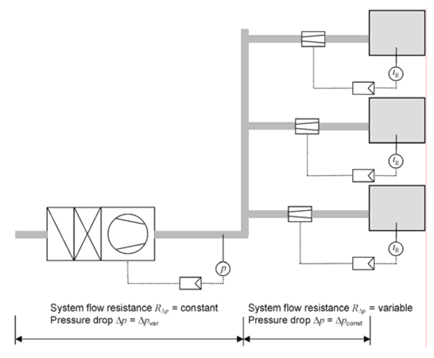

# 2.2. 송풍에 필요한 에너지소요량
## 2.2.1. 정풍량방식(CAV) 공조기
### 2.2.1.1. 팬의 소비전력 (\(P_{V}\))
제품 성능이 주어진 경우 그 값을 사용하고, 제품 성능이 없는 경우, 급/배기 풍량 (\(\dot{V}\)), 덕트망의 총 압력손실 (\(\Delta p^*\)), 그리고 시스템의 팬\( \cdot \)전달시스템\( \cdot \)모터 및 회전수제어 등에 대한 총 효율 (\(\eta\))로부터 계산합니다.   

- 급기 팬:   

$$P_{V,ZUL,m} = P_{V,ZUL,m} = \frac{ \dot{V}_{ZUL} \Delta p^*_{ZUL} } { \eta_{ZUL} }$$
   

- 배기 팬:

$$P_{V,ABL,m} = P_{V,ABL,m} = \frac{ \dot{V}_{ABL} \Delta p^*_{ABL} } { \eta_{ABL} }$$

- 급기와 배기 풍량이 5% 미만의 편차를 보일 경우, 아래와 같이 가정합니다:   

$$
\dot{V}_{ZUL} = \dot{V}_{ABL} = \dot{V}_{\mathrm{mech},m} = \dot{V}^*
$$

### 2.2.1.2. 월별 에너지소요량 (\(Q_{V,E,m}\))
급기 팬과 배기 팬의 소비전력 합에 월간 총 가동시간을 곱하여 산출합니다.   

$$
Q_{V,E,m} = (P_{V,ZUL,m} + P_{V,ABL,m}) \cdot t_{V,\mathrm{mech},m} \cdot d_{V,\mathrm{mech},m}
$$

   
## 2.2.2. 변풍량방식(VAV) 공조기
### 2.2.2.1. 계산 원리
변풍량방식시스템(VAV)은 각 존의 개별 댐퍼에 의해 풍량이 제어되고, 중앙의 급기와 배기 팬은 덕트망의 일정한 압력 하에서 회전수에 의해 제어됩니다. 변풍량방식시스템(VAV)은 덕트망에서 압력센서가 위치하는 지점을 기준으로 아래와 같이 두 부분으로 나뉩니다.   

- 센서 전단: 기기저항 \( R_{\Delta p} = \text{constant} \) 내지 압력손실 \( \Delta p = \text{variable} \) (압력센서 전단의 기기저항은 항상 일정하게 유지됩니다. 후반부의 압력을 일정하게 유지하려면 센서 전단의 압력을 조절하여야 합니다.)   
- 센서 후단: 기기저항 \( R_{\Delta p} = \text{variable} \) 내지 압력손실 \( \Delta p = \text{constant} \) (압력센서 후단의 압력은 항상 일정하게 유지됩니다. 만약 댐퍼를 닫으면 기기저항이 증가하고, 센서 후단 덕트 내부의 압력은 일정하므로 압력저항에 해당하는 만큼 풍량이 줄어듭니다.)

     
     
<strong>환기 덕트망의 고정 및 변동 저항</strong>

### 2.2.2.2. 부분부하 풍량에 대한 팬의 소비전력 (\(P_{V}\)): 
정압손실 부분(식의 첫째 항)과 변압손실 부분(식의 둘째 항)의 합으로 계산됩니다.   

- 급기 팬:   

$$P_{V,ZUL} =
\frac{ \dot{V}_{ZUL} \Delta p^*_{ZUL} f_{p,ZUL} }{ \eta_{ZUL} } +
\frac{ \dot{V}_{ZUL}^3 \Delta p^*_{ZUL} (1 - f_{p,ZUL}) }{ \eta_{ZUL} \, \dot{V}_{ZUL}^{*2} }
$$

- 배기 팬:   

$$P_{V,ABL} =
\frac{ \dot{V}_{ABL} \Delta p^*_{ABL} f_{p,ABL} }{ \eta_{ABL} } +
\frac{ \dot{V}_{ABL}^3 \Delta p^*_{ABL} (1 - f_{p,ABL}) }{ \eta_{ABL} \, \dot{V}_{ABL}^{*2} }
$$

- 압력상관비계수:   

$$
f_{p} = \frac{\Delta p_{\mathrm{konst}}}{\Delta p^{*}}
$$

   

  

    <!-- Where 텍스트: 독립적, 굵고 이탤릭 -->
    

      Where,
    

    <!-- 수식 설명들: 왼쪽 정렬, Pretendard 유지 -->
    \( \Delta p_{\mathrm{konst}} \) : 덕트망의 각 부분에서 고정 압력손실
  

   

### 2.2.2.3. 시간과 용도에 따른 변풍량방식 공조기
풍량이 하루 중 특정 시간이나 건물의 사용에 따라 제어되고, 이러한 제어가 규칙적 또는 연중 균일하게 분포되어 있을 경우, 2.1.3처럼 부분부하 상태의 빈도를 알아야 합니다. 팬의 송풍 동력에 필요한 월별 에너지소요량은 월별 모든 부분부하 상태 \(j\)에서 전력 소비와 운전 시간을 곱한 값입니다.   

- 월별 에너지소요량 (\(Q_{V,E,m}\)): 월별 모든 부분부하 상태 (\(j\))에서의 전력 소비와 해당 운전 시간을 곱한 값의 총합으로 계산합니다.   

$$
Q_{V,E,m} = \sum_{j} t_{V,\mathrm{mech},j,m} \cdot \left( P_{V,ZUL,j} + P_{V,ABL,j} \right)
$$

   

### 2.2.2.4. 실내 냉방부하에 따른 변풍량방식 공조기
풍량 제어가 평가 대상인 존 또는 공간의 냉방 부하에 따르는 경우, 시간당 부분부하 풍량의 분포는 건물 사용과 외기 조건에 의한 함수입니다. 부분부하 급기풍량의 빈도 분포는 해당 공간 또는 존의 월별 최대 냉방부하를 이용하여 총 에너지 밸런스 계산을 통해 산정해야 합니다.
- 월별 에너지소요량 (\(Q_{V,E,m}\)): 급기 팬과 배기 팬의 에너지소요량 합으로 계산합니다.   

$$
Q_{V,E,m} = Q_{V,E,ZUL,m} + Q_{V,E,ABL,m}$$

- 급기 팬 에너지소요량 (\(Q_{V,E,ZUL,m}\)):   

$$Q_{V,E,ZUL,m} = \left( \frac{\Delta p^{*}_{ZUL} \cdot f_{p,ZUL}}{\eta_{ZUL}} \right) \cdot \sum_{m} \dot{V}_{ZUL} + \left( \frac{\Delta p^{*}_{ZUL} \cdot (1 - f_{p,ZUL})}{\eta_{ZUL} \cdot \dot{V}_{ZUL}^{*2}} \right) \cdot \sum_{m} \dot{V}_{ZUL}^3   $$

- 배기 팬 에너지소요량 (\(Q_{V,E,ABL,m}\)):   

$$Q_{V,E,ABL,m} = \left( \frac{\Delta p^{*}_{ABL} \cdot f_{p,ABL}}{\eta_{ABL}} \right) \cdot \sum_{m} \dot{V}_{ABL} + \left( \frac{\Delta p^{*}_{ABL} \cdot (1 - f_{p,ABL})}{\eta_{ABL} \cdot \dot{V}_{ABL}^{*2}} \right) \cdot \sum_{m} \dot{V}_{ABL}^3   $$

한편 \(\sum_{m} \dot{V}^3\)의 근사값은 아래 식으로 구할 수 있습니다:   

$$ 
\sum_{m} \dot{V}^3 = \sum_{m} \dot{V} \cdot \left( 0.8 \cdot \dot{V}_{\mathrm{mech},m} + 0.2 \cdot \dot{V}_{\mathrm{mech},\max,m} \right)^2 
$$

