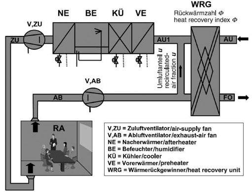

# 2.3. 가열, 냉각, 가습, 제습을 위한 에너지요구량
## 2.3.1. 공조처리
공조처리에 필요한 에너지와 물질의 양을 계산하는 방식은 그림 2.3-1 와 같이 3 단계로 구분됩니다.

     
     
<strong>공조처리에 필요한 요구량의 계산 절차</strong>

 

- 1단계: 습공기선도 (h-x diagram) 조닝
    - 동일한 기기(예열, 냉각, 가습, 재열)에 의해 비슷한 공기상태변화를 보이는 습공기선도 존이 분류됩니다. 습공기선도 존의 수와 모양은 가동모드와 공조시스템 구성기기에 영향을 받습니다. 습공기선도 존의 위치와 크기는 용도 즉, 풍량과 시스템 설계(예: 공기의 질량유량)에 따라 정해집니다. 습공기선도 존의 경계라인은 보조계산에 따라 정해집니다.   

- 2단계: 기상데이터분석
    - 기상데이터분석에 따라 해당하는 각 습공기선도 존에 대해 평균 외기 조건과 연간 시간을 구할 수 있습니다.   

- 3단계: 공조처리에 필요한 요구량 계산
    - 주어진 값에 따라 각 시스템구성기기의 에너지와 유량 요구량을 산정합니다.   
    - 기본적인 계산의 방향은 2.3-2의 대표적인 사례에 근접하여 해석됩니다. 공조처리과정에서 누기가 없다는 전제하에서 \(dot{m}_{1,L} = dot{m}_{12,L}\) 이 성립합니다. 여기에 또한 시스템과 가동모드에 대한 전제조건이 설정됩니다.   

     
     
<strong>CAV 시스템의 개요</strong>

 

그림 2.3-2는  CAV 시스템에 대한 개요를 나타내고 있습니다. 열 회수율 \(\Phi\) 와 리턴 공기 혼합비율 \(u\)는 상수이며, 설계치로 주어집니다. 이외 다음의 조건들이 성립됩니다.   
- 가습기나 열회수기의 펌프와 같은 보조구성요소의 소비전력량은 설정되지 않습니다.   
- 단열가습기는 가습률 100%로 가동됩니다.   
- 팬은 온도상승을 유발하지 않습니다.   

그림 2.3-3은 AU1(열회수 및 리턴공기 혼합 후의 공기상태)의 상태변화를 습공기선도에서 예시적으로 나타낸 것입니다.

     
     
<strong>AU1(열회수 및 리턴공기 혼합 후의 공기상태)의 상태변화</strong>

### 1단계: 습공기선도 (h-x diagram) 조닝
### 2단계: 기상데이터분석
### 3단계: 공조처리에 필요한 요구량 계산