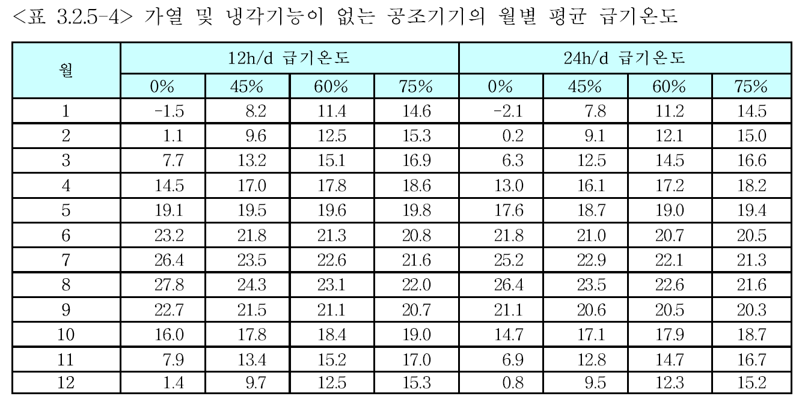

# 1. 분석치의 연계   

## Nomenclature

### Symbols
<table class="nomenclature">
  <thead style="background:#f5f7fa;">
    <tr><th>Symbol</th><th>Description</th><th>Unit</th></tr>
  </thead>
  <tbody>
    <tr><td>\(c_{p,L}\)</td><td>공기 비열 (Specific heat of air)</td><td>kJ/kg·K</td></tr>
    <tr><td>d</td><td>일수 (Days)</td><td>d</td></tr>
    <tr><td>\(f_p\)</td><td>압력상관비계수 (Pressure ratio factor)</td><td>-</td></tr>
    <tr><td>h</td><td>엔탈피 (Enthalpy)</td><td>kJ/kg</td></tr>
    <tr><td>P</td><td>(팬) 소비전력 (Power consumption)</td><td>W</td></tr>
    <tr><td>p</td><td>압력 (Pressure)</td><td>Pa</td></tr>
    <tr><td>\(p_{S}\)</td><td>포화증기압 (Saturation vapor pressure)</td><td>Pa</td></tr>
    <tr><td>Q</td><td>에너지 (Energy)</td><td>kWh</td></tr>
    <tr><td>q</td><td>환산된 에너지요구량 (Calculated energy need per volume)</td><td>kWh/(m³/h)</td></tr>
    <tr><td>R</td><td>기기저항 (Flow resistance)</td><td>-</td></tr>
    <tr><td>t</td><td>시간 (Time)</td><td>h</td></tr>
    <tr><td>u</td><td>리턴공기 혼합비율 (Recirculated-air fraction)</td><td>-</td></tr>
    <tr><td>x</td><td>절대습도 (Humidity ratio)</td><td>g/kg</td></tr>
    <tr><td>\(\Delta\)</td><td>차이 (Difference)</td><td>-</td></tr>
    <tr><td>\(\dot{m}\)</td><td>질량유량 (Mass flow rate)</td><td>kg/s</td></tr>
    <tr><td>\(\dot{Q}\)</td><td>성능, 부하, 출력 (Power, Load, Output)</td><td>kW</td></tr>
    <tr><td>\(\dot{V}\)</td><td>풍량 (Volume flow rate)</td><td>m³/h</td></tr>
    <tr><td>\(\eta\)</td><td>(시스템) 총 효율 (Total efficiency)</td><td>-</td></tr>
    <tr><td>\(\Phi\)</td><td>열회수율 (Heat recovery rate)</td><td>-</td></tr>
    <tr><td>\(\rho_L\)</td><td>공기 밀도 (Density of air)</td><td>kg/m³</td></tr>
    <tr><td>\(\Phi_{WRG}\)</td><td>열회수율 (Heat recovery index)</td><td>-</td></tr>
    <tr><td>\(\vartheta\)</td><td>온도 (Temperature)</td><td>°C</td></tr>
  </tbody>
</table>

### Subscripts
<table class="nomenclature">
  <thead style="background:#f5f7fa;">
    <tr><th>Subscript</th><th>Description</th><th>Subscript</th><th>Description</th></tr>
  </thead>
  <tbody>
    <tr><td>*</td><td>설계 조건 (Design point)</td><td>AB, ABL</td><td>배기 (Exhaust air)</td></tr>
    <tr><td>AU, AUL</td><td>외기 (Outdoor air)</td><td>b</td><td>요구량 (Energy need)</td></tr>
    <tr><td>B</td><td>(가습) (Humidifying)</td><td>c</td><td>냉방 (Cooling)</td></tr>
    <tr><td>C</td><td>냉열 (Cooling)</td><td>E</td><td>(전기) 에너지 (Electrical energy)</td></tr>
    <tr><td>g</td><td>(조닝) 경계 (Boundary for zoning)</td><td>H</td><td>가열 (Heating)</td></tr>
    <tr><td>i</td><td>실내 (Indoor)</td><td>j</td><td>부분부하 상태 (Partial load state)</td></tr>
    <tr><td>konst</td><td>고정 (Constant)</td><td>L</td><td>공기 (Air)</td></tr>
    <tr><td>m</td><td>월별 (Monthly)</td><td>max</td><td>최대 (Maximum)</td></tr>
    <tr><td>mech</td><td>기계환기 (Mechanical ventilation)</td><td>o</td><td>상위 (Upper)</td></tr>
    <tr><td>op</td><td>주중 (Weekday / Operation)</td><td>RA</td><td>실내공기 (Room air)</td></tr>
    <tr><td>So</td><td>여름 (Summer)</td><td>soll</td><td>설정 (Setpoint)</td></tr>
    <tr><td>st</td><td>증기 (Steam, humidification)</td><td>t</td><td>(엔탈피 임계값, 온도 기반) (Temperature-based)</td></tr>
    <tr><td>u</td><td>하위경계 (Lower bound)</td><td>V</td><td>환기, 송풍 (Ventilation, Fan)</td></tr>
    <tr><td>W</td><td>수증기 (Water vapor)</td><td>we</td><td>주말 (Weekend)</td></tr>
    <tr><td>Wi</td><td>겨울 (Winter)</td><td>WRG</td><td>열회수기 (Heat recovery unit)</td></tr>
    <tr><td>x</td><td>(엔탈피 임계값, 습도 기반) (Humidity-based)</td><td>ZU, ZUL</td><td>급기 (Supply air)</td></tr>
  </tbody>
</table>

---

## 1.1. 일반사항   
존의 난방 및 냉방에너지 요구량을 분석하기 위해서는 다음의 값들이 사전에 결정되어야 합니다.

- 분석-급기풍량 (\( \dot{V}_{mech,b,m}\)): 실내 냉난방 부하와 무관하게 결정되는 기준 풍량
- 분석-급기온도 (\(\vartheta_{mech,m}\)): 월별 평균 급기 온도
- 월간 공조기기 가동시간: 일일 가동시간 (\(t_{V,mech,m}\))과 월간 가동일수 (\(d_{V,mech,m}\))를 통해 산정
    - 주중의 경우, \(d_{V,mech,m}\) = \(d_{op}\)
    - 주말, 휴일의 경우, \(d_{V,mech,m}\) = \(d_{we}\)

공조처리(가열, 냉각, 가습, 제습)에 필요한 에너지 요구량을 계산하기 위해서는 월별 평균 급기풍량 (\( \dot{V}_{mech,m}\))이 주어져야 합니다.   

## 1.2. 정풍량방식(CAV) 공조기의 급기풍량   
급기풍량은 실내 열 부하가 아닌 실내 공기질 요구 조건에 의해 결정됩니다. 따라서 풍량은 계산 기간 동안 일정합니다.   

- 월별 평균 급기풍량 (\( \dot{V}_{mech,m}\)): 정풍량 방식에서는 분석-급기풍량과 동일하며, 설계 풍량 (\( \dot{V}^*\)) 값을 따릅니다.   

$$
 \dot{V}_{mech,b,m} = \dot{V}_{mech,m} = \dot{V}^*$$ 
 (1.2-1)

  

  <!-- 수식 설명들: 왼쪽 정렬, Pretendard 유지 -->
\( \dot{V}_{\mathrm{mech},b,m} \) : 월별 기준 급기풍량 (DIN V 18599-2에 정의됨) [단위 m³/h]
\( \dot{V}_{\mathrm{mech},m} \) : 열공조 에너지 요구량 산정 시 사용되는 월평균 급기풍량 [단위 m³/h]
\( \dot{V}^{\ast} \) : 설계 급기풍량 [단위 m³/h]

## 1.3. 시간 및 용도 기반 변풍량방식(VAV) 공조기의 급기풍량
실내공기질 유지, 스케줄, 실험실 배기 등 시간이나 용도에 따라 풍량이 변하는 경우, 월별 평균 급기풍량은 부분부하 비율 및 부분부하 운전 시간에 따라 산정됩니다.    아래에서 \(j\)는 부분부하 운전(시간별 풍량이 다른)을 나타내며, 월별 공조기의 운전시간에 따른 부분부하일 경우, 월별 운전시간의 비율에 의해 급기풍량이 정해집니다.   

$$
 \dot{V}_{mech,b,m}=\dot{V}_{mech,m}=\frac{\sum_{j} \left( \dot{V}_{j} \cdot t_{V,\mathrm{mech},j,m} \right)}{t_{V,\mathrm{mech},m} \cdot d_{V,\mathrm{mech},m}}$$
 (1.3-1)

  

    <!-- Where 텍스트: 독립적, 굵고 이탤릭 -->
    

      Where,
    

    <!-- 수식 설명들: 왼쪽 정렬, Pretendard 유지 -->
     \( \dot{V}_{j} \)
  : 부분부하 운전 \(j\)에서의 급기풍량
    \( t_{V,\mathrm{mech},j,m} \) : 부분부하 운전 \(j\)에서의 월별 운전시간
    \( t_{V,\mathrm{mech},m} \) : 일일 운전시간 
    \( d_{V,\mathrm{mech},m} \) : 월별 시스템 운전 일수
  

## 1.4. 실내 냉방부하 기반 변풍량방식(VAV) 공조기의 급기풍량
실내 냉방 부하에 따라 풍량이 변하는 변풍량 공조기의 경우, 월별 평균 급기풍량은 실내 공기질 유지를 위한 최소 급기풍량과 냉방 부하를 처리하기 위한 추가 풍량을 더하여 산정합니다.   

- 월별 평균 급기풍량 (\(\dot{V}_{\mathrm{mech},m}\)):   

$$
\dot{V}_{\mathrm{mech},m} =
\dot{V}_{\mathrm{mech},b,m} +
\frac{
Q_{C,b}
}{
t_{V,\mathrm{mech},m} \,
d_{V,\mathrm{mech},m} \,
c_{p,L} \,
\rho_{L} \,
\left( \vartheta_{i,c,m} - \vartheta_{V,\mathrm{mech},m} \right)
}
$$
(1.4-2)

또는   

- 월별 송풍된 급기풍량 \( \sum_{m} \dot{V}\):   

$$
 \sum_{m} \dot{V} = t_{V,\mathrm{mech},m} \cdot d_{V,\mathrm{mech},m} \cdot \dot{V}_{\mathrm{mech},b,m} + \frac{Q_{c,b}}{c_{p,L} \cdot \rho_{L} \cdot\left( \vartheta_{i,c,m} - \vartheta_{V,\mathrm{mech},m} \right)}$$
 (1.4-2)

   

- 최대급기풍량 (\(\dot{V}_{\mathrm{mech},\max,m}\)): 월별 최대 냉방 부하(\(\dot{Q}_{c,max,m}\))를 처리하기 위해 필요한 풍량으로, 송풍 에너지 계산에 사용됩니다.   

$$
 \dot{V}_{\mathrm{mech},\max,m} = \frac{\dot{Q}_{c,\max,m}}{c_{p,L} \cdot \rho_{L} \cdot (\vartheta_{i,c,m} - \vartheta_{V,\mathrm{mech},m})}$$
 (1.4-3)

   

  

    <!-- Where 텍스트: 독립적, 굵고 이탤릭 -->
    

      Where,
    

    <!-- 수식 설명들: 왼쪽 정렬, Pretendard 유지 -->
    \( \vartheta_{i,c,m} \) : 냉방에너지 요구량 분석 - 실내온도
    \( \vartheta_{V,\mathrm{mech},m} \) : 대표 월에서 공조기기의 평균 급기온도
  

   

- \(\vartheta_{i,c}\):   

  $$\vartheta_{i,c} = \vartheta_{i,c,soil} - 2$$
  (1.4-4)

 
 
 

## 1.5. 월별 평균 급기온도
월별 평균 급기온도 (\(\vartheta_{V,\mathrm{mech},m}\))는 건물 또는 존의 냉방 또는 난방에너지요구량을 분석하는데 필요한 입력 값입니다.   

- 가열 및 냉각 기능이 있는 공조기: 급기 요구 온도와 월별 평균 급기 온도가 일치하며, 존의 에너지요구량 분석에서 산정된 설계 표준값을 적용합니다.   
- 냉각 기능이 없는 공조기: 팬이나 열회수 시스템의 영향으로 급기 온도가 변하며, <표 3.2.5-3>을 참조합니다.   
- 가열 및 냉각 기능이 없는 공조기: <표 3.2.5-4>를 참조합니다.   
- 가동시간이 12h/d 와 24h/d 사이일 경우 선형 보간하여 급기온도를 산정하고 \(12h/d\) 이하일 경우 \(12h/d\)에 해당하는 값을 적용합니다.   

<strong>Table 1.5-1. 냉각기능이 없는 공조기기의 월별 평균 급기온도</strong>

     

<!-- 캡션 삽입하고 싶으면 
<strong>냉각기능이 없는 공조기기의 월별 평균 급기온도</strong>
를 그림 위나 아래에 삽입한다-->

<strong>Table 1.5-2. 가열 및 냉각기능이 없는 공조기기의 월별 평균 급기온도</strong>

     

 
