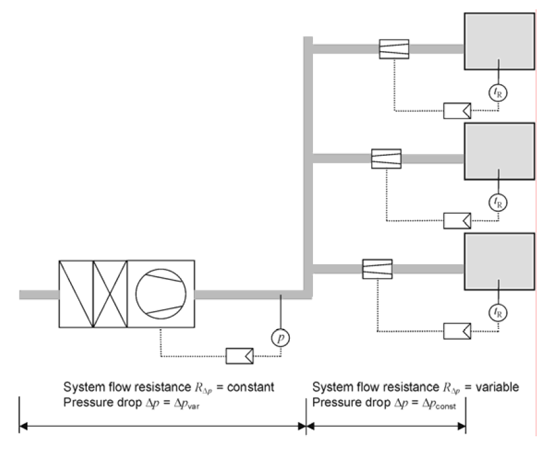
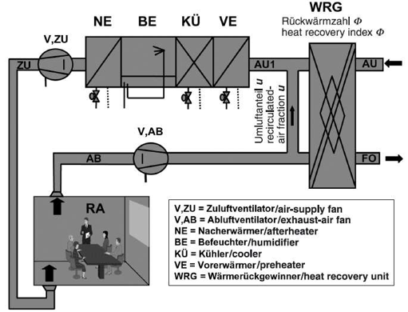
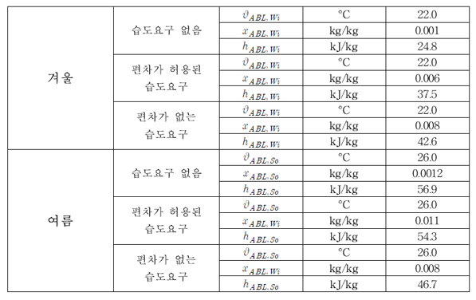

# 1. 분석치의 연계   

## Nomenclature

### Symbols
<table class="nomenclature">
  <thead style="background:#f5f7fa;">
    <tr><th>Symbol</th><th>Description</th><th>Unit</th></tr>
  </thead>
  <tbody>
    <tr><td>\(c_{p,L}\)</td><td>공기 비열 (Specific heat of air)</td><td>kJ/kg·K</td></tr>
    <tr><td>d</td><td>일수 (Days)</td><td>d</td></tr>
    <tr><td>\(f_p\)</td><td>압력상관비계수 (Pressure ratio factor)</td><td>-</td></tr>
    <tr><td>h</td><td>엔탈피 (Enthalpy)</td><td>kJ/kg</td></tr>
    <tr><td>P</td><td>(팬) 소비전력 (Power consumption)</td><td>W</td></tr>
    <tr><td>p</td><td>압력 (Pressure)</td><td>Pa</td></tr>
    <tr><td>\(p_{S}\)</td><td>포화증기압 (Saturation vapor pressure)</td><td>Pa</td></tr>
    <tr><td>Q</td><td>에너지 (Energy)</td><td>kWh</td></tr>
    <tr><td>q</td><td>환산된 에너지요구량 (Calculated energy need per volume)</td><td>kWh/(m³/h)</td></tr>
    <tr><td>R</td><td>기기저항 (Flow resistance)</td><td>-</td></tr>
    <tr><td>t</td><td>시간 (Time)</td><td>h</td></tr>
    <tr><td>u</td><td>리턴공기 혼합비율 (Recirculated-air fraction)</td><td>-</td></tr>
    <tr><td>x</td><td>절대습도 (Humidity ratio)</td><td>g/kg</td></tr>
    <tr><td>\(\Delta\)</td><td>차이 (Difference)</td><td>-</td></tr>
    <tr><td>\(\dot{m}\)</td><td>질량유량 (Mass flow rate)</td><td>kg/s</td></tr>
    <tr><td>\(\dot{Q}\)</td><td>성능, 부하, 출력 (Power, Load, Output)</td><td>kW</td></tr>
    <tr><td>\(\dot{V}\)</td><td>풍량 (Volume flow rate)</td><td>m³/h</td></tr>
    <tr><td>\(\eta\)</td><td>(시스템) 총 효율 (Total efficiency)</td><td>-</td></tr>
    <tr><td>\(\Phi\)</td><td>열회수율 (Heat recovery rate)</td><td>-</td></tr>
    <tr><td>\(\rho_L\)</td><td>공기 밀도 (Density of air)</td><td>kg/m³</td></tr>
    <tr><td>\(\Phi_{WRG}\)</td><td>열회수율 (Heat recovery index)</td><td>-</td></tr>
    <tr><td>\(\vartheta\)</td><td>온도 (Temperature)</td><td>°C</td></tr>
  </tbody>
</table>

### Subscripts
<table class="nomenclature">
  <thead style="background:#f5f7fa;">
    <tr><th>Subscript</th><th>Description</th><th>Subscript</th><th>Description</th></tr>
  </thead>
  <tbody>
    <tr><td>*</td><td>설계 조건 (Design point)</td><td>AB, ABL</td><td>배기 (Exhaust air)</td></tr>
    <tr><td>AU, AUL</td><td>외기 (Outdoor air)</td><td>b</td><td>요구량 (Energy need)</td></tr>
    <tr><td>B</td><td>(가습) (Humidifying)</td><td>c</td><td>냉방 (Cooling)</td></tr>
    <tr><td>C</td><td>냉열 (Cooling)</td><td>E</td><td>(전기) 에너지 (Electrical energy)</td></tr>
    <tr><td>g</td><td>(조닝) 경계 (Boundary for zoning)</td><td>H</td><td>가열 (Heating)</td></tr>
    <tr><td>i</td><td>실내 (Indoor)</td><td>j</td><td>부분부하 상태 (Partial load state)</td></tr>
    <tr><td>konst</td><td>고정 (Constant)</td><td>L</td><td>공기 (Air)</td></tr>
    <tr><td>m</td><td>월별 (Monthly)</td><td>max</td><td>최대 (Maximum)</td></tr>
    <tr><td>mech</td><td>기계환기 (Mechanical ventilation)</td><td>o</td><td>상위 (Upper)</td></tr>
    <tr><td>op</td><td>주중 (Weekday / Operation)</td><td>RA</td><td>실내공기 (Room air)</td></tr>
    <tr><td>So</td><td>여름 (Summer)</td><td>soll</td><td>설정 (Setpoint)</td></tr>
    <tr><td>st</td><td>증기 (Steam, humidification)</td><td>t</td><td>(엔탈피 임계값, 온도 기반) (Temperature-based)</td></tr>
    <tr><td>u</td><td>하위경계 (Lower bound)</td><td>V</td><td>환기, 송풍 (Ventilation, Fan)</td></tr>
    <tr><td>W</td><td>수증기 (Water vapor)</td><td>we</td><td>주말 (Weekend)</td></tr>
    <tr><td>Wi</td><td>겨울 (Winter)</td><td>WRG</td><td>열회수기 (Heat recovery unit)</td></tr>
    <tr><td>x</td><td>(엔탈피 임계값, 습도 기반) (Humidity-based)</td><td>ZU, ZUL</td><td>급기 (Supply air)</td></tr>
  </tbody>
</table>

---

## 1.1. 일반사항   
존의 난방 및 냉방에너지 요구량을 분석하기 위해서는 다음의 값들이 사전에 결정되어야 합니다.

- 분석-급기풍량 (\( \dot{V}_{mech,b,m}\)): 실내 냉난방 부하와 무관하게 결정되는 기준 풍량
- 분석-급기온도 (\(\vartheta_{mech,m}\)): 월별 평균 급기 온도
- 월간 공조기기 가동시간: 일일 가동시간 (\(t_{V,mech,m}\))과 월간 가동일수 (\(d_{V,mech,m}\))를 통해 산정
    - 주중의 경우, \(d_{V,mech,m}\) = \(d_{op}\)
    - 주말, 휴일의 경우, \(d_{V,mech,m}\) = \(d_{we}\)

공조처리(가열, 냉각, 가습, 제습)에 필요한 에너지 요구량을 계산하기 위해서는 월별 평균 급기풍량 (\( \dot{V}_{mech,m}\))이 주어져야 합니다.   

## 1.2. 정풍량방식(CAV) 공조기의 급기풍량   
급기풍량은 실내 열 부하가 아닌 실내 공기질 요구 조건에 의해 결정됩니다. 따라서 풍량은 계산 기간 동안 일정합니다.   

- 월별 평균 급기풍량 (\( \dot{V}_{mech,m}\)): 정풍량 방식에서는 분석-급기풍량과 동일하며, 설계 풍량 (\( \dot{V}^*\)) 값을 따릅니다.   

$$
 \dot{V}_{mech,b,m} = \dot{V}_{mech,m} = \dot{V}^*$$ 
 (1.2-1)

  

  <!-- 수식 설명들: 왼쪽 정렬, Pretendard 유지 -->
\( \dot{V}_{\mathrm{mech},b,m} \) : 월별 기준 급기풍량 (DIN V 18599-2에 정의됨) [단위 m³/h]
\( \dot{V}_{\mathrm{mech},m} \) : 열공조 에너지 요구량 산정 시 사용되는 월평균 급기풍량 [단위 m³/h]
\( \dot{V}^{\ast} \) : 설계 급기풍량 [단위 m³/h]

## 1.3. 시간 및 용도 기반 변풍량방식(VAV) 공조기의 급기풍량
실내공기질 유지, 스케줄, 실험실 배기 등 시간이나 용도에 따라 풍량이 변하는 경우, 월별 평균 급기풍량은 부분부하 비율 및 부분부하 운전 시간에 따라 산정됩니다.    아래에서 \(j\)는 부분부하 운전(시간별 풍량이 다른)을 나타내며, 월별 공조기의 운전시간에 따른 부분부하일 경우, 월별 운전시간의 비율에 의해 급기풍량이 정해집니다.   

$$
 \dot{V}_{mech,b,m}=\dot{V}_{mech,m}=\frac{\sum_{j} \left( \dot{V}_{j} \cdot t_{V,\mathrm{mech},j,m} \right)}{t_{V,\mathrm{mech},m} \cdot d_{V,\mathrm{mech},m}}$$
 (1.3-1)

  

    <!-- Where 텍스트: 독립적, 굵고 이탤릭 -->
    

      Where,
    

    <!-- 수식 설명들: 왼쪽 정렬, Pretendard 유지 -->
     \( \dot{V}_{j} \)
  : 부분부하 운전 \(j\)에서의 급기풍량
    \( t_{V,\mathrm{mech},j,m} \) : 부분부하 운전 \(j\)에서의 월별 운전시간
    \( t_{V,\mathrm{mech},m} \) : 일일 운전시간 
    \( d_{V,\mathrm{mech},m} \) : 월별 시스템 운전 일수
  

## 1.4. 실내 냉방부하 기반 변풍량방식(VAV) 공조기의 급기풍량
실내 냉방 부하에 따라 풍량이 변하는 변풍량 공조기의 경우, 월별 평균 급기풍량은 실내 공기질 유지를 위한 최소 급기풍량과 냉방 부하를 처리하기 위한 추가 풍량을 더하여 산정합니다.   

- 월별 평균 급기풍량 (\(\dot{V}_{\mathrm{mech},m}\)):   

$$
\dot{V}_{\mathrm{mech},m} =
\dot{V}_{\mathrm{mech},b,m} +
\frac{
Q_{C,b}
}{
t_{V,\mathrm{mech},m} \,
d_{V,\mathrm{mech},m} \,
c_{p,L} \,
\rho_{L} \,
\left( \vartheta_{i,c,m} - \vartheta_{V,\mathrm{mech},m} \right)
}
$$
(1.4-2)

또는   

- 월별 송풍된 급기풍량 \( \sum_{m} \dot{V}\):   

$$
 \sum_{m} \dot{V} = t_{V,\mathrm{mech},m} \cdot d_{V,\mathrm{mech},m} \cdot \dot{V}_{\mathrm{mech},b,m} + \frac{Q_{c,b}}{c_{p,L} \cdot \rho_{L} \cdot\left( \vartheta_{i,c,m} - \vartheta_{V,\mathrm{mech},m} \right)}$$
 (1.4-2)

   

- 최대급기풍량 (\(\dot{V}_{\mathrm{mech},\max,m}\)): 월별 최대 냉방 부하(\(\dot{Q}_{c,max,m}\))를 처리하기 위해 필요한 풍량으로, 송풍 에너지 계산에 사용됩니다.   

$$
 \dot{V}_{\mathrm{mech},\max,m} = \frac{\dot{Q}_{c,\max,m}}{c_{p,L} \cdot \rho_{L} \cdot (\vartheta_{i,c,m} - \vartheta_{V,\mathrm{mech},m})}$$
 (1.4-3)

   

  

    <!-- Where 텍스트: 독립적, 굵고 이탤릭 -->
    

      Where,
    

    <!-- 수식 설명들: 왼쪽 정렬, Pretendard 유지 -->
    \( \vartheta_{i,c,m} \) : 냉방에너지 요구량 분석 - 실내온도
    \( \vartheta_{V,\mathrm{mech},m} \) : 대표 월에서 공조기기의 평균 급기온도
  

   

- \(\vartheta_{i,c}\):   

  $$\vartheta_{i,c} = \vartheta_{i,c,soil} - 2$$
  (1.4-4)

 
 
 

## 1.5. 월별 평균 급기온도
월별 평균 급기온도 (\(\vartheta_{V,\mathrm{mech},m}\))는 건물 또는 존의 냉방 또는 난방에너지요구량을 분석하는데 필요한 입력 값입니다.   

- 가열 및 냉각 기능이 있는 공조기: 급기 요구 온도와 월별 평균 급기 온도가 일치하며, 존의 에너지요구량 분석에서 산정된 설계 표준값을 적용합니다.   
- 냉각 기능이 없는 공조기: 팬이나 열회수 시스템의 영향으로 급기 온도가 변하며, <표 3.2.5-3>을 참조합니다.   
- 가열 및 냉각 기능이 없는 공조기: <표 3.2.5-4>를 참조합니다.   
- 가동시간이 12h/d 와 24h/d 사이일 경우 선형 보간하여 급기온도를 산정하고 \(12h/d\) 이하일 경우 \(12h/d\)에 해당하는 값을 적용합니다.   

<strong>Table 1.5-1. 냉각기능이 없는 공조기기의 월별 평균 급기온도</strong>

     

<!-- 캡션 삽입하고 싶으면 
<strong>냉각기능이 없는 공조기기의 월별 평균 급기온도</strong>
를 그림 위나 아래에 삽입한다-->

<strong>Table 1.5-2. 가열 및 냉각기능이 없는 공조기기의 월별 평균 급기온도</strong>

     

---

# 2. 송풍에 필요한 에너지소요량
## 2.1. 정풍량방식(CAV) 공조기
### 2.1.1. 팬의 소비전력 (\(P_{V}\))
제품 성능이 주어진 경우 그 값을 사용하고, 제품 성능이 없는 경우, 급/배기 풍량 (\(\dot{V}\)), 덕트망의 총 압력손실 (\(\Delta p^*\)), 그리고 시스템의 팬\( \cdot \)전달시스템\( \cdot \)모터 및 회전수제어 등에 대한 총 효율 (\(\eta\))로부터 계산합니다.   

- 급기 팬:   

$$P_{V,ZUL,m} = \frac{ \dot{V}_{ZUL} \Delta p^*_{ZUL} } { \eta_{ZUL} }$$
(2.1.1-1)

   

- 배기 팬:

$$P_{V,ABL,m} = \frac{ \dot{V}_{ABL} \Delta p^*_{ABL} } { \eta_{ABL} }$$
(2.1.1-2)

- 급기와 배기 풍량이 5% 미만의 편차를 보일 경우, 아래와 같이 가정합니다:   

$$
\dot{V}_{ZUL} = \dot{V}_{ABL} = \dot{V}_{\mathrm{mech},m} = \dot{V}^*$$
(2.1.1-3)

### 2.1.2. 송풍 월별 에너지소요량 (\(Q_{V,E,m}\))
급기 팬과 배기 팬의 소비전력 합에 월간 총 가동시간을 곱하여 산출합니다.   

$$
Q_{V,E,m} = (P_{V,ZUL,m} + P_{V,ABL,m}) \cdot t_{V,\mathrm{mech},m} \cdot d_{V,\mathrm{mech},m}$$
(2.1.1-4)

   
## 2.2. 변풍량방식(VAV) 공조기
### 2.2.1. 계산 원리
변풍량방식시스템(VAV)은 각 존의 개별 댐퍼에 의해 풍량이 제어되고, 중앙의 급기와 배기 팬은 덕트망의 일정한 압력 하에서 회전수에 의해 제어됩니다. 변풍량방식시스템(VAV)은 덕트망에서 압력센서가 위치하는 지점을 기준으로 아래와 같이 두 부분으로 나뉩니다.   

- 센서 전단: 기기저항 \( R_{\Delta p} = \text{constant} \) 내지 압력손실 \( \Delta p = \text{variable} \) (압력센서 전단의 기기저항은 항상 일정하게 유지됩니다. 후반부의 압력을 일정하게 유지하려면 센서 전단의 압력을 조절하여야 합니다.)   
- 센서 후단: 기기저항 \( R_{\Delta p} = \text{variable} \) 내지 압력손실 \( \Delta p = \text{constant} \) (압력센서 후단의 압력은 항상 일정하게 유지됩니다. 만약 댐퍼를 닫으면 기기저항이 증가하고, 센서 후단 덕트 내부의 압력은 일정하므로 압력저항에 해당하는 만큼 풍량이 줄어듭니다.)

     
     
<strong>Figure 2.2.1-1. 환기 덕트망의 고정 및 변동 저항</strong>

### 2.2.2. 부분부하 풍량에 대한 팬의 소비전력 (\(P_{V}\)): 
정압손실 부분(식의 첫째 항)과 변압손실 부분(식의 둘째 항)의 합으로 계산됩니다.   

- 급기 팬:   

$$P_{V,ZUL} =
\frac{ \dot{V}_{ZUL} \Delta p^*_{ZUL} f_{p,ZUL} }{ \eta_{ZUL} } +
\frac{ \dot{V}_{ZUL}^3 \Delta p^*_{ZUL} (1 - f_{p,ZUL}) }{ \eta_{ZUL} \, \dot{V}_{ZUL}^{*2} }$$
(2.2.2-1)

- 배기 팬:   

$$P_{V,ABL} =
\frac{ \dot{V}_{ABL} \Delta p^*_{ABL} f_{p,ABL} }{ \eta_{ABL} } +
\frac{ \dot{V}_{ABL}^3 \Delta p^*_{ABL} (1 - f_{p,ABL}) }{ \eta_{ABL} \, \dot{V}_{ABL}^{*2} }$$
(2.2.2-2)

- 압력상관비계수:   

$$
f_{p} = \frac{\Delta p_{\mathrm{konst}}}{\Delta p^{*}}$$
(2.2.2-3)

   

  

    <!-- Where 텍스트: 독립적, 굵고 이탤릭 -->
    

      Where,
    

    <!-- 수식 설명들: 왼쪽 정렬, Pretendard 유지 -->
    \( \Delta p_{\mathrm{konst}} \) : 덕트망의 각 부분에서 고정 압력손실
  

   

### 2.2.3. 시간과 용도에 따른 변풍량방식 공조기
풍량이 하루 중 특정 시간이나 건물의 사용에 따라 제어되고, 이러한 제어가 규칙적 또는 연중 균일하게 분포되어 있을 경우, 2.1.3처럼 부분부하 상태의 빈도를 알아야 합니다. 팬의 송풍 동력에 필요한 월별 에너지소요량은 월별 모든 부분부하 상태 \(j\)에서 전력 소비와 운전 시간을 곱한 값입니다.   

- 월별 에너지소요량 (\(Q_{V,E,m}\)): 월별 모든 부분부하 상태 (\(j\))에서의 전력 소비와 해당 운전 시간을 곱한 값의 총합으로 계산합니다.   

$$
Q_{V,E,m} = \sum_{j} t_{V,\mathrm{mech},j,m} \cdot \left( P_{V,ZUL,j} + P_{V,ABL,j} \right)$$
(2.2.3-1)

   

### 2.2.4. 실내 냉방부하에 따른 변풍량방식 공조기
풍량 제어가 평가 대상인 존 또는 공간의 냉방 부하에 따르는 경우, 시간당 부분부하 풍량의 분포는 건물 사용과 외기 조건에 의한 함수입니다. 부분부하 급기풍량의 빈도 분포는 해당 공간 또는 존의 월별 최대 냉방부하를 이용하여 총 에너지 밸런스 계산을 통해 산정해야 합니다.
- 월별 에너지소요량 (\(Q_{V,E,m}\)): 급기 팬과 배기 팬의 에너지소요량 합으로 계산합니다.   

$$
Q_{V,E,m} = Q_{V,E,ZUL,m} + Q_{V,E,ABL,m}$$
(2.2.4-1)

- 급기 팬 에너지소요량 (\(Q_{V,E,ZUL,m}\)):   

$$Q_{V,E,ZUL,m} = \left( \frac{\Delta p^{*}_{ZUL} \cdot f_{p,ZUL}}{\eta_{ZUL}} \right) \cdot \sum_{m} \dot{V}_{ZUL} + \left( \frac{\Delta p^{*}_{ZUL} \cdot (1 - f_{p,ZUL})}{\eta_{ZUL} \cdot \dot{V}_{ZUL}^{*2}} \right) \cdot \sum_{m} \dot{V}_{ZUL}^3   $$
(2.2.4-2)

- 배기 팬 에너지소요량 (\(Q_{V,E,ABL,m}\)):   

$$Q_{V,E,ABL,m} = \left( \frac{\Delta p^{*}_{ABL} \cdot f_{p,ABL}}{\eta_{ABL}} \right) \cdot \sum_{m} \dot{V}_{ABL} + \left( \frac{\Delta p^{*}_{ABL} \cdot (1 - f_{p,ABL})}{\eta_{ABL} \cdot \dot{V}_{ABL}^{*2}} \right) \cdot \sum_{m} \dot{V}_{ABL}^3   $$
(2.2.4-3)

한편 \(\sum_{m} \dot{V}^3\)의 근사값은 아래 식으로 구할 수 있습니다:   

$$ 
\sum_{m} \dot{V}^3 = \sum_{m} \dot{V} \cdot \left( 0.8 \cdot \dot{V}_{\mathrm{mech},m} + 0.2 \cdot \dot{V}_{\mathrm{mech},\max,m} \right)^2 $$
(2.2.4-4)

---

# 3. 가열, 냉각, 가습, 제습을 위한 에너지요구량
## 3.1. 공조처리
공조처리에 필요한 에너지와 물질의 양을 계산하는 방식은 <그림 3.1-1>과 같이 3 단계로 구분하여 진행합니다.

     
     
<strong>Figure 3.1-1. 공조처리에 필요한 요구량의 계산 절차</strong>

 

- 1단계: 습공기선도 (h-x diagram) 조닝   
    - 동일한 기기(예열, 냉각, 가습, 재열)에 의해 비슷한 공기상태변화를 보이는 습공기선도 존을 분류합니다. 습공기선도 존의 경계 라인은 보조 계산에 따라 정해집니다.      

- 2단계: 기상데이터분석   
    - 기상데이터분석에 따라 해당하는 각 습공기선도 존에 대해 평균 외기 조건과 연간 시간을 구합니다.   

- 3단계: 공조처리에 필요한 요구량 계산   
    - 주어진 값에 따라 각 시스템 구성기기의 에너지와 유량 요구량을 산정합니다.   
    - 기본적인 계산 방향은 CAV(정풍량) 시스템을 기준으로 하며(그림 3.1-2. CAV 시스템의 개요 참조), 누기가 없다는 전제하에 아래 조건들이 성립합니다.   
        - 가습기나 열회수기의 펌프와 같은 보조 구성요소의 소비 전력량은 설정하지 않습니다.   
        - 단열가습기는 가습률 100%로 가동됩니다.   
        - 팬은 온도 상승을 유발하지 않습니다.      

     
     
<strong>Figure 3.1-2. CAV 시스템의 개요</strong>

 

<그림 3.1-3>은 AU1(열회수 및 리턴공기 혼합 후의 공기상태)의 상태변화를 습공기선도에서 예시적으로 나타낸 것입니다.

     
     
<strong>Figure 3.1-3. AU1(열회수 및 리턴공기 혼합 후의 공기상태)의 상태변화</strong>

### 1단계: 습공기선도 (h-x diagram) 조닝
- 실내공기의 상태는 아래 식으로 제시됩니다.   

$$
\begin{aligned}
    \vartheta_{RA,u} \leq \vartheta_{RA} \leq \vartheta_{RA,o} \\
    x_{RA,u} \leq x_{RA} \leq x_{RA,o}
\end{aligned}
$$
(3.1-4)

 

  

    <!-- Where 텍스트: 독립적, 굵고 이탤릭 -->
    

      Where,
    

    <!-- 수식 설명들: 왼쪽 정렬, Pretendard 유지 -->
    \( \vartheta_{RA,u} \) : 하위경계의 실내온도
    \( \vartheta_{RA,o} \) : 상위경계의 실내온도
    \( \vartheta_{RA} \) : 실내온도
    \( x_{RA,u} \) : 하위경계의 실내절대습도
    \( x_{RA,o} \) : 상위경계의 실내절대습도
    \( x_{RA} \) : 실내절대습도
  

   

- 다양한 HVAC 시스템과 가동 모드를 비교하기 위해서는 실내 공기 온도를 고려해야 합니다. 특히 천장 복사 패널과 같은 시스템의 복사 영향을 정밀하게 비교하기 위해서는 해당 영향이 고려되어야 합니다.   
- 복사 비율을 직접 고려하지 않을 경우, 시스템의 추가 에너지 요구량은 난방 및 냉방 기간의 실내 온도를 일정 수준(\(\Delta\theta_{L}\)) 상향 또는 하향 수정하여 반영합니다.   
- 에너지와 절대습도의 균형을 통해 급기 공기 상태에 대한 경계 조건을 설정합니다.   

$$
\begin{aligned}
    & x_{ZUL,u} = x_{RA,u} + \frac{\dot{m}_{11,W}}{\dot{m}_{11,L}} < x_{ZUL} < x_{RA,o} + \frac{\dot{m}_{11,W}}{\dot{m}_{11,L}} = x_{ZUL,o} \\
    & \vartheta_{ZUL,u} = \vartheta_{RA,u} + \frac{\dot{Q}_{12}}{\dot{m}_{12,L} c_{p,L}} < \vartheta_{ZUL} < \vartheta_{RA,o} + \frac{\dot{Q}_{12}}{\dot{m}_{12,L} c_{p,L}} = \vartheta_{ZUL,o}
\end{aligned}
$$
(3.1-5)

 

  

    <!-- Where 텍스트: 독립적, 굵고 이탤릭 -->
    

      Where,
    

    <!-- 수식 설명들: 왼쪽 정렬, Pretendard 유지 -->
    \( \dot{m}_{11,W} \) : 급기(공조처리)에 필요한 수증기의 질량유량
    \( \dot{m}_{11,L} \) : 급기(공조처리)에 필요한 공기의 질량유량
    \( \dot{m}_{12,L} \) : 송풍(공조처리)에 필요한 공기의 질량유량
    \( x_{ZUL,u} \) : 하위경계의 절대급기습도
    \( x_{ZUL,o} \) : 상위경계의 절대급기습도
    \( \dot{Q}_{12} \) : 송풍에 필요한 에너지부하
    \( c_{p,L} \) : 공기의 비열
    \( \vartheta_{ZUL,u} \) : 하위경계의 급기온도
    \( \vartheta_{ZUL,o} \) : 상위경계의 급기온도
    \( \vartheta_{ZUL} \) : 급기온도
  

   

- 공조 처리를 위한 가습 및 제습 여부는 아래 조건에 따라 결정됩니다.
    - 가습 조건:   
    
$$
        x_{AUL} < \frac{x_{ZUL,u} - u \cdot x_{ABL,u}}{1-u} = x_{g,u} $$
        (3.1-6)
    

    - 제습 조건:   
    

    $$
    x_{AUL} > \frac{x_{ZUL,o} - u \cdot x_{ABL,o}}{1-u} = x_{g,o}
    $$
    (3.1-7)
    

    <!-- Where 텍스트: 독립적, 굵고 이탤릭 -->
    

    Where,
    

    <!-- 수식 설명들: 왼쪽 정렬, Pretendard 유지 -->
    \( x_{AUL} \) : 외기의 절대습도
    \( u \) : 리턴공기의 혼합비율
    \( x_{ABL,u} \) : 하위경계의 배기절대습도
    \( x_{ABL,o} \) : 상위경계의 배기절대습도
    \( x_{g,u} \) : 습공기선도의 조닝을 위한 하위경계의 절대습도
    \( x_{g,o} \) : 습공기선도의 조닝을 위한 상위경계의 절대습도

   

- 가습 전 예열/냉각 조건: 공기가 가습 이전에 가열되거나 냉각되는 경우, 아래의 엔탈피 조건을 추가로 고려합니다.   
    - 가열:   
    

        $$
        h_{AU} - c_{p,L} \Phi \vartheta_{AU} < \frac{h_B - u \cdot h_{AB,u}}{1-u} - c_{p,L} \Phi \vartheta_{AB,u} = h_{g,u}
        $$
        (3.1-8)
    

    - 냉각:   
    

    $$
    h_{AU} - c_{p,L} \Phi \vartheta_{AU} > \frac{h_B - u \cdot h_{AB,o}}{1-u} - c_{p,L} \Phi \vartheta_{AB,o} = h_{g,o}
    $$
    (3.1-9)
    

## 3.2 공조처리에 필요한 에너지요구량
에너지요구량은 환산된 월별 풍량 당 공조에너지요구량과 월별 평균 급기풍량의 곱으로 계산합니다.   

$$
Q_{V,i,m} = q_{i,m} \cdot \dot{V}_{mech,m}
$$
(3.2-1)

## 3.3 최대 성능
가열기, 냉각기, 가습기의 최대 성능 계산은 기기 부하 산정을 위해 필요하며, 기기 선정 시 안전율은 고려하지 않습니다.   

### 3.3.1 외기 및 배기공기의 상태값
최대 성능 계산을 위해 설계 조건에서의 외기 및 배기 공기 상태값(<표 3.3.1-1. 설계 조건에서 배기 상태>, <표 3.3.1-2. 설계 조건에서 외기 상태> 참조)을 사용합니다.   

     
<strong>Table 3.3.1-1. 설계 조건에서 배기 상태</strong>

     

     
<strong>Table 3.3.1-2. 설계 조건에서 외기 상태</strong>

     

### 3.3.2 급기 공기 엔탈피
- 포화압력: 여름철 습공기의 상태를 정하기 위해 증기압 곡선 계산식을 근사치적으로 이용합니다.   

$$
ps(\vartheta) = e^{23.621 - \frac{4065}{\vartheta + 236.2506}}
\qquad 0.01^\circ C \leq \vartheta \leq 80^\circ C\ \text{일 경우}
$$
(3.3.2-1)

- 급기 공기 엔탈피: 습도 요구 조건(없음, 편차 허용, 편차 없음)과 계절(겨울/여름)에 따라 다른 공식을 적용하여 계산합니다.   
    - 습도 요구 없음:   
        - 겨울:   
        

        $$
        h_{ZUL,Wi} = 1.01\,\vartheta_{ZUL,Wi} + 0.001\,\left(2501 + 1.86\,\vartheta_{ZUL,Wi}\right)
        $$
        (3.3.2-2)
        

        - 여름: 
        

        $$ h_{ZUL,So} = 1.01\,\vartheta_{ZUL,So} + 0.011\left(2501 + 1.86\vartheta_{ZUL,So}\right) \qquad ps(\vartheta_{ZUL,So}) > 1737\,Pa\text{일 때} 
        $$
        (3.3.2-3)
        

        

        $$
        h_{ZUL,So} = 1.01\,\vartheta_{ZUL,So} + x_{ZUL,So}\left(2501 + 1.86\vartheta_{ZUL,So}\right) \qquad ps(\vartheta_{ZUL,So}) \leq 1737\,Pa\text{일 때} $$
        (3.3.2-4)
        

        

        $$ x_{ZUL,So} = \frac{0.5911}{\dfrac{100000}{ps(\vartheta_{ZUL,So})} - 0.95} $$ 
        (3.3.2-5)
        

    - 편차 허용 습도 요구:   
        - 겨울:   
        

        $$
        h_{ZUL,Wi} = 1.01\,\vartheta_{ZUL,Wi} + 0.008\,\left(2501 + 1.86\,\vartheta_{ZUL,Wi}\right)
        $$
        (3.3.2-6)
        

        - 여름: 
        

        $$ 
        h_{ZUL,So} = 1.01\,\vartheta_{ZUL,So} + 0.008\left(2501 + 1.86\vartheta_{ZUL,So}\right) \qquad ps(\vartheta_{ZUL,So}) > 1269\,Pa\text{일 때} $$
        (3.3.2-7)
        

        

        $$ h_{ZUL,So} = 1.01\,\vartheta_{ZUL,So} + x_{ZUL,So}\left(2501 + 1.86\vartheta_{ZUL,So}\right) \qquad ps(\vartheta_{ZUL,So}) \leq 1269\,Pa\text{일 때} $$
        (3.3.2-8)
        

        

        $$ x_{ZUL,So} = \frac{0.5911}{\dfrac{100000}{ps(\vartheta_{ZUL,So})} - 0.95} $$
        (3.3.2-9)
        
   

        

        $$
        h_{ZUL,So,x} = 44.1\,\mathrm{kJ}/\mathrm{kg}
        $$
        (3.3.2-10)
        

        

        $$
        h_{ZUL,So} = \min \left[\, h_{ZUL,So,t}\;;\; h_{ZUL,So,x} \,\right]
        $$
        (3.3.2-11)
        

    - 편차 없는 습도 요구:   
        - 겨울:   
        

        $$ h_{ZUL,Wi} = 1.01\,\vartheta_{ZUL,Wi} + 0.001\,\left(2501 + 1.86\,\vartheta_{ZUL,Wi}\right)$$
        (3.3.2-12)
        

        - 여름: 
        

        $$ h_{ZUL,So} = 1.01\,\vartheta_{ZUL,So} + 0.012\left(2501 + 1.86\vartheta_{ZUL,So}\right) \qquad ps(\vartheta_{ZUL,So}) > 1892\,Pa\text{일 때} $$
        (3.3.2-13)
        

        

        $$ h_{ZUL,So} = 1.01\,\vartheta_{ZUL,So} + x_{ZUL,So}\left(2501 + 1.86\vartheta_{ZUL,So}\right) \qquad ps(\vartheta_{ZUL,So}) \leq 1892\,Pa\text{일 때} $$ 
        (3.3.2-14)
        

        

        $$ x_{ZUL,So} = \frac{0.5911}{\dfrac{100000}{ps(\vartheta_{ZUL,So})} - 0.95} $$ 
        (3.3.2-15)
        
   

        

        $$
        h_{ZUL,So,x} = 31.6\,\mathrm{kJ}/\mathrm{kg}
        $$
        (3.3.2-16)
        

        

        $$
        h_{ZUL,So} = \min \left[\, h_{ZUL,So,t}\;;\; h_{ZUL,So,x} \,\right]
        $$
        (3.3.2-17)
        

### 3.3.3 최대 가열 성능
최대 가열 성능은 열 회수(WRG) 장치의 종류와 형식에 따라 회수된 열량을 차감하여 계산합니다.   

- 열 회수량 (\(\Delta h_{WRG}\)):   
    - 열 회수기기 없음:   

    

    $$
    \Delta h_{WRG} = 0
    $$
    (3.3.3-1)
    

    - 현열 회수기기:   

    

    $$
    \Delta h_{WRG} = \Phi_{WRG} \cdot c_{p,L} \left( \vartheta_{ABL,Wi} - \vartheta_{AUL,Wi} \right)
    $$
    (3.3.3-2)
    

    - 전열(열 및 습기) 회수기기:   

    

    $$
    \Delta h_{WRG} = \Phi_{WRG} \cdot c_{p,L} \cdot \left( h_{ABL,Wi} - h_{AUL,Wi} \right)
    $$
    (3.3.3-3)
    

- 최대 가열 성능 (\(\dot{Q}_H^*\)):    

    - 증기 가습이 없는 기기:

 
$$
\dot{Q}_H^{*} = \dot{V}^{*} \cdot \rho_{L}^{*} \cdot \left( h_{ZUL,Wi} - h_{AUL,Wi} - \Delta h_{WRG} \right)
$$ 
(3.3.3-4)

    - 증기 가습이 있는 기기:

$$
\dot{Q}_H^{*} = \dot{V}^{*} \cdot \rho_{L}^{*} \cdot \left( c_{p,L} \left( \vartheta_{ZUL,Wi} - \vartheta_{AUL,Wi} \right) - \Delta h_{WRG} \right)
$$
(3.3.3-5)

### 3.3.4 최대 냉각 성능
최대 냉각 성능은 최대 가열 성능과 같은 방식으로 냉열 회수 부분을 차감하여 계산합니다.   

- 냉열 회수량 (\(\Delta h_{WRG}\)):   

    - 열 회수기기 없음 또는 현열 회수 기능 없음:   

    

    $$
    \Delta h_{WRG} = 0
    $$
    (3.3.4-1)
    

    - 현열 회수기기:   

    

    $$
    \Delta h_{WRG} = \Phi_{WRG} \cdot c_{p,L} \cdot \left( \vartheta_{AUL,so} - \vartheta_{ABL,so} \right)
    $$
    (3.3.4-2)
    
  

    - 전열(열 및 습기) 회수기기:   

    

    $$
    \Delta h_{WRG} = \Phi_{WRG} \cdot c_{p,L} \cdot \left( h_{AUL,so} - h_{ABL,so} \right)
    $$
    (3.3.4-3)
    

 
- 최대 냉각 성능 (\(\dot{Q}^*_C\)):   

$$
\dot{Q}^*_C = \dot{V}^* \cdot \rho_L^* \left( h_{AUL,so} - h_{ZUL,so} - \Delta h_{WRG} \right)
$$
(3.3.4-4)

### 3.3.5 최대 가습 성능
최대 가습 성능은 습도 회수 부분을 차감하여 계산합니다.   

- 습도 회수량 (\(\Delta h_{WRG}\)):   

    - 열 회수기기 없음 또는 현열 회수 기능 없음:   

    

    $$
    \Delta h_{WRG} = 0
    $$
    (3.3.5-1)
    

    - 전열(열 및 습기) 회수기기:   

    

    $$
    \Delta h_{WRG} = 2501 \cdot \Phi_{WRG} \cdot \left( x_{ABL,Wi} - x_{AUL,Wi} \right)
    $$
    (3.3.5-2)
    

   
- 최대 가습 성능 (\(dot{Q}^*_{st}\))*:   

$$
\dot{Q}^*_{st} = \dot{V}^* \cdot \rho_L^* \left( h_{ZUL,wi} - h_{AUL,wi} - \Delta h_{WRG} \right)
$$
(3.3.5-3)

 
