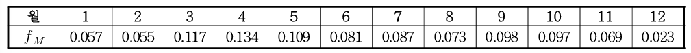
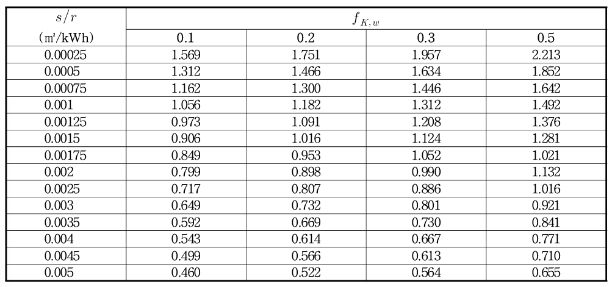

# 1. 태양열 에너지생산량 (Solar thermal energy generation)

태양열 시스템은 태양 복사 에너지를 흡수하여 열로 전환해 급탕, 난방 등에 활용하는 시스템입니다. 주로 집열기, 축열조, 제어장치로 구성됩니다.   

태양열 시스템의 총체적 성능은 이용부의 에너지 소요 패턴에 크게 좌우되는데, 이용부의 에너지 소요량은 방열기의 열손실, 펌프/배관의 분배 열손실 등 건물 내 설비 시스템의 영향을 받습니다. 이용부의 열에너지 소요량이 클수록 태양열 시스템의 출력에 대한 요구가 높아지기 때문에, 이용부의 에너지 소요량을 미리 파악하여 태양열 시스템의 용량을 결정하는 것이 중요합니다.   

## 1.1. 태양열 시스템의 공급 열량 \(Q_{K,sol}\)

총 공급 열량(\(Q_{K,sol}\))은 급탕시스템에 공급된 열량(\(Q_{w,sol}\))과 난방시스템에 공급된 열량(\(Q_{h,sol}\))의 합으로 계산됩니다.   

급탕시스템에 공급된 열량(\(Q_{w,sol}\))은 태양열시스템에서 공급된 총 열량 중에서 급탕시스템에 공급된 열량이 차지하는 비율(\(f_{K,w}\))에 의해 구해집니다. 태양열시스템에서 난방시스템에 공급된 열량(\(Q_{h,sol}\))은 총 공급된 열량(\(Q_{K,sol}\))으로부터 급탕시스템에 사용된 열량이 차감되어 산정됩니다.   

<a href="/eco2_guide_center/1.%20ECO2%20Logic%20Guide/Hee1_Equation_List.html" class="equation-link" target="_blank" rel="noopener noreferrer">
  \( Q_{K,sol} = Q_{w,sol} + Q_{h,sol} \)   
  \( Q_{w,sol} = Q_{K,sol} \cdot f_{K,w} \)   
  \( Q_{h,sol} = Q_{K,sol} \cdot (1.0 - f_{K,w}) \)   (1.1-1)
</a>

### 집열기 효율

태양열 집열기는 태양에너지를 수집하여 열매체에 저장하는 기능을 수행하며, 집열기 내의 열매체와 주변 공기 사이의 온도 차이가 클수록 큰 열손실량이 발생합니다.   

태양열 집열기의 효율은 운전 상태에 따라 수시로 변하기 때문에 최상의 효율을 갖도록 태양열 시스템을 운전하는 것이 시스템의 이용 효율측면에서 중요합니다.   

태양열 집열기의 열손실은 흡수판 표면 온도를 기준으로 계산할 수 있지만, 이는 공급온도, 유량 복사 등 다양한 변수에 따라 변하고 측정이 어렵기 때문에, 집열기 입구 온도(\(t_i\))를 기준으로 하여 집열효율 수정계수(\(F_R\))를 적용해 손실과 효율을 산출합니다.   

<a href="/eco2_guide_center/1.%20ECO2%20Logic%20Guide/Hee1_Equation_List.html" class="equation-link" target="_blank" rel="noopener noreferrer">
  \( \eta_{Ag} = F_R \cdot (\tau \alpha)_{en} - F_R \cdot U_L \left( \frac{t_i - t_a}{I_T} \right)_a \quad : \text{전면적 기준} \)   
  \( \eta_{Aa} = F_R \cdot (\tau \alpha)_{en} - F_R \cdot U_L \left( \frac{t_i - t_a}{I_T} \right) \quad : \text{투과면적 기준} \)   (1.1-2)
</a>

태양열 집열기는 직달일사가 수직으로 입사할 때 효율이 가장 높으며, 이를 위해 경사각과 방위각 조절이 필요합니다. 효율 시험은 입사각이 20° 이하일 때 수행되며, 실제 설치 시 입사각이 다르면 입사각 수정계수 (\(K_\theta\))를 적용해 효율을 보정해야 합니다.   

<a href="/eco2_guide_center/1.%20ECO2%20Logic%20Guide/Hee1_Equation_List.html" class="equation-link" target="_blank" rel="noopener noreferrer">
  \( (\tau \alpha)_e = K_\Theta \cdot (\tau \alpha)_{en} \)   
  \( K_\Theta = 1 - 0.1564 \cdot \left( \frac{1}{\cos \Theta} - 1 \right) \) (1.1-3)
</a>

집열기 1매당 순간 출력은   
<a href="/eco2_guide_center/1.%20ECO2%20Logic%20Guide/Hee1_Equation_List.html" class="equation-link" target="_blank" rel="noopener noreferrer">
  \( \dot{Q} = A \cdot G \left( \eta_0 - a_1 \cdot \frac{(t_m - t_a)}{G} - a_2 \cdot \frac{(t_m - t_a)}{G} \right) \)   (1.1-4) 
</a>

- 설계 지표   

- 태양 부하율   
<a href="/eco2_guide_center/1.%20ECO2%20Logic%20Guide/Hee1_Equation_List.html" class="equation-link" target="_blank" rel="noopener noreferrer">
  \( s / r = \frac{A_c}{Q_{W,ges}} \)   (1.1-5)
</a>

- 축열조 열손실율 보정 계수     
<a href="/eco2_guide_center/1.%20ECO2%20Logic%20Guide/Hee1_Equation_List.html" class="equation-link" target="_blank" rel="noopener noreferrer">
  \( f_{s,loss} = 1.07 - 0.07 \cdot R_{s,loss} \) (1.1-6)
</a>

## 1.2. 태양열 집열시스템에 대한 계산 방식

태양열집열시스템의 연간 에너지수득량(\(Q_{K,sol,a}\))은 아래 표의 월 분배비율(\(f_M\))에 따라 아래 계산식에 따라 월별로 분배되어 월별 에너지수득량(\(Q_{K,sol}\))으로 환산됩니다.   

<a href="/eco2_guide_center/1.%20ECO2%20Logic%20Guide/Hee1_Equation_List.html" class="equation-link" target="_blank" rel="noopener noreferrer">
  \( Q_{K,sol} = f_M \cdot Q_{K,sol,a} \) (1.2-1)
</a>

     
<strong>Table 1.2-2. 연간 수득량의 월 분배비율</strong>

     

<a href="/eco2_guide_center/1.%20ECO2%20Logic%20Guide/Hee1_Equation_List.html" class="equation-link" target="_blank" rel="noopener noreferrer">
  \( Q_{K,sol,a} = Q_{sys} \cdot f_{NA} \cdot f_{s/r} \cdot f_s \cdot f_{s,loss} \cdot f_{h,T} \)   (1.2-3)
</a>

- 집열장치의 연간 시스템-에너지 수득량 (\(Q_{sys}\)) 산정   
<a href="/eco2_guide_center/1.%20ECO2%20Logic%20Guide/Hee1_Equation_List.html" class="equation-link" target="_blank" rel="noopener noreferrer">
  \( Q_{sys} = \left(199 \cdot \eta_0 - 16.3 \cdot k_1 - 504 \cdot k_2 + 133 \cdot IAM(50^\circ) - 0.590 \cdot c - 23.5\right) \cdot A_c \)  (1.2-4)
</a>

- 집열기의 경사각 및 방위각에 대한 수정계수 (\(f_{NA}\))   

     
<strong>Table 1.2-5. 집열면 기울기 및 방향에 대한 수정계수</strong>

     

- 집열시스템의 부하율에 대한 수정계수 (\(f_{s/r}\))   

     
<strong>Table 1.2-6. 태양열집열시스템의 부하율에 대한 수정계수</strong>

     

- 저장조의 열손실율에 대한 수정계수 (\(f_{s,loss}\))   
<a href="/eco2_guide_center/1.%20ECO2%20Logic%20Guide/Hee1_Equation_List.html" class="equation-link" target="_blank" rel="noopener noreferrer">
  \( R_{s,loss} = (UA)^*_s \cdot \dfrac{0.10187 \cdot Q_{w,outg} + V_{sol,ref}}{0.0447 \cdot \sqrt{Q_{w,outg}} + 0.14 \cdot \sqrt{V_{sol,ref}}} \)   (1.2-7)
</a>

     
<strong>Table 1.2-8. 저장기의 열손실율에 대한 수정계수</strong>

     

<a href="/eco2_guide_center/1.%20ECO2%20Logic%20Guide/Hee1_Equation_List.html" class="equation-link" target="_blank" rel="noopener noreferrer">
  \( f_{s,loss} = 1.07 - 0.07 \cdot R_{s,loss} \)   (1.2-9)
</a>

- 실내난방에서 난방순환온도에 대한 수정계수 (\(f_{h,T}\))   

     
<strong>Table 1.2-10. 실내난방에서 난방순환온도에 대한 수정계수</strong>

     

- 급탕에 사용된 태양열 집열시스템의 에너지 비율 (\(f_{K,w}\))   

     
<strong>Table 1.2-11. 급탕에 사용된 태양열집열시스템의 에너지 비율</strong>

     

