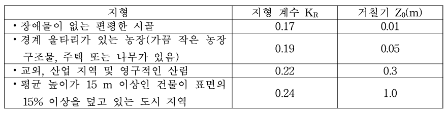

# 4. 풍력 에너지생산량 (Wind turbine energy generation)

풍력발전은 바람의 운동에너지를 회전체를 통해 전기에너지로 변환하는 시스템입니다. 풍력발전기는 날개(blade)와 허브(hub)로 구성된 회전자와 회전을 증속하여 발전기를 구동시키는 종속장치, 제어 장치, 유압 브레이크 장치 등으로 구성됩니다. 풍력발전기에서 연간 발전되는 전력량\(Q_{WT}\)을 산출하는 방법은 평균 전력 밀도법을 바탕으로 합니다. 시간별 데이터를 사용하여 1년 동안에 대한 바람의 평균 전력 밀도를 추정하고 발전기의 변환효율을 적용하여 전력량을 구합니다.

평균 전력 밀도법을 이용하여 연간 발전량을 산출하기 위해서는 다음 4가지 데이터가 요구됩니다:

## 4.1. 지형
풍력 발전기가 설치되는 지형에 따른 지형 계수를 적용합니다.  

     
<strong>Table 4.1-1. 지형 계수</strong>

     

## 4.2. 직경 (m)
풍력발전기 날개의 직경을 지정합니다.

## 4.3. 허브 높이 (m)
풍력발전기의 허브 높이를 지정합니다.

## 4.4. 정격출력 (kW)
풍력발전기의 정격 풍속에서의 전력은 풍력발전기에 대한 변환효율을 지정하는데 사용됩니다.  

     
<strong>Table 4.4-1. 풍력발전기 효율</strong>

     
     
<strong>풍력발전기 효율</strong>

---

### 4.5.1. 풍력발전기의 연간 발전량 산출 공식

<a href="/eco2_guide_center/1.%20ECO2%20Logic%20Guide/Hee1_Equation_List.html" class="equation-link" target="_blank" rel="noopener noreferrer">
  \( Q_{WT} = 0.5 \cdot \rho \cdot (C_R(z) \cdot V_0)^3 \cdot A \cdot EPF \cdot K_{WT} \cdot 24 \cdot N / 1000 \) (4.5.1-1)
</a>

조도 길이 \(z_{0}\)는 풍속이 높이에 따라 대수적 형태로 변화한다고 가정할 때, 평균 풍속이 0이 되는 지표면 근처의 가상의 높이를 의미합니다. 이는 지면의 거칠기 정도를 나타내는 지표로, 흔히 거칠기 길이 또는 지면 거칠기 고도라고도 불립니다.  
<a href="/eco2_guide_center/1.%20ECO2%20Logic%20Guide/Hee1_Equation_List.html" class="equation-link" target="_blank" rel="noopener noreferrer">
  \( C_R(z) = K_R \cdot \ln(z / z_0) \) (4.5.1-2)
</a>

날개의 회전 면적은 풍력발전기의 날개 직경으로부터 구해집니다.  
<a href="/eco2_guide_center/1.%20ECO2%20Logic%20Guide/Hee1_Equation_List.html" class="equation-link" target="_blank" rel="noopener noreferrer">
  \( A = \pi \cdot \frac{D^2}{4} \) (4.5.1-3)
</a>

연간 평균 전력 밀도와 풍속으로부터 에너지 패턴 계수(EPF)를 산출할 수 있으며, 연간 평균 전력 밀도는 시간별 풍속과 공기의 밀도로부터 구해집니다.  
<a href="/eco2_guide_center/1.%20ECO2%20Logic%20Guide/Hee1_Equation_List.html" class="equation-link" target="_blank" rel="noopener noreferrer">
  \( EPF = \frac{APD}{0.5 \cdot \rho \cdot V_0^3} \) (4.5.1-4)
</a>
<a href="/eco2_guide_center/1.%20ECO2%20Logic%20Guide/Hee1_Equation_List.html" class="equation-link" target="_blank" rel="noopener noreferrer">
  \( APD = \frac{\sum_{i=1}^{8760} 0.5 \cdot \rho \cdot V_i^3}{8760} \) (4.5.1-5)
</a>

수직축 풍력발전기의 연간 발전량은 수평축 풍력발전기에 대한 등가 발전기의 날개 직경을 이용하여 산출됩니다.  
<a href="/eco2_guide_center/1.%20ECO2%20Logic%20Guide/Hee1_Equation_List.html" class="equation-link" target="_blank" rel="noopener noreferrer">
  \( A_{VAWT} = \frac{\pi \cdot D_e^2}{4} \) (4.5.1-6)
</a>

### 4.5.2. 보일러 정격 출력 산정

**보일러 정격출력 (\( Q_{N,h} \))**:  
보일러의 정격 출력은 보일러가 부분 부하 상태에서 운전될 때의 효율을 계산하는 기준이 된다.  
건물의 난방 부하보다 과도한 용량의 보일러는 효율이 저하되므로, 적절한 용량 산정이 중요하다.  
본 절에서는 ECO2 프로그램에서 보일러의 정격출력을 결정하는 방법을 서술한다.

**보일러 정격 출력 (\( Q_{N,h} \)):**

- 1994년 이후 설치:  
<a href="/eco2_guide_center/1.%20ECO2%20Logic%20Guide/Hee1_Equation_List.html"
   class="equation-link"
   target="_blank"
   rel="noopener noreferrer">
  \( Q_{N,h} = 1.3 \cdot Q_{h,\text{max}} \)
  (4.5.2-1)
</a>

- 1994년 이전 설치:  
<a href="/eco2_guide_center/1.%20ECO2%20Logic%20Guide/Hee1_Equation_List.html"
   class="equation-link"
   target="_blank"
   rel="noopener noreferrer">
  \( Q_{N,h} = 2.5 \cdot Q_{h,\text{max}} \)
  (4.5.2-2)
</a>

이미 열 생산기기가 설치된 기존 건물의 경우, 정격 출력은 설치된 기기의 값을 이용한다.

**동시 열 부하(난방, 급탕, 공조 등) 발생 시:**  
동시에 여러 가지의 열 부하가 발생할 경우, 보일러의 정격출력은 동시에 발생하는 부하들의 합으로,  
우선순위에 의한 순차적 가동 시스템에서는 개별 부하 중 가장 큰 값으로 결정된다.

<a href="/eco2_guide_center/1.%20ECO2%20Logic%20Guide/Hee1_Equation_List.html"
   class="equation-link"
   target="_blank"
   rel="noopener noreferrer">
  \( Q_N = \max\!\left( \sum Q_{N,\text{gleichzeitig}},\; Q_{\text{vorrang}} \right) \)
  (4.5.2-3)
</a>

---

### 4.5.3. 시스템 운전 시간 산정

**보일러 운전 시간:**  
건물 부하 계산(#.#.# 절)에서 야간감소/정지 또는 주말감소/정지가 고려되었다면,  
보일러 운전에서도 동일하게 고려해야 한다.  

**일일 계산 운전시간:**  
배관망 및 열 생산 과정의 열 손실 계산을 위해 야간이나 주말의 운전 감소/정지,  
온도 저하, 지속 운전 방식의 효과를 반영한 '일일 계산 운전 시간'과 '월별 계산 운전일수'를 계산한다.

**일일 계산 운전 시간 (\( t_{h,rL,T} \)):**  
<a href="/eco2_guide_center/1.%20ECO2%20Logic%20Guide/Hee1_Equation_List.html"
   class="equation-link"
   target="_blank"
   rel="noopener noreferrer">
  \( t_{h,rL,T} = 24 - f_{L,NA} \cdot (24 - t_{h,\text{op}}) \)
  (4.5.3-1)
</a>

- \( f_{L,NA} \) = 야간감소/정지에 대한 운전시간계수  
- \( t_{h,\text{op}} \) = 일일 난방 시간  
- 지속 운전: \( f_{L,NA} = 0 \)  
- 야간 정지: \( f_{L,NA} = 1 \)  
- 야간 감소:  
<a href="/eco2_guide_center/1.%20ECO2%20Logic%20Guide/Hee1_Equation_List.html"
   class="equation-link"
   target="_blank"
   rel="noopener noreferrer">
  \( f_{L,NA} = 1 - \dfrac{ \theta_{NA,\text{Grenz}} - \theta_e }{ \theta_{NA,\text{Grenz}} - \theta_{e,\text{min}} } \)
  (4.5.3-2)
</a>

- \( \theta_{NA,\text{Grenz}} \) = 야간 감소 한계 온도 = 10 ℃  
- \( \theta_e \) = 월 평균 외기 온도 (℃)  
- \( \theta_{e,\text{min}} \) = 일평균 설계 온도 (℃)

---

**월별 계산 운전일 (\( d_{h,rB} \)):**  
주말 감소/정지 운전 방식을 고려하는 계수

<a href="/eco2_guide_center/1.%20ECO2%20Logic%20Guide/Hee1_Equation_List.html"
   class="equation-link"
   target="_blank"
   rel="noopener noreferrer">
  \( d_{h,rB} = \dfrac{ d_{\text{mth}} \cdot (365 - f_{L,WA} \cdot (365 - d_{\text{Nutz,a}})) }{365} \cdot \dfrac{ t_h }{ d_{\text{mth}} \cdot 24 } \)
  (4.5.3-3)
</a>

- \( d_{\text{mth}} \) = 월별 일 수  
- \( d_{\text{Nutz,a}} \) = 연간 이용기간  
- \( f_{L,WA} \) = 주말 운전 감소/정지 운전시간 계수  
  - 지속 운전: \( f_{L,WA} = 0 \)  
  - 주말 정지: \( f_{L,WA} = 1 \)  
  - 주말 감소:  
<a href="/eco2_guide_center/1.%20ECO2%20Logic%20Guide/Hee1_Equation_List.html"
   class="equation-link"
   target="_blank"
   rel="noopener noreferrer">
  \( f_{L,WA} = 1 - \dfrac{ \theta_{WA,\text{Grenz}} - \theta_e }{ \theta_{WA,\text{Grenz}} - \theta_{e,\text{min}} } \)
  (4.5.3-4)
</a>

- \( \theta_{WA,\text{Grenz}} \) = 주말 감소 한계 온도 = 15 ℃

---

**월별 최종 계산 운전 시간 (\( t_{h,RL} \)):**  
<a href="/eco2_guide_center/1.%20ECO2%20Logic%20Guide/Hee1_Equation_List.html"
   class="equation-link"
   target="_blank"
   rel="noopener noreferrer">
  \( t_{h,RL} = t_{h,rL,T} \cdot d_{h,RB} \)
  (4.5.3-5)
</a>
