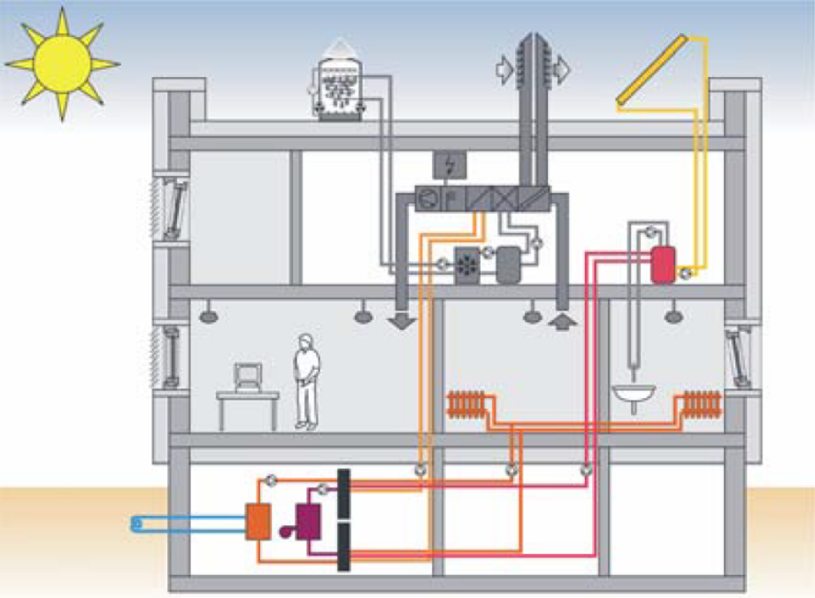

# 2.1. 난방 시스템의 에너지 소요량 (Energy use) 산정

## 2.1.1. 개요

본 절은 난방 시스템의 각 단계(전달, 분배, 저장, 생산)에서 산출된 손실 (loss), 소요량 (energy use), 보조에너지 (auxiliary energy)를 종합하여, **최종적으로 열 생산기기(보일러, 히트펌프 등)가 공급해야 하는 에너지 소요량**을 산정하는 방법을 기술한다.

     
     
<strong>제 2.1장에서 다루는 범위</strong>

열 생산기기의 에너지 소요량 산정을 위해 건물의 난방 에너지 요구량(\( Q_{h,b} \))에 각 과정에서 발생하는 모든 열손실을 더하여 열 생산기기가 실제로 감당해야 할 열 에너지 공급량(\( Q_{h,outg} \))을 결정한다.  
또한, 이 과정에서 소비되는 모든 보조에너지 공급량, 신재생에너지 시스템에 의한 열획득도 합산한다.

---

## 2.1.2. 생산기기 열 에너지 공급량(heat output)

- 열 생산기기가 공급해야 하는 총 열 공급량(\(Q_{h,outg}\))은 최종적으로 실내에 공급되어야 하는 순수 난방에너지 요구량(Energy need)((Q_{h,b}\))과 열이 사용자에게 도달하기까지의 과정, 즉 전달(\(Q_{h,ce}\)), 분배(\(Q_{h,d}\)), 저장(\(Q_{h,s}\)) 단계에서 발생하는 모든 열손실의 합으로 계산된다.

  
$$
Q_{h,outg} = Q_{h,b} + Q_{h,ce} + Q_{h,d} + Q_{h,s}
$$

- 열 생산기기가 공조시스템의 가열유닛(Heating coil)에 열을 공급하는 경우, \(Q_{h,b}\) 대신 공조기 가열에 필요한 열량 \(Q_{h*,b}\)를 사용한다.

  
$$
Q_{h,outg} = Q_{h*,b} + Q_{h,ce} + Q_{h,d} + Q_{h,s}
$$

- 열 생산기기가 흡수식 냉동기에 열을 공급하는 경우, 냉동기 구동에 필요한 열량 \(Q_{c,f}\)를 사용한다.

  
$$
Q_{h,outg} = Q_{c,f} + Q_{h,d} + Q_{h,s}
$$

- 열 생산기기로부터 열이 공급되는 과정이 다수인 경우, 각각의 과정의 \(Q_{h,outg}\)를 합산한다.

---

### 2.1.2.2. 최종 난방 에너지 소요량

- 건물이 실제로 요구하는 최종 난방 에너지 소요량(\(Q_{h,f}\))은 생산기기의 열에너지 공급량(\(Q_{h,outg}\))과 공급 과정의 열 손실량(\(Q_{h,g}\))을 더한 값에서, 태양열 등 신재생에너지로 공급된 열량(\(Q_{h,reg}\))을 차감하여 계산된다.

  
$$
Q_{h,f} = Q_{h,outg} + Q_{h,g} - Q_{h,reg}
$$  
$$
Q_{h,reg} = Q_{h,sol} + Q_{h,in}
$$

(단, \( Q_{h,sol} \): 태양열에너지, \( Q_{h,in} \): 주변환경으로부터 열 획득)

---

### 2.1.2.3. 보조에너지

- 난방 시스템에서 보조에너지(\(Q_{h,aux}\))는 열 전달, 분배, 저장, 생산의 각 단계에서 소요되는 모든 보조에너지의 합으로 산출되며 최종 에너지 소요량에 포함된다.

  
$$
Q_{h,aux} = Q_{h,ce,aux} + Q_{h,d,aux} + Q_{h,s,aux} + Q_{h,g,aux}
$$

---

### 2.1.2.4. 비제어적 열획득(Heat gain)

- 난방 시스템의 전달, 분배, 저장, 생산 과정에서 열 에너지의 일부는 제어되지 않고 난방 중인 실내 공간으로 유입되어 열획득으로 작용할 수 있다. 이 비제어적 열획득(\(Q_{I,h}\))은 열에너지 소요량을 계산할 때 고려되어야 한다.

  
$$
Q_{l,h} = Q_{l,h,s} + Q_{l,h,g}
$$

---

## 2.1.3. 각 프로세스의 기준 조건 설정

기본적으로 일일 난방이용시간 \( t_{h,Nutz} = 0 \)이면, 부하율 \( \beta_j = 0 \)이다.  
만약 #장의 공조난방 시스템에서 요구사항이 있을 경우, #장에서 산정된 \( t_{h,Nutz} \)를 따르도록 한다.

---

### 2.1.3.1. 평균 부하율(Part load level)

평균 부하율(\( \beta_{i} \))은 시스템의 최대 공급 능력 대비 실제 평균 부하가 어느 정도인지를 나타내는 무차원 변수이다. 각 단계(전달, 분배, 저장, 생산)마다 열손실이 존재하므로, 각 단계의 부하율을 개별적으로 계산한다.

- **열 전달 부하율 \( \beta_{h,ce} \)**

$$
\beta_{h,ce} = Q_{h,b} / ( \dot{Q}_{dot\,h,max} \cdot t_h )
$$

- **열 분배 부하율 \( \beta_{h,d} \)**

$$
\beta_{h,d} = ( Q_{h,b} + Q_{h,ce} ) / ( \dot{Q}_{dot\,h,max} \cdot t_h )
$$

- **열 저장 부하율 \( \beta_{h,s} \)**

$$
\beta_{h,s} = ( Q_{h,b} + Q_{h,ce} + Q_{h,d} ) / ( \dot{Q}_{dot\,h,max} \cdot t_h )
$$

- **열 생산 부하율 \( \beta_{h,g} \)**

$$
\beta_{h,g} = ( Q_{h,b} + Q_{h,ce} + Q_{h,d} + Q_{h,s} ) / ( \dot{Q}_{dot\,h,max} \cdot t_h )
$$

(단, \( Q_{h,b} \): 월별 난방 에너지 요구량 [kWh],  
\( Q_{h,max} \): 최대 난방 출력 [kW],  
\( t_{h} \): 월별 난방 시간)

---

### 2.1.3.2. 온도 기반 제어

온도에 따라 자동 조절되는 난방 시스템에서, 개별 프로세스(전달, 분배, 저장, 생산)의 온도는 시스템의 설계 조건에서 평균 부하율과 평균 온도차에 의해 정해진다.

온도 \( \theta_{HK,m(\beta_j)} \)를 산정한다.

- **평균 난방 사이클 온도(\( \theta_{HK,m} \))**

$$
\theta_{HK,m(\beta_j)} = 0.5 \cdot ( \theta_{VL,m(\beta_j)} + \theta_{RL,m(\beta_j)} )
$$

- **평균 온도차(\( \Delta \theta_{HK,m}(\beta_i) \))**

$$
\Delta \theta_{HK,m}(\beta_i) = \theta_{VL,m}(\beta_i) - \theta_{RL,m}(\beta_i)
$$

- **평균 공급 온도(\(\theta_{VL,m}\))**

$$
\theta_{VL,m}(\beta_i) = (\theta_{VA} - \theta_{i,h,\text{soll}}) \cdot \beta_i^{\frac{1}{n}} + \theta_{i,h,\text{soll}}
$$

- **평균 환수 온도(\( \theta_{RL,m} \))**

$$
\theta_{RL,m(\beta_i)} = ( \theta_{RA} - \theta_{i,h,soll} ) \cdot \beta_j^{(1/n)} + \theta_{i,h,soll}
$$

(단,  
- \( \beta_i \) : 2.1.3.1에서 계산된 각 프로세스의 평균 부하율  
- \( \theta_{VA} \) : 난방 시스템의 설계 조건 공급 온도 (℃)  
- \( \theta_{RA} \) : 난방 시스템의 설계 조건 환수 온도 (℃)  
- \( n \) : 방열지수 (라디에이터 = 1.33, 바닥 난방 = 1.1)  
- \( \theta_{i,h,\text{soll}} \) : 난방 시스템 가동 시간 동안의 실내 온도 (℃)
)

---

- **작동 유체(Working fluid)의 평균 초과 온도 \( \Delta \theta_A \)**

$$
\Delta \theta_A = ( \theta_{VA} + \theta_{RA} ) / 2 - \theta_{i,h,soll}
$$

> 혼합기(mixer)가 설치된 정온 보일러의 경우, 전달과 분배 과정에서 초과 온도 값 적용, 혼합기가 없는 정온 보일러의 평균 온도 = 70℃ 적용

- 건물이 리모델링 되었을 경우, 설계 온도는 조정할 수 있다. 새로운 자세한 설계가 수립되지 않은 경우, 아래 표의 설계 온도를 사용하도록 한다. 중간 값일 경우, 한 단계 높은 온도 쌍을 선택하도록 한다.

<!DOCTYPE html>
<html lang="ko">
<head>
  <meta charset="UTF-8">
  <title>설계 온도</title>
  
</head>
<body>

<strong>&lt;설계온도&gt;</strong>

<table>
  <tr>
    <th rowspan="2">기존 설계 온도</th>
    <th colspan="3">새 설계 온도에서 Q̇N,neu / Q̇N,alt</th>
  </tr>
  <tr>
    <th>70/55 ℃</th>
    <th>55/45 ℃</th>
    <th>35/28 ℃</th>
  </tr>
  <tr>
    <td>90/70 ℃</td>
    <td>63.8 %</td>
    <td>40.6 %</td>
    <td>11.3 %</td>
  </tr>
  <tr>
    <td>70/55 ℃</td>
    <td>-</td>
    <td>63.7 %</td>
    <td>17.8 %</td>
  </tr>
  <tr>
    <td>55/45 ℃</td>
    <td>-</td>
    <td>-</td>
    <td>27.9 %</td>
  </tr>
</table>

</body>
</html>

- 축열조가 없는 열 생산기기의 경우 평균 공급/환수 온도는 

$$
\theta_{HK,m}(\beta_i) = 0.5 \cdot \left( \theta_{VL,m}(\beta_i) + \theta_{RL,m}(\beta_i) \right)
$$

 식으로 구한다.

- 상이한 난방 배관망이 설치된 경우, 최대 온도는 열 생산기기가 충족해야 하는 요구 사항에 따른다.

- 정온 보일러와 바이오매스 보일러는 평균 온도를 70 °C로 가정한다.

- 콘덴싱 보일러의 효율 계산에서 환수 온도가 고려되어야 한다.

- 저온 및 콘덴싱 보일러에서 준비 손실은 평균 난방 배관망 온도에 관련된다. 

---

### 2.1.3.3. 보일러 정격 출력(Rated output) 산정

- **보일러 정격출력(\( \dot{Q}_{N,h} \))**: 보일러의 정격 출력을 산정하기 위해 첫 번째로 모든 연결된 열 소비기기의 최대 출력이 결정되어야 한다. 동시 발생하는 수요에 따라 보일러의 정격 출력은 가장 큰 단일 수요 또는 동시 발생하는 수요의 합 중에서 결정된다.  

- **난방 시스템의 보일러 정격 출력(\(Q_{N,h}\))**:

$$
\dot{Q}_{dot\,N,h} = 1.3 \cdot \dot{Q}_{dot\,h,max}
$$

- 이미 열 생산기기가 설치된 기존 건물의 경우, 정격 출력은 설치된 기기의 값을 이용한다. 설치된 기기 값을 알 수 없는 경우, 아래 식을 사용한다.

$$
\dot{Q}_{N,h} = 2.5 \cdot \dot{Q}_{h,\text{max}}
$$

(단, \( \dot{Q}_{h,\text{max}} \) : 건물의 최대 열 부하 (kW))

- **동시 열 부하(난방, 급탕, 공조 등) 발생 시**:

- 동시에 여러 가지의 열 부하가 발생할  경우, 보일러의 정격출력은 **동시에 발생하는 부하들의 합**으로 또는 **우선순위가 높은 부하 중 가장 큰 값**으로 결정된다.

$$
\dot{Q}_N = \max\left( \sum \dot{Q}_{N,\text{gleichzeitig}} , \dot{Q}_{\text{vorrang}} \right)
$$

---

### 2.1.3.4. 운전 시간

건물 난방/급탕 요구량(# 절)에서 야간감소/정지 또는 주말감소/정지가 고려되었다면, 보일러 운전에서도 동일하게 고려해야 한다.

- **난방 시스템의 운전 시간 설계**: 분배 배관망 및 열 생산 과정의 열 손실 계산을 위해 야간이나 주말의 운전 감소/정지, 온도 저하, 지속 운전 방식을 고려하는 일일 운전 시간이 사용된다.

- **일일 설계 운전시간 \( t_{h,rL,T} \)**  
  $$
  t_{h,rL,T} = 24 - f_{L,NA} \cdot (24 - t_{h,op})
  $$
  - \( f_{L,NA} \): 야간감소/정지에 대한 운전시간계수  
  - \( t_{h,op} \): 일일 난방 시간

  - **지속 운전**: \( f_{L,NA} = 0 \)  
  - **야간 정지**: \( f_{L,NA} = 1 \)  
  - **야간 감소**:  
    $$
    f_{L,NA} = 1 - \frac{\theta_{NA,Grenz} - \theta_e}{\theta_{NA,Grenz} - \theta_{e,min}}
    $$

    - \( \theta_{NA,Grenz} \) = 야간 감소 한계 온도 = \(10^\circ\mathrm{C} \)  
    - \( \theta_e \): 월 평균 외기 온도(℃)
    - \( \theta_{e,min} \): 일평균 설계 온도(℃)

---

- **월별 설계 운전일 \( d_{h,rB} \)**  
  $$
  d_{h,rB} = d_{mth} \cdot \left( \frac{365 - f_{L,WA} \cdot (365 - d_{Nutz,A})}{365} \right)
  $$

  - \( d_{mth} \): 월별 일수  
  - \( d_{Nutz,A} \): 연간 이용기간  
  - \( f_{L,WA} \): 주말 운전 감소/정지 계수

  - **지속 운전**: \( f_{L,WA} = 0 \)  
  - **주말 정지**: \( f_{L,WA} = 1 \)  
  - **주말 감소**:  
    $$
    f_{L,WA} = 1 - \frac{\theta_{WA,Grenz} - \theta_e}{\theta_{WA,Grenz} - \theta_{e,min}}
    $$

    - \( \theta_{WA,Grenz} \) = 주말 감소 한계 온도 = \( 15^\circ\mathrm{C} \)

---

- **월별 계산 난방 운전시간 \( t_{h,rL} \)**  
  $$
  t_{h,rL} = t_{h,rL,T} \cdot d_{h,rB}
  $$

- 상이한 난방 배관망 운전 또는 난방 시스템 이외의 열 생산기기가 존재하거나 배관망에 다른 열 수요를 갖는 에너지원(냉동기, 공조장치, 온수 등)이 연결되어 있는 경우, 가장 오랜 시간 수요가 발생하는 에너지원의 운전시간을 적용함.

$$
t_{h,rL} = t_{h,rL,T} \cdot d_{h,rB}
$$

---

- **월별 난방일수 \( d_{h,mth} \)**:  
  $$
  d_{h,mth} = \frac{t_{h,rL,T}^*}{24}
  $$

- **월별 이용일수 \( d_{Nutz,mth} \)**:  
  $$
  d_{Nutz,mth} = \frac{d_{Nutz,A}}{365} \cdot d_{mth}
  $$

- **일년 단위 산정치의 월별 분배**: 

난방 시스템 구성요소 중 에너지 요구량이 존 별 대차대조에 영향을 미치지 않는 요소(순환펌프 등)는 일 년 단위로 계산하여도 무방하다. 에너지 요구량을 월별로 비교해야 하는 경우, 일 년 요구량인 \(W_{h,d,e,a}\)로부터 월별 요구량 \(W_{h,d,e,M}\)를 계산한다.

$$
W_{h,d,e,M} = W_{h,d,e,a} \cdot \frac{ \beta_{h,d,M} \cdot t_{\text{Nutz,mth}} }{ \beta_{h,d,a} \cdot t_{h,op} \cdot d_{\text{Nutz,a}} }
$$

---

## 2.1.4. 열 손실 및 보조에너지 계산

### 2.1.4.1. 전달 과정의 열 손실

- 실내 난방 에너지 전달 과정의 열 손실(Q_h,ce)과 열 전달 총 이용효율 (η_h,ce)은 아래와 같이 정의한다.

  $$
  Q_{h,ce} = \left( \frac{f_{Radiant} \cdot f_{int} \cdot f_{hwdr}}{\eta_{h,ce}} - 1 \right) \cdot Q_{h,b}
  $$

- \( f_{\text{Radiant}} \) : 복사 영향 계수  
- \( f_{\text{int}} \) : 간헐 운전 계수  
- \( f_{\text{hydr}} \) : 수력학적 균형 계수 = 1  

- \( \eta_{h,\text{ce}} \) : 열 전달 총 이용효율  
- \( \eta_{h,\text{ce}} \) = 실내 열전달 총 효율  
- \( \eta_{h,\text{ce}} = \dfrac{1}{4 - (\eta_L + \eta_C + \eta_B)} \)

  - \( \eta_L \) : 실내 공기온도의 수직 분포에 대한 효율  
  - \( \eta_C \) : 실내 온도제어에 대한 효율  
  - \( \eta_B \) : 외피 열손실에 대한 효율

  일반적인 상황에서 \(f_{Radiant}\)(h > 4m인 대형 홀 공간에서 중요)와 \(f_{int}\)(실내 온도감소 고려)는 1로 설정한다.

- 연간 열 손실(\(Q_{h,ce,a}\))은 월별 계산한 열 손실의 합과 같다.

 

 $$
Q_{h,ce,a} = \sum Q_{h,ce}
$$

<!DOCTYPE html>
<html lang="ko">
<head>
  <meta charset="UTF-8">
  <title>라디에이터 이용 효율</title>
  
</head>
<body>

&lt;표. 라디에이터의 부분 이용 효율 (실 높이 ≤ 4m)&gt;

<table>
  <tr>
    <th rowspan="2" colspan="2">매개변수</th>
    <th colspan="4">이용 효율</th>
  </tr>
  <tr>
    <th colspan="2"><i>&eta;L</i></th>
    <th><i>&eta;C</i></th>
    <th><i>&eta;B</i></th>
  </tr>
  <tr>
    <td rowspan="2">실내온도제어</td>
    <td>제어 없음, 중앙에서 공급온도 제어</td>
    <td colspan="2"></td>
    <td>0.8</td>
    <td></td>
  </tr>
  <tr>
    <td>P-제어기 (2 K)</td>
    <td colspan="2"></td>
    <td>0.93</td>
    <td></td>
  </tr>
  <tr>
    <td rowspan="2">초과온도 (θi = 20℃)</td>
    <td rowspan="2">42.5 K (예로 70/55)</td>
    <td>&eta;L1</td>
    <td>&eta;L2</td>
    <td></td>
    <td></td>
  </tr>
  <tr>
    <td>0.93</td>
    <td></td>
    <td></td>
    <td></td>
  </tr>
  <tr>
    <td rowspan="1">외부 벽체를 통한 열손실 (GF = 유리면)</td>
    <td></td>
    <td></td>
    <td>0.95</td>
    <td></td>
    <td>1</td>
  </tr>
</table>

</body>
</html>

- 초과 온도와 외부 벽체를 통한 열손실이 복합적으로 영향을 미치는 경우, 평균 효율을 사용한다.

- 예시) 외벽 측에 위치한 라디에이터, 초과 온도 42.5 K, P-제어기 (2 K)일 때

$$
\eta_L = \frac{\eta_{L1} + \eta_{L2}}{2} = \frac{0.93 + 0.95}{2} = 0.94
$$

$$
\eta_C = 0.93
$$

$$
\eta_B = 1
$$

$$
\eta_{h,\text{ce}} = \frac{1}{4 - (\eta_L + \eta_C + \eta_B)} = \frac{1}{4 - (0.94 + 0.93 + 1)} = \frac{1}{1.13} = 0.88
$$

- 간헐 운전 계수: \(f_{int}\) = 0.97 (지속 운전의 경우, \(f_{int}\) = 1)

- 복사 영향 계수: \(f_{Radiant}\) = 1.0 

<!DOCTYPE html>
<html lang="ko">
<head>
  <meta charset="UTF-8">
  <title>물 기반 난방 시스템의 효율</title>
  
</head>
<body>

&lt;표. 물 기반 난방 시스템의 효율 (실 높이 ≤ 4m)&gt;

<table>
  <tr>
    <th rowspan="2" colspan="2">매개변수</th>
    <th colspan="4">부분이용 효율</th>
  </tr>
  <tr>
    <th><i>&eta;L</i></th>
    <th><i>&eta;C</i></th>
    <th colspan="2"><i>&eta;B</i></th>
  </tr>
  <tr>
    <td rowspan="3">실내온도제어</td>
    <td>열 매체: 물 제어 없음 (중앙 공급온도 제어)</td>
    <td></td>
    <td>0.78</td>
    <td colspan="2"></td>
  </tr>
  <tr>
    <td>PI-제어기</td>
    <td></td>
    <td>0.95</td>
    <td colspan="2"></td>
  </tr>
  <tr>
    <td>전기 난방 PI 제어기</td>
    <td></td>
    <td>0.93</td>
    <td colspan="2"></td>
  </tr>
  <tr>
    <td rowspan="4">시스템</td>
    <td>바닥난방</td>
    <td></td>
    <td></td>
    <td>&eta;B1</td>
    <td>&eta;B2</td>
  </tr>
  <tr>
    <td>습식</td>
    <td>1</td>
    <td></td>
    <td>0.93</td>
    <td></td>
  </tr>
  <tr>
    <td>건식</td>
    <td>1</td>
    <td></td>
    <td>0.96</td>
    <td></td>
  </tr>
  <tr>
    <td>건식 + 얇은 층</td>
    <td>1</td>
    <td></td>
    <td>0.98</td>
    <td></td>
  </tr>
  <tr>
    <td rowspan="1">설치 면을 통한 열 손실</td>
    <td>최소 단열된 바닥 난방</td>
    <td></td>
    <td></td>
    <td></td>
    <td>0.95</td>
  </tr>
</table>

</body>
</html>

- 시스템과 설치 면을 통한 열 손실이 영향을 미치는 경우, 평균을 사용한다.

<!DOCTYPE html>
<html lang="ko">
<head>
  <meta charset="UTF-8">
  <title>공기 난방에 대한 이용 효율</title>
  
</head>
<body>

&lt;표. 공기 난방에 대한 이용 효율 (공조 장치) (실 높이 ≤ 4m)&gt;

<table>
  <tr>
    <th rowspan="2">시스템 구성</th>
    <th rowspan="2">제어 매개변수</th>
    <th colspan="2"><i>&eta;h,ce</i></th>
  </tr>
  <tr>
    <th>낮은 등급 제어 (On/Off)</th>
    <th>높은 등급 제어 (P 제어)</th>
  </tr>
  <tr>
    <td rowspan="3">급기 가열 백업 (추가 가열 유닛)</td>
    <td>실내온도</td>
    <td>0.82</td>
    <td>0.87</td>
  </tr>
    <tr>
    <td>실내온도 (급기 온도 다단 제어)</td>
    <td>0.88</td>
    <td>0.90</td>
  </tr>
  </tr>
    <tr>
    <td>배기 온도</td>
    <td>0.81</td>
    <td>0.85</td>
  </tr>
  <tr>
    <td rowspan="1">순환 공기 가열 (인덕션 유닛, 팬코일 유닛)</td>
    <td>실내온도</td>
    <td>0.89</td>
    <td>0.93</td>
  </tr>
  
</table>

</body>
</html>

- 실 높이 4m 이상 공간에 대한 이용 효율 (대형 홀 건물): 아래 표

<!DOCTYPE html>
<html lang="ko">
<head>
  <meta charset="UTF-8">
  <title>4m ≤ 실 높이 ≤ 10m 공간에 대한 이용 효율</title>
  
</head>
<body>

&lt;표. 4m ≤ 실 높이 ≤ 10m 공간에 대한 이용 효율&gt;

<table>
  <tr>
    <th rowspan="3" colspan="4">매개변수</th>
    <th colspan="6">부분이용 효율</th>
  </tr>
  <tr>
    <th colspan="4"><i>&eta;L</i></th>
    <th rowspan="2"><i>&eta;C</i></th>
    <th rowspan="2"><i>&eta;B</i></th>
  </tr>
    <tr>
    <th>4m</th>
    <th>6m</th>
    <th>8m</th>
    <th>10m</th>
  </tr>
  <tr>
    <td rowspan="2">실내온도제어</td>
    <td colspan="3">제어 없음</td>
    <td></td>
    <td></td>
    <td></td>
    <td></td>
    <td>0.8</td>
    <td></td>
  </tr>
  <tr>
    <td colspan="3">PI-제어기</td>
    <td></td>
    <td></td>
    <td></td>
    <td></td>
    <td>0.97</td>
    <td></td>
  </tr>
  <tr>
    <td rowspan="8">난방 시스템</td>
    <td rowspan="4">온풍 난방</td>
    <td rowspan="2">일반 유도 비율 분배</td>
    <td>측면 취출</td>
    <td>0.98</td>
    <td>0.94</td>
    <td>0.88</td>
    <td>0.83</td>
    <td></td>
    <td>1</td>
  <tr>
  <tr>
    <td>상부 취출</td>
    <td>0.99</td>
    <td>0.96</td>
    <td>0.91</td>
    <td>0.87</td>
    <td></td>
    <td>1</td>
  <tr>
  <tr>
    <td rowspan="2">추가적으로 수직적 재순환 제어가 되는 분배 (상부 고임열 재순환)</td>
    <td>측면 취출</td>
    <td>0.99</td>
    <td>0.97</td>
    <td>0.94</td>
    <td>0.91</td>
    <td></td>
    <td>1</td>
  <tr>
  <tr>
    <td>상부 취출</td>
    <td>0.99</td>
    <td>0.98</td>
    <td>0.96</td>
    <td>0.93</td>
    <td></td>
    <td>1</td>
  <tr>
  <tr>
    <td colspan="3">복사 난방 (천정 복사 방열관, 복사열 파이프, 복사열 히터)</td>
    <td>1</td>
    <td>0.99</td>
    <td>0.97</td>
    <td>0.96</td>
    <td></td>
    <td>1</td>
  <tr>
  <tr>
    <td rowspan="3">바닥 난방 (높은 단열 수준)</td>
    <td></td>
    <td>1</td>
    <td>0.99</td>
    <td>0.97</td>
    <td>0.96</td>
    <td></td>
    <td></td>
  <tr>
  <tr>
    <td>구조 일체형</td>
    <td></td>
    <td></td>
    <td></td>
    <td></td>
    <td></td>
    <td>0.95</td>
  <tr>
  <tr>
    <td>열적 분리됨</td>
    <td></td>
    <td></td>
    <td></td>
    <td></td>
    <td></td>
    <td>1</td>
  <tr>
</table>

</body>
</html>

### 2.1.4.2. 열 전달 보조에너지

- 존으로 열을 전달하는 과정에서 제어기기, 팬, 펌프 등의 전력 소비를 보조에너지로 정의하며 보조에너지 소요량(\(Q_{h,ce,aux}\))은 아래와 같이 계산한다. 

$$
Q_{h,ce,aux} = Q_C + Q_{V,P}
$$

\( Q_C \) = 제어기기의 보조에너지  
\( Q_{V,P} \) = 팬, 펌프 등의 보조에너지  

$$
Q_C = P_C \cdot d_{mth} \cdot \frac{24}{1000}
$$

\( P_C \) = 제어기기의 정격 전력  

$$
Q_{V,P} = (P_V \cdot n_V + P_P \cdot n_P) \cdot \frac{t_{h,rL}}{1000}
$$

\( n_V \) = 팬 개수  
\( n_P \) = 펌프 개수  
\( P_V \) = 팬 정격 전력 소비  
\( P_P \) = 펌프의 정격 전력 소비  

펌프의 정격 전력 소비 데이터가 없는 경우:

$$
P_P = 50 \cdot \dot{Q}_{LH}^{0.08}
$$

\( \dot{Q}_{LH} \) = 공기가열 유닛(Heating coil)의 정격 전력 소비  

- 제어기기, 팬, 펌프의 정격 전력 소비는 제품 사양을 참조하거나 아래 표의 값을 사용한다. 

- 팬/펌프의 운전 시간은 난방 시스템과 같다고 가정한다.

<!DOCTYPE html>
<html lang="ko">
<head>
  <meta charset="UTF-8">
  <title>제어기기의 보조에너지 표준 값</title>
  
</head>
<body>

&lt;표. 제어기기의 보조에너지 표준 값&gt;

<table>
  <tr>
    <th colspan="2">매개변수</th>
    <th>전력 (W) (구동 시)</th>
  </tr>
  <tr>
    <td rowspan="3">PC</td>
    <td>전기모터 구동식 전기적 제어</td>
    <td>0.1</td>
  </tr>
  <tr>
    <td>전기열 구동식 전기적 제어</td>
    <td>0.1</td>
  </tr>
  <tr>
    <td>전자기 구동식 전기적 제어</td>
    <td>0.1</td>
  </tr>

</table>

</body>

<!DOCTYPE html>
<html lang="ko">
<head>
  <meta charset="UTF-8">
  <title>급기 팬의 보조 에너지 표준 값</title>
  
</head>
<body>

&lt;표. 급기 팬의 보조 에너지 표준 값 (실 높이 ≤ 4m)&gt;

<table>
  <tr>
    <th colspan="2">매개변수</th>
    <th>전력</th>
  </tr>
  <tr>
    <td rowspan="4">PV</td>
    <td>팬 코일 유닛</td>
    <td>10</td>
  </tr>
  <tr>
    <td>전기 가열식 팬 코일 유닛</td>
    <td>10</td>
  </tr>
  <tr>
    <td>동적 방열식 축열 난방</td>
    <td>12</td>
  </tr>
  <tr>
    <td>지속 및 동적 방열식 축열 난방</td>
    <td>12</td>
  </tr>

</table>

</body>

<!DOCTYPE html>
<html lang="ko">
<head>
  <meta charset="UTF-8">
  <title>표. 팬 코일 유닛의 용량에 따른 성능 실례</title>
  
</head>
<body>

&lt;표. 팬 코일 유닛의 용량에 따른 성능 실례&gt;

<table>
  <tr>
    <th>구분</th>
    <th>FC-200</th>
    <th>FC-300</th>
    <th>FC-400</th>
    <th>FC-600</th>
    <th>FC-800</th>
  </tr>
  <tr>
    <td>PV (W)</td>
    <td>25</td>
    <td>35</td>
    <td>45</td>
    <td>65</td>
    <td>90</td>
  </tr>

</table>

</body>

### 2.1.4.3. 중앙 온수 난방 분배 배관망의 열 손실

- 중앙 온수 난방 시스템의 분배 과정에서 **배관망의 열 손실(\(Q_{h,d}\))**은 열 생산기기에서 생산된 온수가 각 존까지 배관망을 따라 이동하는 동안 주변으로의 열 손실이다.

$$
Q_{h,d} = \sum \left[ U_i \cdot (\theta_{HK,m} - \theta_i) \cdot L_i \cdot t_{h,rL,i} \right]
$$

\(U_{i}\) = 열관류율

공조난방 시스템에서 가열 유닛이 가열되는 경우, 평균 열매체 온도(\(θ_{h*}\))와 공조 시스템 운전시간(\(t_{h*,op}\))를 사용한다.

평균 열매체 온도(\(θ_{r,Nutz}\))와 시스템 운전시간(\(t_{c,op}\))를 사용한다. 

- **비제어적 열획득(Q_I,h,d)**: 배관망이 존을 통과할 경우, 통과한 구간 i의 배관망에서 발생하는 열 손실은 존의 에너지 요구량 분석에서 비제어적 열 획득에 포함된다.
\(Q_{I,h,d,i}\) = \(Q_{h,d,i}\)

- **배관 길이(L) 산정**: 배관 길이는 기본적으로 배관 도면을 바탕으로 산정한다. 배관망 주변 온도는 2.1.2.4에서 설정한 값을 적용하며, 없을 경우 아래 표에서 채택한다. 배관망은 V, S, A,의 3가지 범위로 구분해 구성한다. V는 생산기기로부터 주관까지의 수평 분배, S는 지관, A는 실내 방열기까지의 차단 가능한 말단 배관을 의미한다. \(L_{G}\), \(B_{G}\), \(h_{G}\), \(n_{G}\)는 각각 건물의 가장 긴 세로 길이, 넓이, 층 수, 층 높이이다.

<!DOCTYPE html>
<html lang="ko">
<head>
  <meta charset="UTF-8">
  <title>배관망 표준값</title>
  
  
  
</head>
<body>

<h3>&lt;표. 배관망에 대한 표준 값&gt;</h3>

<table>
  <tr>
    <th rowspan="1">매개변수</th>
    <th rowspan="1">표기</th>
    <th rowspan="1">단위</th>
    <th>범위 V</th>
    <th>범위 S</th>
    <th>범위 A</th>
  </tr>
  <tr>
    <td>주변 온도</td>
    <td>\( \theta_i \)</td>
    <td>℃</td>
    <td colspan="3">2.1 에서 설정된 값</td>
  </tr>
  <tr>
    <td>난방 주기가 아닐 때 주변 온도</td>
    <td>\( \theta_i \)</td>
    <td>℃</td>
    <td colspan="3">22 ℃</td>
  </tr>
  <tr>
    <td>난방 주기일 때 주변 온도</td>
    <td>\( \theta_i \)</td>
    <td>℃</td>
    <td colspan="3">비 난방 범위 13 ℃ 난방 범위 20 ℃</td>
  </tr>
  <tr>
    <th colspan="6">이중배관 난방</th>
  </tr>
  <tr>
    <td>외부에 놓인 지관의 경우 배관 길이</td>
    <td>\( L \)</td>
    <td>m</td>
    <td>\( 2 \cdot L_G + 0.01625 \cdot G^2 \)</td>
    <td>\( 0.025 \cdot L_G \cdot B_G \cdot h_G \cdot n_G \)</td>
    <td>\( 0.55 \cdot L_G \cdot B_G \cdot n_G \)</td>
  </tr>
  <tr>
    <td>내부에 놓인 지관의 경우 배관 길이</td>
    <td>\( L \)</td>
    <td>m</td>
    <td>\( 2 \cdot L_G + 0.0325 \cdot B_G + 6 \)</td>
    <td>\( 0.025 \cdot L_G \cdot B_G \cdot h_G \cdot n_G \)</td>
    <td>\( 0.55 \cdot L_G \cdot B_G \cdot n_G \)</td>
  </tr>

  <tr>
    <th colspan="6">단일배관 난방</th>
  </tr>
  <tr>
    <td>내부의 놓인 지관의 경우 배관 길이</td>
    <td>\( L \)</td>
    <td>m</td>
    <td>\( 2 \cdot L_G + 0.0325 \cdot B_G + 6 \)</td>
    <td>\( 0.025 \cdot L_G \cdot B_G \cdot h_G \cdot n_G \)</td>
    <td>\( 0.1 \cdot L_G \cdot B_G \cdot (L_G + B_G) \cdot n_G \)</td>
  </tr>
</table>

</body>
</html>

- **배관 열관류율(U)**: 배관의 단열재 사양에 따라 결정되며, 정보가 없는 경우 건물의 준공 연도와 배관 위치를 기준으로 아래 표의 표준값을 사용한다.

<!DOCTYPE html>
<html lang="ko">
<head>
  <meta charset="UTF-8">
  <title>배관의 열관류율 표</title>
  
  
  
</head>
<body>

<h3>&lt;표. 배관의 열관류율 \( U_i \) 표준값&gt;</h3>

<table>
  <tr>
    <th rowspan="2">건물 준공연도</th>
    <th rowspan="1">분배</th>
    <th colspan="2">외부 설치된 수직배관</th>
    <th colspan="2">내부 설치된 수직 배관</th>
  </tr>
  <tr>
    <td>V</td><td>S</td><td>A</td><td>S</td><td>A</td>
  </tr>
  <tr>
    <td>1995 이후</td>
    <td>0.2</td><td>0.255</td><td>0.255</td><td>0.255</td><td>0.255</td>
  </tr>
  <tr>
    <td>1980~1995</td>
    <td>0.2</td><td>0.4</td><td>0.4</td><td>0.3</td><td>0.4</td>
  </tr>
  <tr>
    <td>1980 이전</td>
    <td>0.4</td><td>0.4</td><td>0.4</td><td>0.4</td><td>0.4</td>
  </tr>

  <tr><th colspan="6">비단열 배관</th></tr>

  <tr>
    <td>\( A_{NGF} \leq 200 \, \text{m}^2 \)</td>
    <td>1</td><td>1</td><td>1</td><td>1</td><td>1</td>
  </tr>
  <tr>
    <td>\( 200 \, \text{m}^2 \lt A_{NGF} \leq 500 \, \text{m}^2 \)</td>
    <td>2</td><td>2</td><td>2</td><td>2</td><td>2</td>
  </tr>
  <tr>
    <td>\( A_{NGF} > 500 \, \text{m}^2 \)</td>
    <td>3</td><td>3</td><td>3</td><td>3</td><td>3</td>
  </tr>
  <tr>
    <td>외벽 내 설치</td>
    <td></td><td></td>
    <td>전체 열공급 /  실내 이용 가능한 열공급</td>
    <td></td><td></td>
  </tr>
   <tr>
    <td>외벽 비단열</td>
    <td></td><td></td>
    <td>1.35/0.8</td>
    <td></td><td></td>
  </tr>
   <tr>
    <td>외벽</td>
    <td></td><td></td>
    <td>1/0.9</td>
    <td></td><td></td>
  </tr>
   <tr>
    <td>외부단열</td>
    <td></td><td></td>
    <td></td>
    <td></td><td></td>
  </tr>
  <tr>
    <td>\( \text{외벽 } U = 0.4 \, \text{W/m}^2\cdot \text{K} \)</td>
    <td></td><td></td>
    <td>0.785/0.55</td>
    <td></td><td></td>
  </tr>
</table>

</body>
</html>

---

### 2.1.4.4. 배관망 순환펌프 보조에너지

- **분배 배관망 보조에너지(\(Q_{h,d,aux}\)) 산정**: 순환 펌프의 에너지 소비량은 분배 배관망의 필요 수력학적 에너지 요구량과 히트펌프 운전에 대한 소비지수를 근거로 산정한다.

$$
Q_{h,d,aux} = W_{h,d,hydr} \cdot e_{h,d,aux}
$$

\( W_{h,d,hydr} \) = 수력학적 에너지 요구량  
\( = \frac{P_{\text{pump}}}{1000} \cdot \beta_{h,d} \cdot t_h \)

\( e_{h,d,aux} \) = 히트펌프 운전에 대한 소비지수  
\( = C_{P1} + C_{P2} \cdot \beta_{h,d}^{-1} \)

- 펌프의 정격 성능은 제품 사양 정보로부터 계산할 수 있다.

$$
Q_{h,d,aux} = \frac{P_{\text{pump}}}{1000} \cdot \beta_{h,d} \cdot t_h \cdot \left( C_{P1} + C_{P2} \cdot \beta_{h,d}^{-1} \right)
$$

\(C_{P1}\), \(C_{P2}\) = 보조에너지 계산을 위한 상수

<!DOCTYPE html>
<html lang="ko">
<head>
  <meta charset="UTF-8">
  <title>펌프 제어 계수 표</title>
  
  
  
</head>
<body>

<h3>&lt;표. 펌프 제어에 따른 \( C_{P1}, C_{P2} \)&gt;</h3>

<table>
  <tr>
    <th>펌프 제어</th>
    <th>\( C_{P1} \)</th>
    <th>\( C_{P2} \)</th>
  </tr>
  <tr>
    <td>제어 안함</td>
    <td>0.25</td>
    <td>0.75</td>
  </tr>
  <tr>
    <td>\( \Delta p_{\text{const}} \)</td>
    <td>0.75</td>
    <td>0.25</td>
  </tr>
  <tr>
    <td>\( \Delta p_{\text{variable}} \)</td>
    <td>0.9</td>
    <td>0.1</td>
  </tr>
</table>

</body>
</html>

- **간헐적 운전 시 펌프 보조에너지**: 시스템이 야간/주말에 감소/정지 같은 간헐적 운전할 경우 펌프 에너지 소비량 또한 시간 비율을 반영해야 한다.

$$
Q_{h,d,aux} = W_{h,d,aux} \cdot e_{h,d,aux} \cdot \frac{1.03 \cdot t_{h,rL} + f_{P,A} \cdot (t_h - t_{h,rL})}{t_h}
$$

\( f_{P,A} \) = 펌프 감소/정지 운전 보정 계수 

감소 가동: \( 0 \leq f_{P,A} \leq 1 \), 표준값 0.6  

정지 가동: \( f_{P,A} = 0 \)

### 2.1.4.5. 저장 과정 열손실

- **저장 열손실 (\( Q_{h,s} \))**: 저장 탱크의 열 손실은 아래와 같이 정의한다.

$$
Q_{h,s} = f_{\text{verbindung}} \cdot \left( \frac{\theta_{h,s} - \theta_i}{45} \right) \cdot d_{h,\text{mth}} \cdot q_{B,S}
$$

\( f_{\text{verbindung}} \) (열 생산기기 - 저장탱크 연결 배관 열 손실)  

열 생산기기와 저장 탱크 위치가 동일할 때: \( f_{\text{verbindung}} = 1.2 \) 

열 생산기기와 저장 탱크 위치가 다를 때: #.4.4의 배관손실처럼 계산  

\( q_{B,S} \) = 일일 열 손실 (탱크 내부 물 - 설치 공간 간 평균 온도차 45 K 기준)  

\( q_{B,S} = 0.4 + 0.14 \cdot V^{0.45} \)

- **비제어적 열획득**: 축열조가 난방 중인 존 내에 설치된 경우, 이 손실은 해당 존의 비제어적 열획득으로 고려된다.  

$$
Q_{I,h,s} = Q_{h,s}
$$

- **저장 탱크용 펌프 보조에너지 (\( Q_{h,s,aux} \))**: 축열조 운전을 위한 별도의 펌프가 있는 경우, 펌프의 보조에너지 소비량은 아래와 같다.

$$
Q_{h,s,aux} = \left( \frac{P_{\text{Pumpe}}}{1000} \right) \cdot t_P
$$

\( P_{\text{Pumpe}} \) = 펌프의 정격 전력 소비  
\( t_P = \beta_{h,s} \cdot 24 \cdot d_{h,\text{mth}} \) (열 생산기기와 동시 가동될 경우)

---

### 2.1.4.6. 열 생산기기(보일러)의 에너지 공급량(Heat output)  

- 난방 시스템에 태양열 시스템이나 공조 시설 등으로부터 열이 공급되면, 난방 시스템에서 요구하는 추가 열량을 보일러와 같은 열 생산기기로 공급해야 한다.  
이를 **생산기기 잔여 열 공급량** (\( Q^*_h \)) 이라고 정의하고 아래와 같이 계산한다.

$$
Q^*_h = Q_{h,\text{outg}} - Q_{h,\text{sol}} - Q_{rv,h,\text{outg}}
$$

- 보일러가 여러 대 적용된 경우, 공급되는 열량은 차례대로 계산한다.  
난방과 급탕이 하나의 보일러로 공급될 경우, 난방 운전시간에서 급탕을 위한 가동시간을 차감한다.  
난방/급탕/공조를 위해 요구되는 보일러의 최대 성능은 동시 가동할 경우 모든 보일러 성능의 합 또는 순차 가동의 최대 보일러 성능으로부터 정한다.

$$
\dot{Q}_N = \max \left( \sum \dot{Q}_{N,\text{gleichzeitig}}, \dot{Q}_{\text{Vorrang}} \right)
$$

---

#### 2.1.4.6.1. 난방 보일러

난방 열 생산 과정의 열손실 (\( Q_{h,g} \))은 보일러 종류에 따라 계산된다.  
보일러의 정격 성능은 난방 배관망으로의 평균 열 공급성능 (\( \dot{Q}_{d,in} \))에 의해 결정된다.  
단일/동시/순차 가동 시 보일러의 부하율은 아래와 같다.

단일 보일러 부하율 (\( \beta_h \)):  

$$
\beta_h = \frac{ \dot{Q}_{d,in} }{ \dot{Q}_N }
$$

다수 보일러 동시 가동 시 부하율 (\( \beta_{h,i} \)):  

$$
\beta_{h,i} = \frac{ \dot{Q}_{d,in} }{ \sum \dot{Q}_{N,j} }
$$

다수 보일러 순차 가동 시 부하율 (\( \beta_{h,n} \)):  

$$
\beta_{h,n} = \frac{ \dot{Q}_{d,in} - \sum \dot{Q}_{N,n-1} }{ \dot{Q}_{N,n} } \quad (\dot{Q}_{d,in} < \sum \dot{Q}_{N,n} \text{일 경우})
$$

---

- **연료장전식 난방 보일러의 열 생산과정에서 손실 (\( Q_{h,g} \)) 및 보조에너지 (\( Q_{h,g,aux} \))**:  
보일러의 열 생산과정에서 발생하는 열 손실 (\( Q_{h,g} \))과 보조에너지 (\( Q_{h,g,aux} \))는  
보일러의 정격 생산 성능 (\( \dot{Q}_N \)), 정격 운전일 때 효율 (\( \eta_{K,100\%} \)),  
부분 부하 효율 (\( \eta_{K,30\%} \)), 측정 손실 (\( q_{B,70} \)), 전기적 성능 (\( P_{aux} \)) 등으로부터 계산된다.

**일일 열 생산손실 (\( Q_{h,g} \)):**  

$$
Q_{h,g} = \sum Q_{h,g,v,i} \cdot d_{h,rB}
$$

조건별 계산:  
- \( 0 < \beta_{h,i} \leq \beta_{K,pl} \) 일 경우:  
  
$$
  Q_{h,g,v,i} = \left( \left( \frac{ \beta_{h,i} }{ \beta_{K,pl} } \cdot \dot{Q}_{v,g,pl} - \dot{Q}_{B,h} \right) + \dot{Q}_{B,h} \right) \cdot (t_{h,rL} - t_{w,100\%})
  $$

- \( \beta_{K,pl} < \beta_{h,i} < 1.0 \) 일 경우:  
  
$$
  Q_{h,g,v,i} = \frac{ \beta_{h,i} - \beta_{K,pl} }{ 1 - \beta_{K,pl} } \cdot (\dot{Q}_{V,g,100\%} - \dot{Q}_{V,g,pl}) \cdot (t_{h,rL} - t_{w,100\%})
  $$

- \( \beta_{K,pl} = 0.3 \) (기름 & 가스 보일러), \( \beta_{K,100\%} = 1.0 \)  
- \( t_{w,100\%} = \frac{Q_{w,outg}}{ \dot{Q}_N \cdot d_{\text{Nutz,mth}} } \) (참조: #.#.#)

---

**평균 열 공급성능 (\( \dot{Q}_{d,in} \)):**  
- 난방 또는 난방/급탕 시:  
  
$$
  \dot{Q}_{d,in} = \frac{ Q_{h,outg} }{ d_{h,rB} \cdot (t_{h,r,L,T} - t_{w,100\%}) }
  $$

- 난방/급탕/공조 시:  
  
$$
  \dot{Q}_{d,in} = \sum \left( \frac{ Q_{h,outg} }{ t_{\text{Betrieb,K}} - t_{w,100\%} } \cdot d_{\text{Nutz,mth}} \right)
  $$

---

**보일러 손실성능:**  
- 대기 손실 성능 (\( \dot{Q}_{B,h} \)):  
  
$$
  \dot{Q}_{B,h} = q_{B,v} \cdot \left( \frac{ \dot{Q}_N }{ \eta_{K,100\%} } \right) \cdot f_{Hs/Hi}
  $$

- \( q_{B,v} = q_{B,70} \cdot \frac{ \theta_{HK,m} - \theta_i }{ 70 - 20 } \)

- 전부하 손실 성능:  
  
$$
  \dot{Q}_{V,g,100\%} = \frac{ f_{Hs/Hi} - \eta_{K,100\%,Betrieb} }{ \eta_{K,100\%,Betrieb} } \cdot \dot{Q}_N
  $$

- 부분 부하 손실 성능:  
  
$$
  \dot{Q}_{V,g,pl} = \frac{ f_{Hs/Hi} - \eta_{K,pl\%,Betrieb} }{ \eta_{K,pl\%,Betrieb} } \cdot \beta_{K,pl} \cdot \dot{Q}_N
  $$

- 효율 보정식:  
  \( \eta_{K,100\%,Betrieb} = \eta_{K,100\%} + G \cdot (\theta_{g,\text{test,100}} - \theta_{HK,m}) \)  
  \( \eta_{K,pl\%,Betrieb} = \eta_{K,pl\%} + H \cdot (\theta_{g,\text{test,pl}} - \theta_{HK,m}) \)

---

**비제어적 열 유입 (\( Q_{I,h,g} \)):**  

$$
Q_{I,h,g} = q_{s,v} \cdot \frac{ \dot{Q}_N }{ \eta_{K,100\%} } \cdot (t_{h,RL,T} - t_{w,100\%}) \cdot d_{h,rB}
$$

- \( q_{s,v} = 0.5 \cdot q_{B,v} \) (가스보일러)  
- \( q_{s,v} = 0.75 \cdot q_{B,v} \) (그 외 모든 보일러)

---

**보조에너지 (\( Q_{h,g,aux} \)):**  

$$
Q_{h,g,aux} = \sum \left( P_{h,g,aux,i} \cdot \left( t_{h,RL} - t_{w,100\%} \cdot \frac{ d_{\text{mth}} \cdot d_{\text{Nutz,a}} }{365} \right) + P_{aux,SB} \cdot (24 \cdot d_{\text{mth}} - t_{h,RL}) \right)
$$

조건별 보조 전력 소비:
- \( 0 < \beta_{h,i} \leq \beta_{K,pl} \):  
  
$$
  P_{h,g,aux,i} = \frac{ \beta_{h,i} }{ \beta_{K,pl} } \cdot (P_{aux,pl,i} - P_{aux,SB}) + P_{aux,SB}
  $$

- \( \beta_{K,pl} < \beta_{h,i} < 1.0 \):  
  
$$
  P_{h,g,aux,i} = \frac{ \beta_{h,i} - \beta_{K,pl} }{ 1 - \beta_{K,pl} } \cdot (P_{aux,100} - P_{aux,pl}) + P_{aux,pl}
  $$

---

**P_aux 계산식:**  
- 표준-난방 보일러  
  - 가스 보일러:  
    \( P_{aux,100} = P_{aux,p} = \frac{0.148 \cdot \dot{Q}_N + 40}{1000} \)

  - 분무식 보일러 (가스/기름):  
    \( P_{aux,100} = 0.045 \cdot \dot{Q}_N^{0.48} \),  
    \( P_{aux,pl} = 0.015 \cdot \dot{Q}_N^{0.48} \)

- 저온 보일러  
  - 가스 보일러:  
    \( P_{aux,100} = P_{aux,pl} = \frac{0.148 \cdot \dot{Q}_N + 40}{1000} \)

  - 분무식 보일러 (가스/기름):  
    동일

- 콘덴싱 보일러:  
  \( P_{aux,100} = 0.045 \cdot \dot{Q}_N^{0.48} \)  
  \( P_{aux,pl} = 0.015 \cdot \dot{Q}_N^{0.48} \)

---

### 2.1.4.7. 개별 열 생산기기

#### 2.1.4.7.1. 실내 가스히터  
굴뚝 연계식 (1985년 이전):  

$$
Q_{h,f} = 1.4 \cdot Q_{h,b}
$$
  
월간 (1985년 이전)  

$$
Q_{h,f} = 1.34 \cdot Q_{h,b}
$$
  
월간 (1985년 이후)  

외벽-기기  

$$
Q_{h,f} = 1.47 \cdot Q_{h,b}
$$
  
월간 (1985년 이전)  

$$
Q_{h,f} = 1.40 \cdot Q_{h,b}
$$
  
월간 (1985년 이후)

---

#### 2.1.4.7.2. 증발버너 기름연소난로  

$$
Q_{h,f} = 1.4 \cdot Q_{h,b}
$$
  
월간 (1985년 이전)  

$$
Q_{h,f} = 1.34 \cdot Q_{h,b}
$$
  
월간 (1985년 이후)

---

#### 2.1.4.7.3. 홀 난방기  
복사열 파이프, 개별 온풍기:  

$$
Q_{h,f} = (1 - f) \cdot Q_h
$$

복사열 히터 열손실 (\( Q_{h,g} \)):  

$$
Q_{h,g} = V_{\text{abluft,spez}} \cdot C_{p,\text{Abluft}} \cdot (\theta_{\text{Abluft}} - \theta_{\text{Außen}}) \cdot t_{h,rL}
$$

복사열 히터의 보조에너지 (\( Q_{h,g,aux} \)): 벽 또는 천정에 설치된 팬의 전력 소비량  

$$
Q_{h,g,aux} = 0.0006 \cdot Q_{h,b}
$$

---

#### 2.1.4.7.4. 전기 보일러  
**분리 생산식 저장:**  

$$
Q_{h,s} + Q_{h,g} = 0.11 \cdot Q_{h,\text{outg}}
$$
  
월간

**내부 생산식 저장:**  

$$
Q_{h,s} + Q_{h,g} = 0.09 \cdot Q_{h,\text{outg}}
$$
  
월간

---

#### 2.1.4.7.5. 원/근거리 지역난방  
열 손실 (\( Q_{h,g} \)):  

$$
Q_{h,g} = H_{DS} \cdot (\theta_{DS} - \theta_i)
$$

$$
H_{DS} = B_{DS} \cdot \Phi_{DS}^{1/3}
$$

$$
\theta_{DS} = D_{DS} \cdot \theta_{\text{prim,DS}} + (1 - D_{DS}) \cdot \theta_{\text{sek,DS}}
$$

- \( D_{DS} \) = 급수 온도에 따른 계수  
- \( \theta_{\text{prim,DS}} \): 기계실 1차 급수 온도  
- \( B_{DS} \) = 기계실 단열 등급에 따른 계수  

**보조에너지 (\( Q_{h,g,aux} \)):**  
지역난방 열이 건물로 중계되는 과정의 보조에너지는 무시하며,  
난방 시스템의 공급온도제어가 기계실에서 이루어질 시, 이에 대한 보조에너지로 **월간 10 kWh**를 적용한다.
