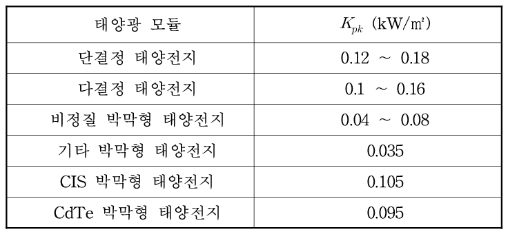
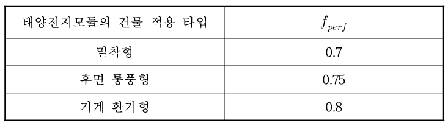

# 3.2. 태양광 (Photovoltaic, PV)

태양광 발전은 태양에너지를 직접 전기에너지(DC)로 변환하여, 인버터를 통해 교류(AC)로 바꾸어 활용합니다. 태양광발전시스템은 햇빛을 직류전류로 변환시키는 태양전지모듈, 발생된 직류전류를 교류로 변환시키는 인버터 등으로 구성됩니다. 발전 과정에서 오염물질이 발생하지 않고 건물 외피에 쉽게 통합할 수 있다는 장점이 있습니다. 

## 3.2.1. 태양광 발전시스템의 전력 생산량 \(E_{el,pv,out}\)

전력 생산량 \(E_{el,pv,out}\)은 입사 일사량 \(E_{sol}\), 최대 출력 \(P_{peak}\), 시스템 성능 계수 \(f_{perf}\)의 곱을 \(I_{ref}\)로 나누어 계산합니다.  
<a href="/eco2_guide_center/1.%20ECO2%20Logic%20Guide/Hee1_Equation_List.html" class="equation-link" target="_blank" rel="noopener noreferrer">
  \( E_{el,pv,out} = \frac{E_{sol} \cdot P_{peak} \cdot f_{perf}}{I_{ref}} \)
</a>

연간 전력생산량을 산출할 때에는 건물의 부위에 의한 음영 효과에 대한 영향을 고려하고, 건물 내에서 생산되는 신재생에너지에 대해서는 생산에 필요한 에너지를 고려하지 않습니다.  
\[
E_{pv,gen,in} = 0
\]

---

- 입사 일사량 \(E_{sol}\)  
<a href="/eco2_guide_center/1.%20ECO2%20Logic%20Guide/Hee1_Equation_List.html" class="equation-link" target="_blank" rel="noopener noreferrer">
  \( E_{sol} = E_{sol,hor} \cdot f_{tlt} \)
</a>

- 최대 출력 \(P_{pk}\)  
<a href="/eco2_guide_center/1.%20ECO2%20Logic%20Guide/Hee1_Equation_List.html" class="equation-link" target="_blank" rel="noopener noreferrer">
  \( P_{pk} = K_{pk} \cdot A \)
</a>

     

---

- 시스템 성능 계수 \(f_{perf}\)

태양전지모듈의 온도는 발전량에 영향을 미치기 때문에, 태양광발전시스템의 실제 성능을 도출함에 있어서 직류를 교류로 변환하는 시스템, 태양전지모듈의 실제 작동 온도, 건물 적용 방식과 같은 영향들을 고려하기 위해 성능 계수 \(f_{perf}\)를 적용합니다. 태양전지모듈은 배면의 환기 여부 및 방식에 따라 구분됩니다.  

     

---
 
- 태양전지모듈은 열을 생산하지 않으므로, 이는 고려하지 않습니다  
 \[
Q_{pv,gen,out} = 0
\]
- 태양전지모듈에서 전력을 생산하는 데 보조로 소비되는 에너지는 무시합니다  
\[
W_{pv,gen,aux} = 0
\]
- 태양광발전시스템에서 발생하는 열 손실은 무시합니다  
\[
Q_{pv,gen,ls} = 0
\]
- 난방에너지 요구에 대한 열회수시스템에 대한 열 손실은 고려하지 않습니다  
\[
Q_{pv,gen,ks,rbl} = 0
\]
