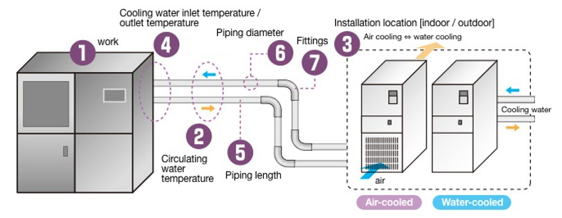

# 냉방 부하 계산

## 🔹 Introduction
냉방 부하 계산은 건물의 열 부하를 평가하고 냉방 시스템의 성능을 최적화하는 과정입니다.  
이를 통해 적정 용량을 설정하고 에너지 효율을 높일 수 있습니다.

냉방 부하 계산에는 다양한 접근 방식이 있으며, ECO2에서는 간단하면서도 직관적인 Simple Method를 활용합니다.  

---
<center>
  { loading=lazy width=600 }  
  **Figure 1. Energy Flow Diagram**
</center>

---

## 🔹 냉방기기 설정 항목 및 계산 로직

### **1. [일반데이터]**
- **냉동기 방식** → 압축식 / 흡수식 선택
- **냉동기 총 용량 (kW)** → 냉방 부하 계산 시 필수 값
- **정격열성능지수 (COP)** → 냉동기 효율을 평가하는 지표

**🔹 계산식:**
```python
COP = Q_output / W_input
```

---

### **2. [신재생 및 열병합 시스템 연결여부]**
- **신재생 시스템 연결 여부** → 시스템 연결 여부 선택
- **연결된 시스템** → 지열 냉난방, 태양열 시스템 등 선택
- **적용된 입력존 수** → 시스템 적용 범위 지정

**🔹 신재생 시스템 반영 시 부하 보정식:**
```python
Q_total = Q_cooling - Q_renewable
```

---

### **3. [압축식 냉동기]**
- **압축식 냉동기 종류** → 공기 간격식, 수냉식 등 선택
- **냉동기 압축방식** → 왕복동식, 스크류 압축기 등 선택
- **제어방식** → On/Off 제어, PID 제어 등 선택

**🔹 냉방 부하 계산:**
```python
Q_cooling = Q_sensible + Q_latent
```
- \( Q_{sensible} \) : 현열 부하 (온도 조절)
- \( Q_{latent} \) : 잠열 부하 (습도 조절)

---

### **4. [흡수식 냉동기]**
- **열원과 연결 방식** → 외부 보일러 등 열원 선택
- **사용 연료** → 도시가스, 전기, 증기 등 선택
- **냉동기 종류** → 단효용, 이중효용 등 효율에 따라 구분

**🔹 흡수식 냉동기 열원 계산:**
```python
Q_absorption = Q_cooling / 효율
```

---

### **5. [재냉각기 (냉각탑)]**
- **종말식 또는 건식냉각기** → 냉각 방식 선택 (없음, 공기냉각 등)
- **냉각탑의 보조냉각기 유무** → 부가적으로 설치된 냉각기 여부

**🔹 냉각탑 열 방출 계산:**
```python
Q_tower = m_dot * Cp * (T_in - T_out)
```
- \( m_dot \) : 냉각수 유량
- \( C_p \) : 물의 비열 (4.18 kJ/kg·K)
- \( T_{in}, T_{out} \) : 냉각탑 입/출구 온도

---

## 🔹 Key Formula
The core equation for heat energy calculation is:

$$
Q = mc\Delta T
$$

Where:  
- **Q** = Heat energy (Joules)  
- **m** = Mass (kg)  
- **c** = Specific heat capacity (J/kg·K)  
- **ΔT** = Temperature change (K)

---

## 🔹 Example Calculation
Let's calculate the energy required to heat 2 kg of water from 20°C to 80°C. Assuming water's specific heat capacity is \( 4.18 \ \mathrm{J/g \cdot K} \).  

$$
Q = (2 \times 1000) \times 4.18 \times (80 - 20) = 502,000 \ \text{J}
$$
