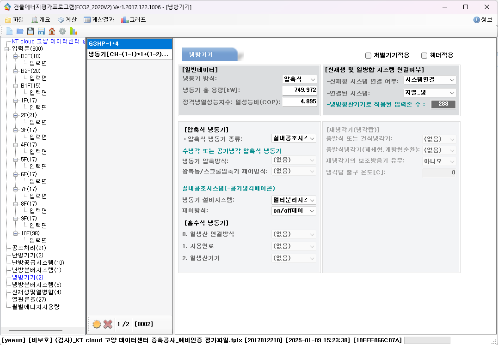

# 냉방 시스템 구성 요소

## 🔹 냉방기기 설정 항목 및 계산 로직
냉방기기 설정은 냉방 부하 계산의 핵심 단계로, 다양한 기기의 특성과 제어 방식을 반영해 정확한 에너지 요구량을 산출하는 과정입니다.   
기본 정보부터 신재생에너지 연결, 압축식 및 흡수식 냉동기, 냉각탑 설정까지 폭넓은 항목이 포함되며, 각 요소의 설정에 따라 냉방 시스템의 효율성과 성능이 좌우됩니다.

---

  { loading=lazy width=600 }  
  **Figure 2. ECO2 냉방기기 입력 화면**

---

### **1. [일반데이터]**
냉방 부하 계산의 출발점이 되는 기본 정보입니다.   
냉동기의 총 용량은 냉방 부하 산출의 기준이 되며, 정격열성능지수(COP)는 냉동기의 효율을 계산하는 핵심 값으로 활용됩니다.

- **냉동기 방식** → 압축식 / 흡수식 선택  
- **냉동기 총 용량 (kW)** → 냉방 부하 계산 시 필수 값  
- **정격열성능지수 (COP)** → 냉동기 효율을 평가하는 지표  

**🔹 계산식:**  
$$
COP = \frac{Q_{output}}{W_{input}}
$$

---

### **2. [신재생 및 열병합 시스템 연결여부]**
신재생에너지 시스템이 연결된 경우, 이를 통해 발생하는 부하 감축 효과가 냉방 부하 계산에 반영됩니다.   
연결된 시스템의 유형과 적용 영역에 따라 냉방 부하가 조정되며, 해당 값을 보정하는 과정이 필요합니다.

- **신재생 시스템 연결 여부** → 시스템 연결 여부 선택  
- **연결된 시스템** → 지열 냉난방, 태양열 시스템 등 선택  
- **적용된 입력존 수** → 시스템 적용 범위 지정  

**🔹 신재생 시스템 반영 시 부하 보정식:**  
$$
Q_{total} = Q_{cooling} - Q_{renewable}
$$

---

### **3. [압축식 냉동기]**
압축식 냉동기는 냉방 부하를 현열 부하와 잠열 부하로 나눠 계산합니다.   
압축기 방식 및 제어 방식에 따라 실제 냉방 부하가 조정되며, 이 두 값의 합산으로 최종 부하가 결정됩니다.

- **압축식 냉동기 종류** → 공기 간격식, 수냉식 등 선택  
- **냉동기 압축방식** → 왕복동식, 스크류 압축기 등 선택  
- **제어방식** → On/Off 제어, PID 제어 등 선택  

**🔹 냉방 부하 계산:**  
$$
Q_{cooling} = Q_{sensible} + Q_{latent}
$$

- \( Q_{sensible} \) : 현열 부하 (온도 조절)  
- \( Q_{latent} \) : 잠열 부하 (습도 조절)  

---

### **4. [흡수식 냉동기]**
흡수식 냉동기는 외부 열원을 통해 냉방 부하를 처리합니다.   
냉방 부하를 열원의 공급량과 효율로 환산하여 산출하며, 이때 효율이 냉방 부하 산출에 중요한 영향을 줍니다.

- **열원과 연결 방식** → 외부 보일러 등 열원 선택  
- **사용 연료** → 도시가스, 전기, 증기 등 선택  
- **냉동기 종류** → 단효용, 이중효용 등 효율에 따라 구분  

**🔹 흡수식 냉동기 열원 계산:**  
$$
Q_{absorption} = \frac{Q_{cooling}}{\text{효율}}
$$

---

### **5. [재냉각기 (냉각탑)]**
재냉각기는 냉동기에서 발생한 폐열을 외부로 방출하는 기기로, 유량과 입출구 온도의 차이에 따라 방출되는 열량이 결정됩니다.   
냉각탑의 설치 유무와 방식에 따라 냉방 부하 산출 값이 크게 달라집니다.

- **종말식 또는 건식냉각기** → 냉각 방식 선택 (없음, 공기냉각 등)  
- **냉각탑의 보조냉각기 유무** → 부가적으로 설치된 냉각기 여부  

**🔹 냉각탑 열 방출 계산:**  
$$
Q_{tower} = \dot{m} \cdot C_p \cdot ( T_{in} - T_{out} )
$$

- \( \dot{m} \) : 냉각수 유량  
- \( C_p \) : 물의 비열 (4.18 kJ/kg·K)  
- \( T_{in}, T_{out} \) : 냉각탑 입/출구 온도  

---
이러한 각 설정 항목은 상호 연계되어 냉방 부하를 종합적으로 결정하며, 각 항목의 설정값에 따라 최종 에너지 요구량과 시스템 효율이 달라집니다.